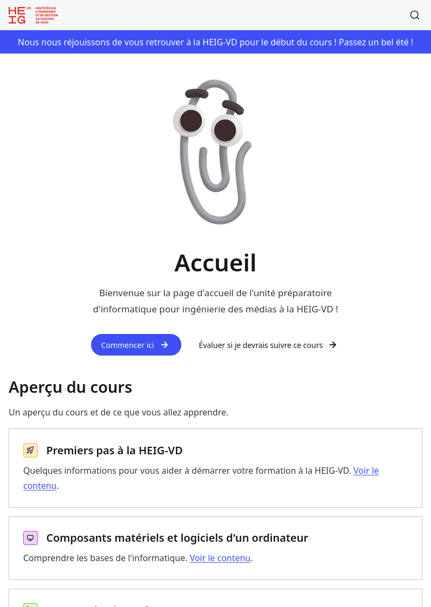

# Premiers pas à la HEIG-VD

<!--
_class: lead
_paginate: false
-->

[ `github.com/heig-vd-upinfo-course`](https://github.com/heig-vd-upinfo-course/heig-vd-upinfo-course)

[Visualiser le contenu complet sur le site dédié][contenu-complet].

<small>L. Delafontaine et V. Guidoux, avec l'aide de
[GitHub Copilot](https://github.com/features/copilot).</small>

<small>Ce travail est sous licence [CC BY-SA 4.0][license].</small>

![bg opacity:0.05][illustration-principale]

## Bienvenue à l'unité unité préparatoire d'informatique pour ingénierie des médias !

<!-- _class: lead -->

## Qui sommes-nous ?

**Ludovic  
Delafontaine**

**Vincent  
Guidoux**

---

**Ludovic  
Delafontaine**

[Mail](mailto:ludovic.delafontaine@heig-vd.ch) ·
[GitHub](https://github.com/ludelafo) ·
[LinkedIn](https://www.linkedin.com/in/ludelafo/)

<small>

**Parcours**

- 2011-2015 : CFC en informatique @ ETML.
- 2015-2019 : BSc en informatique @ HEIG-VD.
- 2020-2024 : Collaborateur Ra&D @ HEIG-VD.
- 2023-2026 : Artios + Enseignement @ HEIG-VD.

**Enseignement**

- [DAI](https://github.com/heig-vd-dai-course/heig-vd-dai-course) &
  [MVP](https://github.com/heig-vd-mvp-course/heig-vd-mvp-course) @ TIC.
- [UPInfo](https://github.com/heig-vd-upinfo-course/heig-vd-upinfo-course),
  [ProgServ1](https://github.com/heig-vd-progserv-course/heig-vd-progserv1-course),
  [ProgServ2](https://github.com/heig-vd-progserv-course/heig-vd-progserv2-course),
  [DévProdMéd](https://github.com/heig-vd-devprodmed-course/heig-vd-devprodmed-course),
  [DévAppliS](https://github.com/heig-vd-devapplis-course/heig-vd-devapplis-course)
  @ COMEM.

</small>

---

**Vincent  
Guidoux**

[Mail](mailto:vincent.guidoux1@heig-vd.ch) ·
[GitHub](https://github.com/Nortalle)

<small>

**Parcours**

- TODO

**Enseignement**

- TODO

</small>

## Nos souhaits pour ce cours

Votre ordinateur va vous accompagner tout au long de vos études à la HEIG-VD et
aussi plus tard dans votre vie professionnelle.

Notre objectif est de vous donner des bases solides et une bonne compréhension
de votre ordinateur pour travailler efficacement avec durant vos études et pour
la suite.

Notre but n'est pas de vous rendre expert·e en informatique, mais de vous donner
les bases nécessaires pour comprendre votre ordinateur et l'utiliser
efficacement.

## Comment nous contacter

Selon vos préférences, vous pouvez utiliser l'un des canaux de communication
suivants pour toute question relative au cours :

- En personne.
- Par e-mail (mettre tout le monde en copie sauf cas particulier) :
  - [ludovic.delafontaine@heig-vd.ch](mailto:ludovic.delafontaine@heig-vd.ch).
  - [vincent.guidoux1@heig-vd.ch](mailto:vincent.guidoux1@heig-vd.ch).

## Objectifs (1/2)

Selon les
[objectifs et programme](https://heig-vd-upinfo-course.github.io/heig-vd-upinfo-course/01-introduction-au-cours/04-objectifs-et-programme/)
disponibles en ligne, à la fin de ce cours, vous devriez être capable de :

> - Comprendre les bases de l'informatique pour ses études à la HEIG-VD.
> - Configurer et utiliser son ordinateur pour un environnement de travail
>   efficace.
> - Installer et configurer les applications de base nécessaires pour ses études
>   à la HEIG-VD.

## Objectifs (2/2)

> - Sauvegarder et restaurer ses données pour ne jamais perdre son travail.
> - Prendre des notes et documenter son travail avec Markdown.
> - Travailler efficacement dans le terminal pour automatiser des tâches et
>   gérer son environnement de travail.

---

<!-- _class: lead -->

> Grâce à ces compétences, la personne qui étudie sera en mesure de travailler
> efficacement avec les outils et les technologies informatiques nécessaires
> pour réussir dans son parcours académique et professionnel.

## Programme (1/3)

Le cours est en présentiel sur quatre jours, du lundi au jeudi, avec des
sessions le matin et l'après-midi.

Le cours est organisé en plusieurs parties, chacune dédiée à un thème spécifique
lié à l'informatique.

Chaque contenu sera accompagné d'un moment de théorie et d'exercices pratiques
pour vous permettre de mettre en pratique ce que vous avez appris et configurer
votre ordinateur pour un environnement de travail efficace.

## Programme (2/3)

<small>

| Jour         | Matin (8:30-12:00)                                                                                                                    | Après-midi (13:00-16:15)                                                                                                                                                       |
| :----------- | :------------------------------------------------------------------------------------------------------------------------------------ | :----------------------------------------------------------------------------------------------------------------------------------------------------------------------------- |
| **Lundi**    | [Premiers pas à la HEIG-VD](/heig-vd-upinfo-course/02-premiers-pas-a-la-heig-vd/01-introduction-et-ressources/)                       | [Composants matériels et logiciels d'un ordinateur](/heig-vd-upinfo-course/03-composants-materiels-et-logiciels-dun-ordinateur/01-introduction-et-ressources/)                 |
| **Mardi**    | [Communications réseaux et Internet](/heig-vd-upinfo-course/04-communications-reseaux-et-internet/01-introduction-et-ressources/)     | [Configurer son système d'exploitation et ses applications](/heig-vd-upinfo-course/05-configurer-son-systeme-dexploitation-et-ses-applications/01-introduction-et-ressources/) |
| **Mercredi** | [Sauvegarder et restaurer ses données](/heig-vd-upinfo-course/06-sauvegarder-et-restaurer-ses-donnees/01-introduction-et-ressources/) | [Prendre des notes Markdown](/heig-vd-upinfo-course/07-prendre-des-notes-markdown/01-introduction-et-ressources/)                                                              |
| **Jeudi**    | [Travailler dans le terminal](/heig-vd-upinfo-course/08-travailler-avec-le-terminal/01-introduction-et-ressources/)                   | [Conclusion au cours](/heig-vd-upinfo-course/09-conclusion-au-cours/01-introduction-et-ressources/)                                                                            |
| **Vendredi** | _Travail en autonomie\*_                                                                                                              | _Travail en autonomie\*_                                                                                                                                                       |

\*Vendredi permet de rattraper des contenus ou de compléter des exercices.

</small>

## Programme (3/3)

Bien que le contenu du cours puisse faire peur, nous souhaitons que vous gardiez
à l'esprit que ce cours est là pour vous aider à réussir vos études et à vous
préparer pour votre future carrière.

Vous aurez du temps durant la semaine pour réaliser les tâches et exercices
proposés dans le cours. N'hésitez pas à demander de l'aide si vous avez des
questions. **Nous sommes payés pour ça.**

Si quelque chose ne convient pas, n'hésitez pas à nous le dire. Nous acceptons
toutes critiques pour améliorer notre enseignement.

## La ressource principale : le site web

Nous avons créé un site web dédié pour l'unité préparatoire.

Vous y trouverez tous les contenus du cours pour configurer votre ordinateur
(théorie, exercices, etc.).

[heig-vd-upinfo-course.github.io/heig-vd-upinfo-course](https://heig-vd-upinfo-course.github.io/heig-vd-upinfo-course/)

## La ressource principale : le site web (2/2)

➡️ Moments de théorie commun.

➡️ Ressources et contenus à lire/appliquer en autonomie.

➡️ Exercices pratiques à réaliser en autonomie.

**Nous sommes là pour vous aider.**

## HES-SO et HEIG-VD (1/3)

La HES-SO (Haute école spécialisée de Suisse occidentale) est une institution
d'enseignement supérieur qui regroupe plusieurs hautes écoles spécialisées en
Suisse romande, dont la HEIG-VD (Haute école d'ingénierie et de gestion du
canton de Vaud).

La HEIG-VD a trois sites principaux situés à Yverdon-les-Bains :
[Cheseaux](https://maps.app.goo.gl/kZ2QDfWy95Uf4G9SA),
[St-Roch](https://maps.app.goo.gl/g6CLANpgAWc7zMwr5) et
[Y-Parc](https://maps.app.goo.gl/pRw7TZ9PT3pGB5RL7).

En tant qu'étudiant·e à la HEIG-VD, vous aurez surtout l'occasion de connaître
le site de Cheseaux et de St-Roch.

## HES-SO et HEIG-VD (2/3)

La HEIG-VD propose les éléments suivants :

- Une vie associative et culturelle dynamique.
- Des services de restauration, tels que des cafétérias.
- Un service de soutien et d'accompagnement.
- Des ressources pour le sport et les activités physiques.
- Des ressources pour trouver un logement étudiant.
- Un Makelab pour les projets et l'innovation.
- Et bien plus encore.

## HES-SO et HEIG-VD (3/3)

Des études universitaires et ce que cela implique.

La HEIG-VD est une université de sciences appliquées, ce qui signifie que
l'accent est mis sur l'application pratique des connaissances et des compétences
acquises.

Il est attendu à ce que les étudiant·es soient autonomes dans leur apprentissage
et qu'ils/elles prennent des initiatives pour approfondir leurs connaissances.

**Donnez-vous les ressources nécessaires pour réussir.**

## Votre ordinateur, un outil de travail

Votre ordinateur va vous accompagner tout au long de vos études à la HEIG-VD et
aussi plus tard dans votre vie professionnelle.

Ne négligez pas un outil de travail mal configuré ou non sécurisé, vous allez
perdre du temps et des ressources.

Prenez le temps de bien configurer votre ordinateur et de suivre les bonnes
pratiques pour éviter ces situations.

**Cette unité préparatoire est là pour vous aider à configurer votre ordinateur
et à le préparer pour vos études.**

## Questions

<!-- _class: lead -->

Est-ce que vous avez des questions ?

## Et maintenant ?

- Se connecter au Wi-Fi.
- Installer et configurer un gestionnaire de mots de passe et une application
  2FA.
- Gérer son compte HES-SO, HEIG-VD et Switch eduID.
- Accéder à ses e-mail, Microsoft Teams, GAPS et l'intranet.
- Se connecter au VPN et aux partages réseaux.
- Imprimer et numériser des documents.

**But** : connaître la base de ce qui compose la HEIG-VD.

## À vous de jouer !

Appliquez le contenu "[Premiers pas à la HEIG-VD][contenu-complet]" :

- Lisez le contenu et les instructions.
- Appliquez les exercices pratiques.
- Si vous ne finissez pas en classe, finissez le contenu à la maison.

N'hésitez pas à vous entraidez ou nous solliciter si vous avez des difficultés.

[![contenu-complet-qr-code]][contenu-complet]

[heig-vd-upinfo-course.github.io/heig-vd-upinfo-course][contenu-complet]

## Sources

- [Illustration principale][illustration-principale] par
  [Growtika](https://unsplash.com/@growtika) sur
  [Unsplash](https://unsplash.com/photos/a-computer-with-a-keyboard-and-mouse-yGQmjh2uOTg)

<!-- URLs -->

[license]:
	https://github.com/heig-vd-upinfo-course/heig-vd-upinfo-course/blob/main/LICENSE.md
[contenu-complet]:
	https://heig-vd-upinfo-course.github.io/heig-vd-upinfo-course/02-premiers-pas-a-la-heig-vd/01-introduction-et-ressources/
[contenu-complet-qr-code]:
	https://quickchart.io/qr?format=png&ecLevel=Q&size=300&margin=1&text=https://heig-vd-upinfo-course.github.io/heig-vd-upinfo-course/02-premiers-pas-a-la-heig-vd/01-introduction-et-ressources/

<!-- Illustrations -->

[illustration-principale]:
	https://images.unsplash.com/photo-1537498425277-c283d32ef9db?fit=crop&h=720
