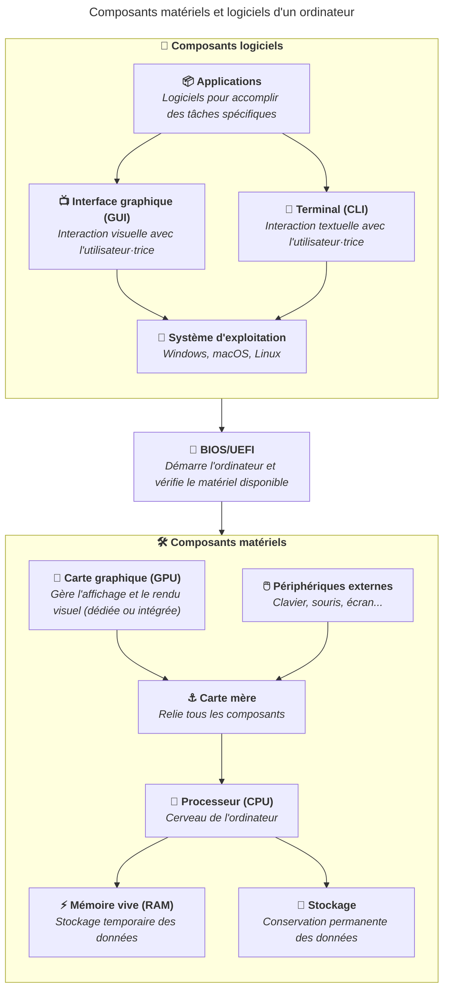

---
title:
  Composants matériels et logiciels d'un ordinateur - Introduction et ressources
sidebar:
  label: Introduction et ressources
---

Cette section présente les principaux composants d'un ordinateur, aussi bien
matériels que logiciels. Vous y découvrirez comment ces éléments fonctionnent
ensemble pour faire tourner vos applications quotidiennes.

Les thématiques abordées sont les suivantes :

- Le processeur (CPU), qui exécute les instructions des programmes.
- La mémoire vive (RAM), qui stocke temporairement les données en cours
  d'utilisation.
- Le stockage (disque dur, SSD), qui conserve les données de manière permanente.
- La carte mère, qui relie tous les composants entre eux.
- La carte graphique (GPU), qui gère l'affichage et le rendu visuel.
- Les périphériques externes (clavier, souris, écran...), qui permettent
  d'interagir avec l'ordinateur.
- Le BIOS/UEFI, qui démarre l'ordinateur et initialise le matériel.
- Le système d'exploitation (Windows, macOS, Linux), qui gère l'interaction
  entre le matériel et les logiciels.
- L'interface graphique (GUI) et le terminal (CLI), qui permettent d'interagir
  avec l'ordinateur.
- Les applications, qui sont les logiciels utilisés pour accomplir des tâches
  spécifiques.

