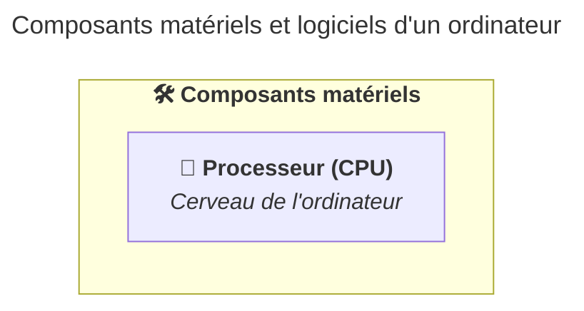

import { Steps, TabItem, Tabs } from "@astrojs/starlight/components";

Le processeur, ou CPU (Central Processing Unit), est le composant central d'un
ordinateur. Il exécute les instructions des programmes : calculs, comparaisons,
déplacements de données. Tout ce que fait un ordinateur passe par lui.

Vous pouvez imaginer le processeur comme le cerveau de l'ordinateur. Il reçoit
des instructions, les interprète et effectue les opérations nécessaires pour
produire un résultat. Il est responsable de la vitesse et de l'efficacité de
l'ordinateur.

## Langage machine/binaire

Un ordinateur est un composant électronique qui, dans le fond, est extrêmement
basique et n'a aucune intelligence (il n'est pas capable de réfléchir ou de
comprendre le langage humain).

Il ne comprend que le langage machine, constitué de 0 et de 1 (appelés des
bits), qui forment des instructions binaires. Ces instructions sont ensuite
interprétées par le processeur pour effectuer des opérations sur les données.

Tout ce que vous faites sur un ordinateur, que ce soit ouvrir un logiciel, taper
du texte ou regarder une vidéo, est traduit en langage machine pour que le
processeur puisse l'exécuter et vous renvoyer le résultat.

## Notation binaire et hexadécimale

Les nombres que nous utilisons au quotidien sont en base 10 (décimale),
c'est-à-dire qu'ils sont composés de chiffres allant de 0 à 9. Cependant, le
langage machine est en base 2 (binaire), ce qui signifie qu'il n'utilise que
deux chiffres : 0 et 1. Chaque chiffre binaire est appelé un bit.

Par exemple, le nombre décimal 5 est représenté en binaire par `0101`.

Nous lisons le nombre binaire de droite à gauche, en groupe de quatre bits.
Chaque bit représente une puissance de 2, en commençant par 2<sup>0</sup>.

Ainsi, le nombre binaire `0101` se décompose comme suit :

- Le bit le plus à droite (1) représente 2<sup>0</sup> = 1
- Le bit suivant (0) représente 2<sup>1</sup> = 0
- Le bit suivant (1) représente 2<sup>2</sup> = 4
- Le bit le plus à gauche (0) représente 2<sup>3</sup> = 0

En additionnant ces valeurs, on obtient 0 + 4 + 0 + 1 = 5 en décimal.

Le nombre binaire `10101111` se décompose comme suit :

- Le bit le plus à droite (1) représente 2<sup>0</sup> = 1
- Le bit suivant (1) représente 2<sup>1</sup> = 2
- Le bit suivant (1) représente 2<sup>2</sup> = 4
- Le bit suivant (1) représente 2<sup>3</sup> = 8
- Le bit suivant (0) représente 2<sup>4</sup> = 0
- Le bit suivant (1) représente 2<sup>5</sup> = 32
- Le bit suivant (0) représente 2<sup>6</sup> = 0
- Le bit le plus à gauche (1) représente 2<sup>7</sup> = 128

En additionnant ces valeurs, on obtient 128 + 0 + 32 + 0 + 8 + 4 + 2 + 1 = 175
en décimal.

Une autre façon de représenter les nombres binaires est l'hexadécimal, qui est
en base 16. L'hexadécimal utilise les chiffres de 0 à 9 et les lettres A à F
pour représenter les valeurs de 10 à 15.

Ainsi, le nombre binaire `0101` peut également être représenté en hexadécimal
par `0x05`, car il correspond à la valeur décimale 5.

Pour différencier les nombres binaires et hexadécimaux, on utilise souvent des
préfixes : `0b` pour le binaire (souvent omis) et `0x` pour l'hexadécimal. Par
exemple, `0b0101` représente le nombre binaire 0101, tandis que `0x05`
représente le nombre hexadécimal 5.

Le nombre binaire `1111` correspond à la valeur décimale 15, qui est représentée
en hexadécimal par `0x0F`.

<details>
<summary>Voir la décomposition</summary>

Le nombre binaire `1111` se décompose comme suit :

- Le bit le plus à droite (1) représente 2<sup>0</sup> = 1
- Le bit suivant (1) représente 2<sup>1</sup> = 2
- Le bit suivant (1) représente 2<sup>2</sup> = 4
- Le bit le plus à gauche (1) représente 2<sup>3</sup> = 8

En additionnant ces valeurs, on obtient 8 + 4 + 2 + 1 = 15 en décimal, ce qui
correspond à `F` en hexadécimal.

</details>

Le nombre binaire `10101111` correspond à la valeur décimale 175, qui est
représentée en hexadécimal par `0xAF`.

<details>
<summary>Voir la décomposition</summary>

Le nombre binaire `10101111` se décompose comme suit :

- Premier groupe de quatre bits (de droite à gauche) : `1111` correspond à 15 en
  décimal, soit `0x0F` en hexadécimal.
- Deuxième groupe de quatre bits : `1010` correspond à 10 en décimal, soit
  `0x0A` en hexadécimal.

En combinant ces deux groupes, on obtient `0xAF` en hexadécimal.

</details>

## Processeurs 32 bits et 64 bits

Un bit est la plus petite unité d'information en informatique, représentée par
un 0 ou un 1.

Plutôt que de traiter les bits un par un, les processeurs traitent les données
par blocs de bits. La taille de ces blocs dépend de l'architecture du processeur
: un processeur 32 bits traite les données par blocs de 32 bits, tandis qu'un
processeur 64 bits traite les données par blocs de 64 bits.

Cette différence de taille de bloc a des implications sur la quantité de mémoire
que le processeur peut utiliser et sur la performance globale de l'ordinateur.

Les processeurs 32 bits sont parfois appelés x86, tandis que les processeurs 64
bits sont appelés x64 ou x86-64 (car un processeur 64 bits peut exécuter des
instructions 32 bits).

Certains logiciels font encore la différence entre les versions 32 bits et 64
bits, mais la plupart des logiciels modernes sont conçus pour les processeurs 64
bits. C'est la raison pour laquelle vous pourriez encore trouver des logiciels
avec les mentions "32 bits" ou "64 bits" dans leurs noms ou descriptions.

## Architectures x86/x64 et ARM

Il existe deux grandes familles d'architectures de processeurs :

- L'architecture x86/x64 est la plus répandue sur les ordinateurs de bureau et
  les portables. Elle est utilisée par les processeurs Intel et AMD. Elle est
  puissante mais consomme plus d'énergie.
- L'architecture ARM est utilisée notamment par Apple (Apple Silicon : M1, M2,
  M3, etc.) et dans les smartphones. Elle est plus économe en énergie tout en
  offrant d'excellentes performances. Son adoption croissante ne date que de
  quelques années, mais elle est en train de devenir un standard pour les
  ordinateurs portables et les appareils mobiles.

Ces deux architectures ne sont pas directement compatibles : un programme
compilé pour x86/x64 ne fonctionnera pas nativement sur un processeur ARM, et
vice versa.

Durant votre formation, il est important de connaître ces architectures, car
elles influencent la compatibilité des logiciels. Vos enseignant·es essaient de
considérer les deux architectures dans leurs cours, mais il est possible que
certains logiciels ne soient pas disponibles pour l'une ou l'autre architecture.

Lorsque vous allez installer un logiciel, vérifiez toujours la compatibilité
avec votre architecture de processeur. Par exemple, si vous utilisez un
ordinateur Apple récent avec un processeur Apple Silicon, pensez à bien
installer et utiliser la version ARM du logiciel, et non la version x86/x64.

Des systèmes de traduction permettent d'exécuter des logiciels x86/x64 sur ARM,
mais cela peut entraîner une perte de performance. Il est donc préférable
d'utiliser des logiciels natifs pour votre architecture.

## Résumé

Le processeur est le cerveau de l'ordinateur. C'est lui qui exécute toutes les
applications et gère les opérations de calcul et de traitement des données. Il
s'agit de la pièce maîtresse qui détermine en majorité la vitesse et
l'efficacité de l'ordinateur.

Les processeurs ont beaucoup évolué au fil des années, mais les concepts de base
restent les mêmes : ils traitent des instructions en langage machine, et leur
architecture (x86/x64 ou ARM) influence la compatibilité des logiciels et les
performances de l'ordinateur.



## À vous de jouer !

### Exercice pratique 1 : identifier la marque et le modèle de son ordinateur

Identifiez la marque et le modèle de votre ordinateur et notez ces informations
pour référence future.

### Exercice pratique 2 : identifier le processeur de son ordinateur

Identifiez le fabricant (Intel, AMD, Apple, etc.) et le modèle de votre
processeur et notez ces informations pour référence future. Identifiez également
l'architecture de votre processeur ainsi que sa version (32 bits ou 64 bits) sur
votre ordinateur.

<Tabs syncKey="operating-system">

    <TabItem label="Windows" icon="seti:windows">
    	Accédez aux informations sur votre processeur en suivant ces étapes :

      <Steps>

    	1. Cliquez sur le bouton Démarrer.

    	2. Tapez "Informations système" dans la barre de recherche et appuyez sur Entrée.

      3. Dans la fenêtre qui s'ouvre, recherchez la section "Processeur" pour voir le fabricant, le modèle et l'architecture de votre processeur.

      </Steps>
    </TabItem>
    <TabItem label="macOS" icon="apple">
    	Accédez aux informations sur votre processeur en suivant ces étapes :

      <Steps>

    	1. Cliquez sur le menu Apple dans le coin supérieur gauche de l'écran.

    	2. Sélectionnez "À propos de ce Mac".

    	3. Dans la fenêtre qui s'ouvre, vous verrez les informations sur votre processeur, y compris le fabricant, le modèle et l'architecture.

      </Steps>
    </TabItem>
    <TabItem label="Linux" icon="linux">
      	Accédez aux informations sur votre processeur en suivant ces étapes :

        <Steps>

      	1. Ouvrez un terminal.

      	2. Tapez la commande suivante et appuyez sur Entrée :
      	   ```
      	   lscpu
      	   ```

      	3. Recherchez les lignes "Architecture" et "Modèle du processeur" pour voir le fabricant, le modèle et l'architecture de votre processeur.

        </Steps>
    </TabItem>

</Tabs>

### Exercice pratique 3 : conversions décimales, binaires et hexadécimales

Soit les nombres décimaux suivants, convertissez-les en binaire et en
hexadécimal :

- 10
- 15
- 20
- 134
- 1400

<details>
<summary>Voir les réponses</summary>

- 10 : binaire `0b1010`, hexadécimal `0x0A`
- 15 : binaire `0b1111`, hexadécimal `0x0F`
- 20 : binaire `0b00010100`, hexadécimal `0x14`
- 134 : binaire `0b10000110`, hexadécimal `0x86`
- 1400 : binaire `0b10101111000`, hexadécimal `0x578`

</details>

Soit les nombres binaires suivants, convertissez-les en décimal et en
hexadécimal :

- `0b1010`
- `0b1111`
- `0b00010100`
- `0b10000110`
- `0b10101111000`

<details>
<summary>Voir les réponses</summary>

- `0b1010` : décimal 10, hexadécimal `0x0A`
- `0b1111` : décimal 15, hexadécimal `0x0F`
- `0b00010100` : décimal 20, hexadécimal `0x14`
- `0b10000110` : décimal 134, hexadécimal `0x86`
- `0b10101111000` : décimal 1400, hexadécimal `0x578`

</details>

Soit les nombres hexadécimaux suivants, convertissez-les en décimal et en
binaire :

- `0x0A`
- `0x0F`
- `0x14`
- `0x86`
- `0xFF`

<details>
<summary>Voir les réponses</summary>

- `0x0A` : décimal 10, binaire `0b1010`
- `0x0F` : décimal 15, binaire `0b1111`
- `0x14` : décimal 20, binaire `0b00010100`
- `0x86` : décimal 134, binaire `0b10000110`
- `0xFF` : décimal 255, binaire `0b11111111`

</details>
