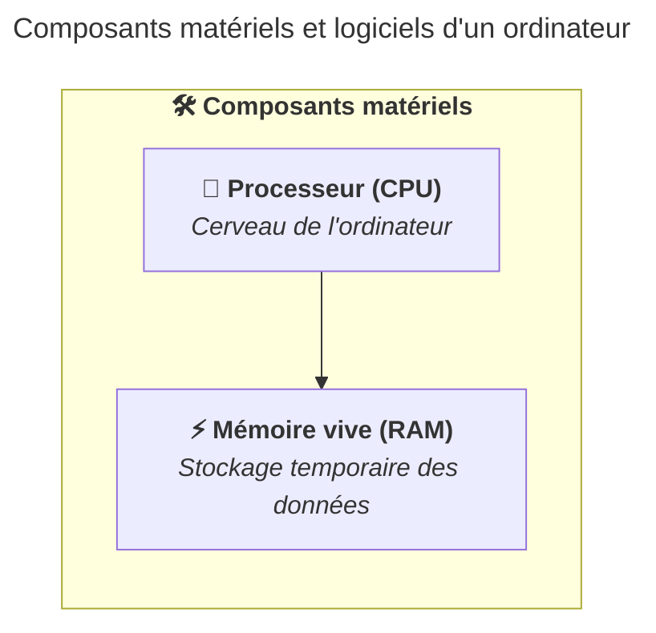

import { Aside, Steps, TabItem, Tabs } from "@astrojs/starlight/components";

La mémoire vive, ou RAM (Random Access Memory), est le composant qui stocke
temporairement les données et les programmes en cours d'utilisation par le
processeur.

Imaginez un tableau noir dans une salle de cours : vous y écrivez les
informations dont vous avez besoin maintenant, mais dès que le cours se termine
(ou que l'ordinateur s'éteint), le tableau est effacé. C'est exactement ainsi
que fonctionne la RAM : rapide et accessible, mais volatile.

La RAM se distingue du stockage sur deux points essentiels :

- Elle est rapide : le processeur peut y accéder en quelques nanosecondes.
- Elle est volatile : son contenu disparaît dès que l'ordinateur est mis hors
  tension.

La quantité de RAM détermine combien de programmes peuvent tourner simultanément
sans ralentissement. Une quantité insuffisante oblige l'ordinateur à arrêter
certains programmes ou à utiliser le stockage comme mémoire temporaire, ce qui
est beaucoup plus lent et peut provoquer des ralentissements ou des plantages.

Les tailles de RAM typiques pour un ordinateur en 2026 sont de 8 Go (gigaoctets
en français ou GB (gigabytes) en anglais) à 32 Go.

Pour vos études, il est recommandé d'avoir au moins 16 Go de RAM pour un
fonctionnement fluide et efficace de votre ordinateur.

## Résumé

La RAM est un composant essentiel pour le fonctionnement rapide et efficace d'un
ordinateur. Elle stocke temporairement les données et les programmes en cours
d'utilisation, permettant au processeur d'y accéder rapidement. Une quantité
suffisante de RAM est cruciale pour éviter les ralentissements.



## À vous de jouer !

<Aside type="tip">

Ces exercices sont là pour vous aider. Bien qu'ils ne soient pas notés, il est
fortement recommandé de les réaliser pour vous familiariser avec l'environnement
de la HEIG-VD.

Si vous avez des questions ou des difficultés, n'hésitez pas à demander de
l'aide au corps enseignant.

</Aside>

### Exercice pratique : identifier la quantité de RAM installée sur votre ordinateur

Identifiez la quantité de RAM installée sur votre ordinateur et notez cette
information pour référence future.

<Tabs syncKey="operating-system">

    <TabItem label="Windows" icon="seti:windows">
    	Accédez aux informations sur votre RAM en suivant ces étapes :

      <Steps>

    	1. Cliquez sur le bouton Démarrer.

    	2. Tapez "Informations système" dans la barre de recherche et appuyez sur Entrée.

      3. Dans la fenêtre qui s'ouvre, recherchez la section "Mémoire physique (RAM) installée" pour voir la quantité de RAM installée sur votre ordinateur.

      </Steps>

</TabItem>
<TabItem label="macOS" icon="apple">
    	Accédez aux informations sur votre RAM en suivant ces étapes :

      <Steps>

    	1. Cliquez sur le menu Apple dans le coin supérieur gauche de l'écran.

    	2. Sélectionnez "À propos de ce Mac".

    	3. Dans la fenêtre qui s'ouvre, vous verrez les informations sur votre RAM.

      </Steps>

</TabItem>
<TabItem label="Linux" icon="linux">
      	Accédez aux informations sur votre RAM en suivant ces étapes :

        <Steps>

      	1. Ouvrez un terminal.

      	2. Tapez la commande suivante et appuyez sur Entrée :
      	   ```
      	   free -h
      	   ```

      	3. Recherchez les lignes "Mem" pour voir la quantité de RAM installée sur votre ordinateur.

        </Steps>

</TabItem>
</Tabs>
