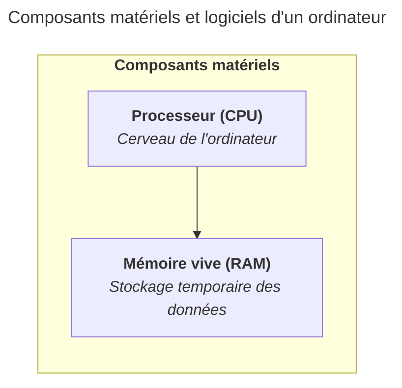

import { Aside } from "@astrojs/starlight/components";

<Aside type="caution">
	Ce contenu est encore en cours de rédaction. Il est amené à évoluer tout
	prochainement. Merci de revenir plus tard.
</Aside>

La mémoire vive, ou RAM (Random Access Memory), est le composant qui stocke
temporairement les données et les programmes en cours d'utilisation par le
processeur.

Imaginez un tableau noir dans une salle de cours : vous y écrivez les
informations dont vous avez besoin maintenant, mais dès que le cours se termine
(ou que l'ordinateur s'éteint), le tableau est effacé. C'est exactement ainsi
que fonctionne la RAM : rapide et accessible, mais volatile.

La RAM se distingue du stockage sur deux points essentiels :

- Elle est rapide : le processeur peut y accéder en quelques nanosecondes.
- Elle est volatile : son contenu disparaît dès que l'ordinateur est mis hors
  tension.

La quantité de RAM détermine combien de programmes peuvent tourner simultanément
sans ralentissement. Une quantité insuffisante oblige l'ordinateur à utiliser le
disque de stockage comme mémoire temporaire (swap), ce qui est beaucoup plus
lent.

Les tailles de RAM typiques pour un ordinateur en 2026 sont de 8 Go à 32 Go.

## Résumé

La RAM est un composant essentiel pour le fonctionnement rapide et efficace d'un
ordinateur. Elle stocke temporairement les données et les programmes en cours
d'utilisation, permettant au processeur d'y accéder rapidement. Une quantité
suffisante de RAM est cruciale pour éviter les ralentissements.

