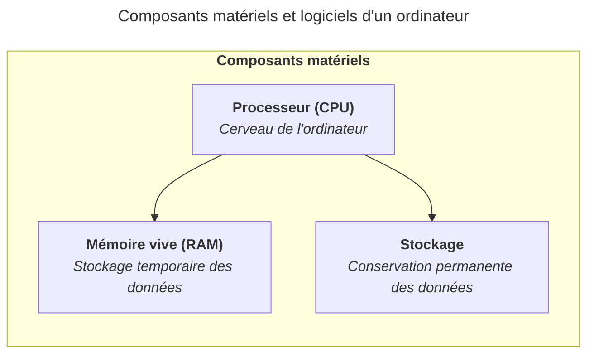

import { FileTree, Steps, TabItem, Tabs } from "@astrojs/starlight/components";

Le stockage est un composant essentiel d'un ordinateur, permettant de conserver
les données et les programmes de manière permanente.

Le stockage se distingue de la mémoire vive (RAM) par le fait qu'il conserve les
données même lorsque l'ordinateur est éteint, tandis que la RAM est volatile et
perd son contenu à l'arrêt de l'alimentation.

Il existe différents types de stockage, chacun ayant ses propres
caractéristiques et usages. Les principaux types de stockage sont :

- Les disques durs (HDD) : ils utilisent des plateaux magnétiques pour stocker
  les données. Ils offrent une grande capacité de stockage à un coût
  relativement bas, mais sont plus lents que les SSD.
- Les disques SSD (Solid State Drives) : ils utilisent des puces de mémoire pour
  stocker les données. Ils sont plus rapides que les HDD, mais plus coûteux par
  unité de capacité.

## Tailles de stockage

Les tailles de stockage typiques pour un ordinateur aujourd'hui varient de 256
Go (gigaoctets en français ou GB (gigabytes) en anglais) à plusieurs To
(teraoctets en français ou TB (terabytes) en anglais), selon les besoins et le
type de stockage utilisé.

Nous parlons de Go (gigaoctets) et de To (teraoctets) pour mesurer la capacité
de stockage. 1 To équivaut à 1 024 Go, et 1 Go équivaut à 1 024 Mo (mégaoctets).

Un octet est une unité de mesure de la quantité de données, équivalente à 8
bits. Les bits sont les plus petites unités d'information dans un ordinateur,
représentant un état binaire (0 ou 1).

Pour vos études, il est recommandé d'avoir au moins 512 Go de stockage pour
pouvoir installer le système d'exploitation, les logiciels et disposer d'un
espace suffisant pour vos fichiers et projets.

## Partitions

Un disque de stockage peut être divisé en plusieurs partitions, c'est-à-dire en
zones indépendantes qui se comportent comme des disques séparés.

Cela permet, par exemple, de séparer les données personnelles des données
système ou de d'installer plusieurs systèmes d'exploitation sur le même disque.

Imaginez un disque de stockage comme un placard que vous pouvez séparer en
plusieurs espaces. Chaque espace représente une partition, et vous pouvez
choisir d'utiliser chaque espace pour un usage différent, comme stocker vos
fichiers personnels, installer un système d'exploitation ou créer une partition
de sauvegarde.

## Systèmes de fichiers

Chaque partition est formatée avec un système de fichiers, qui définit comment
les données sont organisées et stockées. Les systèmes de fichiers les plus
courants sont :

- NTFS : utilisé par Windows.
- APFS : utilisé par macOS.
- ext4 : utilisé par la plupart des distributions Linux.
- FAT32 / exFAT : formats universels souvent utilisés sur les clés USB et les
  cartes SD.

Ces systèmes de fichiers ont des caractéristiques différentes en termes de
performances, de sécurité et de compatibilité avec les différents systèmes
d'exploitation.

Par exemple, si vous utilisez un disque externe formaté en exFAT, vous pourrez
l'utiliser à la fois sur Windows, macOS et Linux sans problème. Cependant, si
vous utilisez un disque formaté en NTFS, vous pourriez rencontrer des
limitations sur macOS et Linux, et vice versa pour les systèmes de fichiers
spécifiques à macOS ou Linux.

Lorsque vous allez travailler sur vos projets, il sera commun de travailler
entre différents systèmes de fichiers, surtout si vous utilisez des
périphériques de stockage externes ou si vous partagez des fichiers avec
d'autres personnes utilisant différents systèmes d'exploitation. Il est donc
important de comprendre les différences entre ces systèmes de fichiers et de
choisir le format approprié pour vos besoins.

### Encodage des caractères

Comme mentionné dans le contenu
[Processeur (CPU)](/heig-vd-upinfo-course/03-composants-materiels-et-logiciels-dun-ordinateur/02-processeur-cpu),
un ordinateur ne comprend que le langage machine, constitué de 0 et de 1, appelé
des bits.

Ces séquences de bits permettent de représenter des caractères à l'aide d'octets
(des séries de 8 bits). Mais une problématique survient : comment interpréter
une suite de bits tels que `01000001` ? Ou encore `11000011 10101000` ? Comment
savoir ce que ces suites de bits représentent ? Des lettres, des chiffres ou des
symboles ?

C'est ici qu'intervient l'encodage des caractères. L'encodage des caractères
définit comment les lettres, chiffres et symboles doivent être interprétés pour
l'humain à partir de ces suites de bits. Il existe plusieurs encodages, chacun
ayant ses propres règles pour représenter les caractères :

- ASCII : un encodage simple qui représente les caractères anglais de base.
- ISO-8859-1 : un encodage qui étend ASCII pour inclure des caractères accentués
  utilisés dans les langues européennes comme le français, l'espagnol et
  l'allemand.
- UTF-8 : un encodage universel et moderne qui peut représenter tous les
  caractères de toutes les langues du monde, y compris les symboles et les
  emojis.

Ainsi, selon l'encodage utilisé, une même suite de bits peut représenter des
caractères différents. Par exemple, la suite de bits `01000001` représente la
lettre `A` en ASCII et UTF-8, mais pourrait représenter un caractère différent
dans un autre encodage. De même, la suite de bits `11000011 10101000` représente
le caractère `è` en UTF-8, mais pourrait être interprétée différemment dans un
autre encodage.

Peut-être êtes-vous déjà tombé·e sur des fichiers texte avec des caractères
bizarres ou des symboles étranges à la place des lettres accentuées. Cela est
souvent dû à un problème d'encodage des caractères. Par exemple, si un fichier
texte est encodé en UTF-8 mais ouvert avec un logiciel qui s'attend à un
encodage ISO-8859-1, les caractères accentués peuvent apparaître comme des
symboles étranges (`�`) ou des points d'interrogation (`?`). C'est pour ça que
l'encodage des caractères est crucial pour garantir que les fichiers texte sont
lisibles et interprétés correctement sur différents systèmes et logiciels.

L'encodage le plus répandu aujourd'hui est UTF-8, qui supporte la quasi-totalité
des caractères de toutes les langues du monde.

La plupart des systèmes d'exploitation modernes et des logiciels utilisent UTF-8
par défaut, ce qui facilite le partage de fichiers texte entre différents
systèmes et logiciels sans rencontrer de problèmes d'affichage des caractères.

Mais peut-être que vous allez rencontrer des fichiers texte encodés dans
d'autres formats, comme ISO-8859-1 ou ASCII. Si vous rencontrez des problèmes
d'affichage de caractères, il est recommandé de vérifier l'encodage du fichier
et de le convertir en UTF-8 si nécessaire. La plupart des éditeurs de texte
modernes offrent des options pour changer l'encodage d'un fichier ou pour
l'enregistrer dans un encodage différent.

### Sensibilité à la casse

La sensibilité à la casse désigne le fait de distinguer les lettres majuscules
et minuscules dans les noms des fichiers et des dossiers. Cela peut varier selon
le système de fichiers utilisé.

Sur les systèmes de fichiers par défaut de Linux et macOS, les noms de fichiers
sont sensibles à la casse : `Document.txt` et `document.txt` sont deux fichiers
différents.

Sur Windows, ils sont traités comme un seul et même fichier.

Bien que cela puisse paraître anodin, il est important de garder cette
différence à l'esprit lorsque vous travaillez en équipe ou lorsque vous partagez
des fichiers entre différents systèmes.

### Fichiers et dossiers

Les fichiers et les dossiers sont stockés sur le disque de stockage selon les
notions présentées ci-dessus, à savoir
l'[Encodage des caractères](#encodage-des-caractères) et la
[Sensibilité à la casse](#sensibilité-à-la-casse).

Lorsque nous parlons de fichiers et de dossiers, il est important de garder à
l'esprit les concepts suivants :

- Un fichier est une unité de stockage qui contient des données, comme un
  document texte, une image, une vidéo ou un programme.
- Un dossier (ou répertoire) est un conteneur qui peut contenir des fichiers ou
  d'autres dossiers. Il permet d'organiser les fichiers de manière logique.
- Nous parlons parfois de dossier racine (appelé _"root"_ en anglais) pour
  désigner le dossier principal d'un disque de stockage ou d'un projet, à partir
  duquel tous les autres dossiers et fichiers sont organisés.

Il est de coutume de se limiter à des lettres minuscules sans accents, des
espaces, des tirets (`-`), des underscores (`_`) et des chiffres pour nommer vos
fichiers et dossiers, afin d'éviter les problèmes d'encodage et de sensibilité à
la casse.

### Arborescence et chemins d'accès

Les fichiers et les dossiers sont stockés sur le disque de stockage et organisés
en une structure hiérarchique appelée _"arborescence"_. Cette arborescence est
représentée par des chemins d'accès qui indiquent l'emplacement d'un fichier ou
d'un dossier dans cette structure.

Pour naviguer dans cette arborescence, nous parlons de chemins d'accès,
c'est-à-dire la séquence de dossiers à suivre pour atteindre un fichier ou un
dossier spécifique.

Il existe deux types de chemins d'accès : les chemins absolus et les chemins
relatifs.

- Un chemin absolu décrit l'emplacement complet d'un fichier depuis la racine
  (ex. `/home/sam/documents/rapport.pdf` sur Linux ou macOS ou
  `C:\Users\sam\documents\rapport.pdf` sur Windows).
- Un chemin relatif décrit l'emplacement d'un fichier par rapport au répertoire
  courant (ex. `documents/rapport.pdf` si nous sommes dans le répertoire
  `/home/sam`).

Lorsque nous sommes dans un dossier, la notation `.` (point) représente le
dossier courant, tandis que la notation `..` (double point) représente le
dossier parent. Cela permet de naviguer facilement dans l'arborescence des
fichiers et des dossiers.

Ainsi, si nous sommes dans le dossier `/home/sam/documents` et que nous voulons
accéder au fichier `rapport.pdf` situé dans le dossier `/home/sam`, nous pouvons
utiliser le chemin relatif `../rapport.pdf`, où `..` nous ramène au dossier
parent `/home/sam`.

Nous reviendrons sur la notion d'arborescence dans le contenu
[Système d'exploitation](/heig-vd-upinfo-course/03-composants-materiels-et-logiciels-dun-ordinateur/09-systeme-dexploitation).

### Différences entre les systèmes de fichiers

Le tableau suivant résume les principales caractéristiques des systèmes de
fichiers courants :

| Système de fichiers | Compatibilité                                                                                     | Sensible à la casse | Commentaires                                                                                                                                |
| ------------------- | ------------------------------------------------------------------------------------------------- | ------------------- | ------------------------------------------------------------------------------------------------------------------------------------------- |
| NTFS                | Windows, macOS (lecture seule), Linux (lecture/écriture avec des limitations)                     | Non                 | Système de fichiers par défaut pour Windows.                                                                                                |
| APFS                | macOS, iOS                                                                                        | Oui                 | Système de fichiers par défaut pour macOS et iOS.                                                                                           |
| ext4                | Linux, Windows (lecture seule avec des outils tiers), macOS (lecture seule avec des outils tiers) | Oui                 | Système de fichiers principal pour la plupart des distributions Linux.                                                                      |
| FAT32               | Windows, macOS, Linux                                                                             | Non                 | Ancien système de fichiers compatible avec presque tous les systèmes. Ne supporte pas les fichiers plus grands que 4 Go ni les permissions. |
| exFAT               | Windows, macOS, Linux                                                                             | Non                 | Système de fichiers moderne pour les périphériques amovibles. Supporte de grands fichiers mais ne supporte pas les permissions.             |

## Résumé

Le stockage est un composant essentiel d'un ordinateur, permettant de conserver
les données et les programmes de manière permanente. Il existe différents types
de stockage, chacun ayant ses propres caractéristiques et usages. Les principaux
types de stockage sont les disques durs (HDD) et les disques SSD (Solid State
Drives).

Les fichiers et les dossiers sont organisés en une structure hiérarchique
appelée arborescence, et sont stockés sur le disque de stockage selon l'encodage
des caractères et la sensibilité à la casse. Il est important de comprendre les
systèmes de fichiers et les chemins d'accès pour naviguer efficacement dans
l'arborescence des fichiers et des dossiers d'un ordinateur.



## À vous de jouer !

### Exercice pratique 1

Identifiez le type de stockage (HDD ou SSD) et la capacité de stockage de votre
ordinateur et notez ces informations pour référence future.

<Tabs syncKey="operating-system">

    <TabItem label="Windows" icon="seti:windows">
    	Accédez aux informations sur votre stockage en suivant ces étapes :

      <Steps>

    	1. Cliquez sur le bouton Démarrer.

    	2. Tapez "Informations système" dans la barre de recherche et appuyez sur Entrée.

      3. Dans la fenêtre qui s'ouvre, recherchez la section "Stockage" pour voir le type de stockage et la capacité installée sur votre ordinateur.

      </Steps>
    </TabItem>
    <TabItem label="macOS" icon="apple">
    	Accédez aux informations sur votre stockage en suivant ces étapes :

      <Steps>

    	1. Cliquez sur le menu Apple dans le coin supérieur gauche de l'écran.

    	2. Sélectionnez "À propos de ce Mac".

    	3. Dans la fenêtre qui s'ouvre, vous verrez les informations sur votre stockage.

      </Steps>
    </TabItem>
    <TabItem label="Linux" icon="linux">
      	Accédez aux informations sur votre stockage en suivant ces étapes :

        <Steps>

      	1. Ouvrez un terminal.

      	2. Tapez la commande suivante et appuyez sur Entrée :
      	   ```
      	   df -h
      	   ```

      	3. Recherchez les lignes "Filesystem" pour voir la capacité de stockage installée sur votre ordinateur.

        </Steps>
    </TabItem>

</Tabs>

### Exercice pratique 2

Soit l'arborescence suivante d'un projet informatique :

<FileTree>

- public
  - favicon.svg
  - `_headers`
  - og.webp
- src
  - assets
    - houston.webp
    - logo.svg
  - components
    - CheckList.astro
    - ContactForm.astro
    - Feedback.astro
    - Footer.astro
    - Progress.astro
  - content
    - docs
      - 01-introduction-au-cours
        - 01-bienvenue.md
        - 02-a-qui-sadresse-ce-cours.md
        - 03-est-ce-obligatoire.md
        - 04-objectifs-et-programme.md
        - 05-evaluer-si-je-devrais-suivre-ce-cours.md
        - 06-sinscrire.md
        - 07-elements-a-prendre-pour-la-premiere-seance.md
        - 08-nous-nous-retrouvons-a-la-heig-vd.md
      - 02-premiers-pas-a-la-heig-vd
        - 01-introduction-et-ressources.md
        - 02-comment-utiliser-ce-site.md
        - 03-obtenir-de-laide-durant-ce-cours.md
        - 04-hes-so-et-heig-vd.md
        - 05-votre-ordinateur-un-outil-de-travail.md
        - 06-se-connecter-au-wi-fi.md
        - 07-installer-et-configurer-un-gestionnaire-de-mots-de-passe.md
        - 08-installer-et-configurer-une-application-a-deux-facteurs.md
        - 09-gerer-son-compte-hes-so-heig-vd-et-switch-eduid.md
        - 10-acceder-a-ses-e-mails.md
        - 11-acceder-a-microsoft-teams.md
        - 12-acceder-a-gaps.md
        - 13-acceder-a-lintranet.md
        - 14-se-connecter-au-vpn.md
        - 15-imprimer-et-numeriser-des-documents.md
        - 16-obtenir-de-laide-au-helpdesk.md
      - 03-composants-materiels-et-logiciels-dun-ordinateur
        - 01-introduction-et-ressources.md
        - 02-processeur-cpu.md
        - 03-memoire-vive-ram.md
        - 04-stockage.md
        - 05-carte-mere.md
        - 06-carte-graphique-gpu.md
        - 07-peripheriques-externes.md
        - 08-bios-uefi.md
        - 09-systeme-dexploitation.md
        - 10-interface-graphique-gui-et-terminal-cli.md
        - 11-applications.md
      - 04-communications-reseaux-et-internet
        - 01-introduction-et-ressources.md
        - 02-ordinateurs-serveurs-et-internet.md
        - 03-adresse-ip.md
        - 04-serveur-dhcp.md
        - 05-serveur-dns.md
        - 06-modem-routeur-wi-fi.md
        - 07-definition-dun-processus.md
        - 08-communications-inter-processus.md
        - 09-effectuer-une-recherche-sur-internet.md
      - 05-configurer-son-systeme-dexploitation-et-ses-applications
        - 01-introduction-et-ressources.md
        - 02-langue-et-clavier.md
        - 03-gestionnaire-de-fichiers.md
        - 04-terminal-et-shells.md
        - 05-droits-et-permissions.md
        - 06-gerer-les-mises-a-jour.md
        - 07-services-de-synchronisation-en-ligne.md
        - 08-applications-par-defaut.md
        - 09-applications-au-demarrage.md
        - 10-chiffrement-de-ses-donnees.md
        - 11-anti-virus.md
        - 12-environnement-wsl.md
        - 13-gestionnaires-de-paquets.md
        - 14-mozilla-firefox.md
        - 15-google-chrome.md
        - 16-safari.md
        - 17-un-client-de-messagerie.md
        - 18-un-outil-pour-compresser-decompresser-des-archives.md
        - 19-visual-studio-code.md
        - 20-vlc.md
        - 21-la-suite-microsoft-office.md
        - 22-la-suite-adobe.md
        - 23-git.md
        - 24-docker.md
        - 25-un-outil-pour-traiter-des-documents-pdf.md
        - 26-reinstaller-son-systeme-dexploitation.md
      - 06-sauvegarder-et-restaurer-ses-donnees
        - 01-introduction-et-ressources.md
        - 02-strategie-de-sauvegarde-3-2-1.md
        - 03-installer-un-outil-pour-sauvegarder-restaurer-ses-documents.md
        - 04-sauvegarder-ses-donnees.md
        - 05-restaurer-ses-donnees.md
        - 06-que-faire-en-cas-de-desastre.md
      - 07-prendre-des-notes-markdown
        - 01-introduction-et-ressources.md
        - 02-presentation-de-markdown.md
        - 03-avec-visual-studio-code.md
        - 04-avec-obsidian.md
        - 05-avec-pandoc.md
        - 06-alternatives.md
      - 08-travailler-avec-le-terminal
        - 01-introduction-et-ressources.md
        - 02-ouvrir-un-terminal.md
        - 03-naviguer-dans-larborescence-de-fichiers.md
        - 04-commandes-communes.md
        - 05-ecrire-et-executer-un-script-simple.md
      - 09-conclusion-au-cours
        - 01-introduction-et-ressources.md
        - 02-recapitulatif.md
        - 03-valider-vos-acquis.md
        - 04-aller-plus-loin.md
        - 05-conclusion.md
      - 10-autre
        - 01-contribuer-a-ce-site.md
      - 404.md
      - demo.md
      - index.md
    - i18n
      - fr.json
  - pages
    - robot.txt.ts
  - content.config.ts
  - routeData.ts
- astro.config.ts
- generate-diagrams.sh
- generate-presentations.sh
- LICENSE.md
- package.json
- package-lock.json
- prettier.config.ts
- README.md
- tsconfig.json

</FileTree>

Répondez aux questions suivantes en utilisant l'arborescence ci-dessus :

1. Quel(s) fichier(s) et dossier(s) se trouvent à la racine du projet ?
2. Quel est le chemin d'accès absolu du fichier `04-stockage.md` ?
3. Quel est le chemin d'accès relatif du fichier `LICENSE.md` si nous sommes
   dans le répertoire
   `src/content/docs/03-composants-materiels-et-logiciels-dun-ordinateur/` ?
4. Quel est le chemin d'accès absolu du dossier `src` ?
5. Quel est le chemin d'accès relatif du fichier `02-ouvrir-un-terminal.md` si
   nous sommes dans le répertoire
   `src/content/docs/05-configurer-son-systeme-dexploitation-et-ses-applications/`
   ?
6. Si nous sommes dans le répertoire
   `src/content/docs/08-travailler-avec-le-terminal` et que nous souhaitons
   accéder au dossier
   `src/content/docs/06-sauvegarder-et-restaurer-ses-donnees`, est-ce que le
   chemin relatif
   `../../../../src/content/docs/06-sauvegarder-et-restaurer-ses-donnees/` est
   correct ? Voyez-vous une meilleure solution pour accéder à ce dossier depuis
   le répertoire `src/content/docs/08-travailler-avec-le-terminal` ?

<details>
<summary>Afficher la solution</summary>

1. Les fichiers à la racine du projet sont :
   - `public/`
   - `src/`
   - `astro.config.ts`
   - `generate-diagrams.sh`
   - `generate-presentations.sh`
   - `LICENSE.md`
   - `package.json`
   - `package-lock.json`
   - `prettier.config.ts`
   - `README.md`
   - `tsconfig.json`
2. Le chemin d'accès absolu du fichier `04-stockage.md` est :
   `src/content/docs/03-composants-materiels-et-logiciels-dun-ordinateur/04-stockage.md`.
3. Le chemin d'accès relatif du fichier `LICENSE.md` si nous sommes dans le
   répertoire
   `src/content/docs/03-composants-materiels-et-logiciels-dun-ordinateur/` est :
   `../../../../LICENSE.md`.
4. Le chemin d'accès absolu du dossier `src` est : `src/`.
5. Le chemin d'accès relatif du fichier `02-ouvrir-un-terminal.md` si nous
   sommes dans le répertoire
   `src/content/docs/05-configurer-son-systeme-dexploitation-et-ses-applications/`
   est : `../08-travailler-avec-le-terminal/02-ouvrir-un-terminal.md`.
6. Le chemin relatif
   `../../../../src/content/docs/06-sauvegarder-et-restaurer-ses-donnees/` est
   correct pour accéder au dossier
   `src/content/docs/06-sauvegarder-et-restaurer-ses-donnees` depuis le
   répertoire `src/content/docs/08-travailler-avec-le-terminal`. Cependant, une
   meilleure solution serait d'utiliser un chemin relatif plus simple en
   remontant seulement un niveau et en accédant directement au dossier souhaité
   : `../06-sauvegarder-et-restaurer-ses-donnees/`.

</details>
