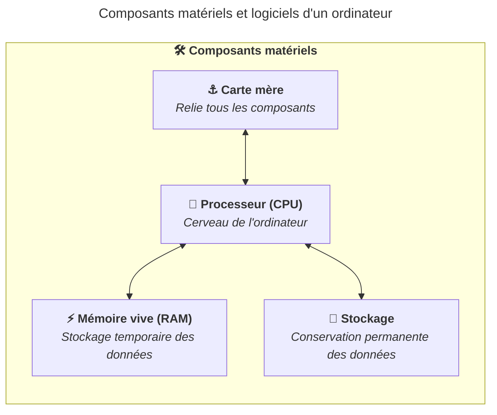

La carte mère (motherboard) est le circuit imprimé principal d'un ordinateur.
Elle relie entre eux tous les composants : le processeur, la mémoire vive, le
stockage, la carte graphique et les périphériques.

Elle contient notamment :

- Le socket CPU, qui accueille le processeur.
- Les emplacements RAM (slots DIMM), qui reçoivent les barrettes de mémoire
  vive.
- Les emplacements d'extension (PCIe), utilisés pour installer une carte
  graphique ou d'autres cartes additionnelles.
- Les connecteurs de stockage (SATA, M.2), qui relient les disques durs et les
  SSD.
- Les ports d'entrée/sortie (USB, HDMI, audio...) accessibles depuis l'extérieur
  du boîtier.

## Connecteurs et interfaces pour le stockage

Les connecteurs et interfaces de stockage déterminent comment les dispositifs de
stockage sont connectés à l'ordinateur. Les principaux connecteurs sont :

- SATA : utilisé pour les disques durs et SSDs.
- NVMe : interface plus rapide pour les SSDs.
- USB : utilisé pour les clés USB et les disques externes.

Les ordinateurs portables et de bureau modernes utilisent généralement des SSDs
NVMe pour le stockage principal, offrant des vitesses de lecture et d'écriture
beaucoup plus rapides que les disques durs traditionnels ou les SSDs SATA.

## Résumé

La carte mère est le composant central qui relie tous les autres composants d'un
ordinateur. Elle ne propose pas de logique de traitement, mais elle permet aux
autres composants de communiquer entre eux.

