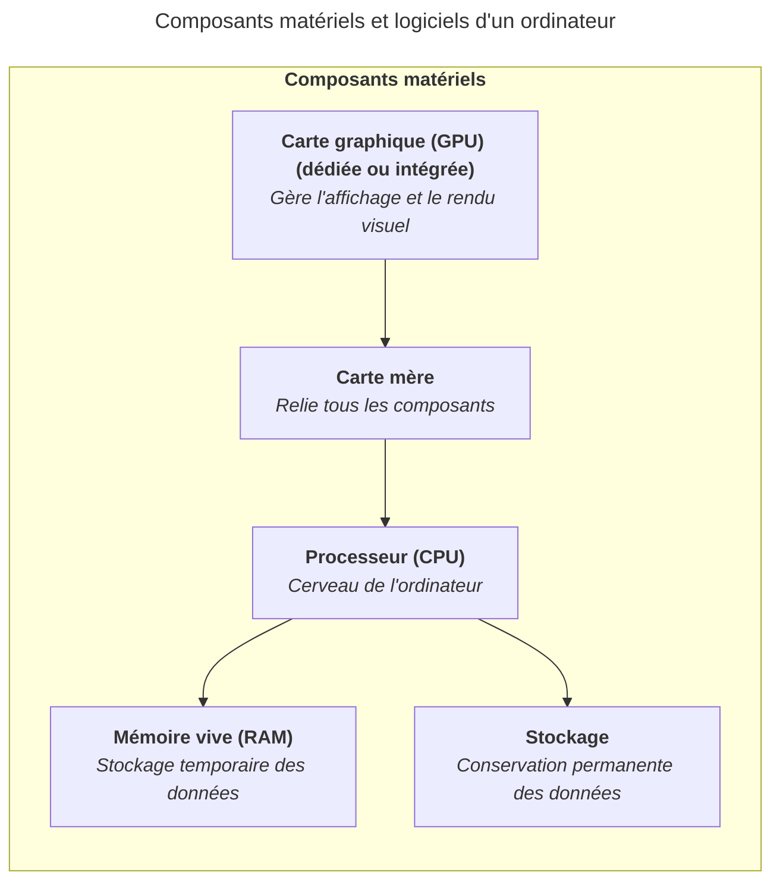

La carte graphique, ou GPU (Graphics Processing Unit), est responsable du rendu
visuel de l'ordinateur : affichage de l'interface, vidéos, jeux, etc. Elle
décharge le processeur central (CPU) de ce travail.

Une carte graphique est spécialisée dans le traitement des images et des calculs
graphiques.

Il existe deux types de GPU :

- Le GPU intégré (iGPU) est directement inclus dans le processeur. Il est
  suffisant pour un usage quotidien (navigation web, bureautique, vidéo).
- Le GPU dédié est une carte séparée, plus puissante, utilisée pour des tâches
  exigeantes comme les jeux vidéo, la création graphique ou le montage vidéo.

Au-delà de l'affichage, les GPU sont aujourd'hui utilisés dans de nombreux
domaines car ils sont très efficaces pour effectuer des milliers de calculs en
parallèle : apprentissage automatique (machine learning), rendu 3D, simulation
scientifique, etc.

Ce n'est pas parce que votre ordinateur portable professionnel n'a pas de carte
graphique dédiée qu'il ne peut pas faire de calculs graphiques. Les GPU intégrés
modernes sont déjà très performants et suffisent pour la majorité des usages.
Cependant, pour les jeux vidéo récents ou les logiciels de création graphique,
un GPU dédié peut permettre d'obtenir de meilleures performances.

## Résumé

La carte graphique (GPU) est responsable du rendu visuel de l'ordinateur. Elle
peut être intégrée au processeur ou dédiée, et est utilisée pour les jeux vidéo,
la création graphique et d'autres tâches exigeantes orientées vers le traitement
visuel.

