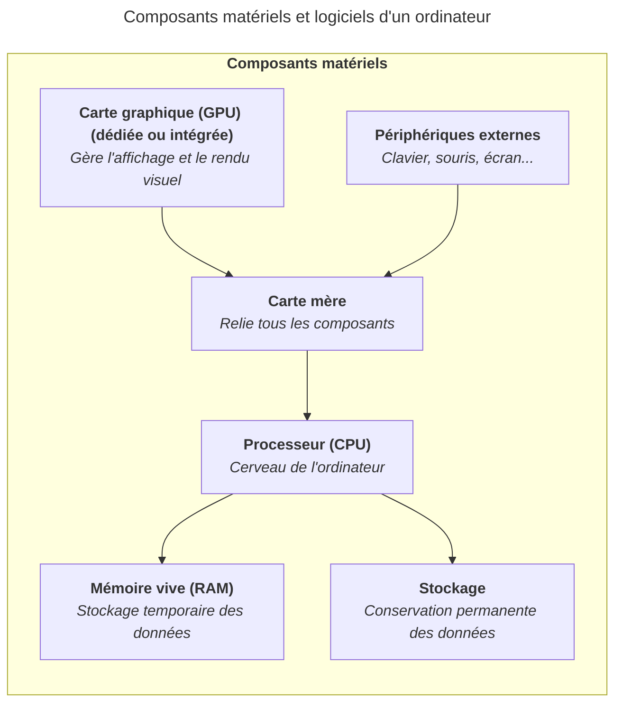

Les périphériques externes sont des dispositifs matériels qui se connectent à un
ordinateur pour étendre ses fonctionnalités. Ils peuvent être classés en deux
catégories principales : les périphériques d'entrée et les périphériques de
sortie.

## Périphériques d'entrée

Les périphériques d'entrée permettent de transmettre des informations à
l'ordinateur :

- Le clavier, pour saisir du texte et des commandes.
- La souris ou le pavé tactile (trackpad), pour naviguer et interagir avec
  l'interface.
- Le microphone, pour capter le son.
- La webcam, pour capter des images vidéo.
- Le scanner, pour numériser des documents.

## Périphériques de sortie

Les périphériques de sortie permettent à l'ordinateur de restituer des
informations :

- L'écran (moniteur), pour afficher l'interface et le contenu visuel.
- Les haut-parleurs ou le casque audio, pour restituer le son.
- L'imprimante, pour produire des documents sur papier.

## Connectique

Les périphériques se connectent à l'ordinateur via différents types de ports :

- USB (Universal Serial Bus) : le port le plus courant, disponible en plusieurs
  formats (USB-A, USB-C, micro-USB).
- HDMI et DisplayPort : pour connecter des écrans et des projecteurs.
- Jack audio 3.5 mm : pour les casques et les haut-parleurs.
- Bluetooth et Wi-Fi : pour les connexions sans fil (clavier, souris,
  casque...).
- PCIe : pour les cartes d'extension internes, comme les cartes graphiques ou
  les cartes réseau qui viennent se brancher directement sur la carte mère.

## Résumé

Les périphériques externes sont essentiels pour interagir avec un ordinateur.

Consultez la page
[Votre ordinateur, un outil de travail](/heig-vd-upinfo-course/02-premiers-pas-a-la-heig-vd/05-votre-ordinateur-un-outil-de-travail)
pour découvrir les périphériques externes recommandés pour un usage quotidien et
professionnel.

