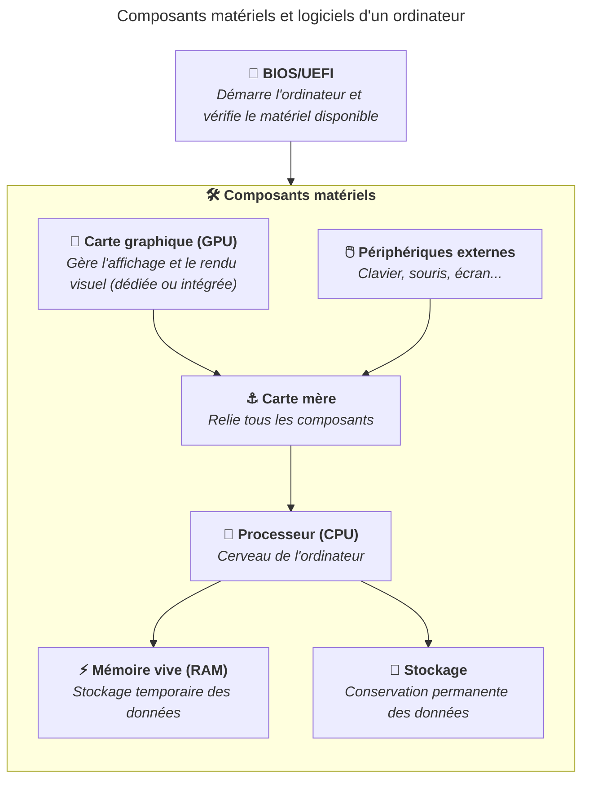

Le BIOS (Basic Input/Output System) et son successeur l'UEFI (Unified Extensible
Firmware Interface) sont des logiciels intégrés directement dans la carte mère.
Ils constituent le premier programme exécuté lorsque l'ordinateur est mis sous
tension.

Leur rôle principal est de vérifier que les composants matériels fonctionnent
correctement, puis de lancer le système d'exploitation installé sur le disque de
stockage.

Le BIOS/UEFI peut être considéré comme un composant matériel et logiciel, car il
est stocké directement sur la carte mère mais fonctionne comme un logiciel qui
interagit avec le matériel.

## Séquence de démarrage (boot)

Lorsque l'ordinateur démarre, il suit une séquence précise :

1. Le BIOS/UEFI s'exécute et effectue un test rapide des composants (appelé
   POST - Power-On Self Test). Il vérifie que le processeur, la mémoire, la
   carte graphique et les autres composants essentiels sont disponibles et
   fonctionnent correctement (dans la limite de ses capacités). Si une erreur
   survient, le BIOS/UEFI peut émettre des bips sonores ou afficher un message
   d'erreur à l'écran pour indiquer le problème.
2. Il recherche un périphérique de démarrage (disque dur, SSD, clé USB...) selon
   un ordre configurable.
3. Il lance le chargeur d'amorçage (bootloader), qui à son tour charge le
   système d'exploitation.

## Différences entre BIOS et UEFI

Le BIOS est l'ancienne technologie, présente sur les ordinateurs depuis les
années 1980. L'UEFI est son successeur moderne, introduit progressivement à
partir des années 2010. Aujourd'hui, tous les ordinateurs récents utilisent
l'UEFI.

Les principales améliorations apportées par l'UEFI sont :

- Une interface graphique plus conviviale (parfois avec support de la souris).
- La prise en charge de disques de grande capacité (au-delà de 2 To).
- Un démarrage plus rapide.
- Des mécanismes de sécurité renforcés (Secure Boot).

## Accéder au BIOS/UEFI

Pour accéder au BIOS/UEFI, il faut généralement appuyer sur une touche
spécifique lors du démarrage de l'ordinateur. Les touches les plus courantes
sont `F2`, `F10`, `Del` ou `Esc`. Le message indiquant la touche à presser
s'affiche souvent à l'écran au moment du démarrage.

## Paramétrer le BIOS/UEFI

Le BIOS/UEFI permet de configurer divers paramètres matériels, tels que l'ordre
de démarrage, la fréquence de la mémoire, les options de sécurité et bien plus
encore. Il est important de manipuler ces paramètres avec précaution, car des
modifications incorrectes peuvent empêcher l'ordinateur de démarrer
correctement. A l'inverse, certaines options permettent d'optimiser les
performances ou de résoudre des problèmes matériels qu'il est nécessaire de
connaître pour un usage avancé de l'ordinateur.

## Résumé

Le BIOS/UEFI est le logiciel de base qui initialise le matériel de l'ordinateur
et lance le système d'exploitation. L'UEFI est la version moderne du BIOS,
offrant des fonctionnalités avancées et une meilleure compatibilité avec les
systèmes récents.

## À vous de jouer !

### Exercice pratique 1 - Accéder au BIOS/UEFI

Identifiez la touche à presser pour accéder au BIOS/UEFI de votre ordinateur.
Redémarrez votre ordinateur et appuyez sur cette touche pour entrer dans le
BIOS/UEFI. Explorez les différentes options disponibles, mais soyez prudent et
évitez de modifier des paramètres si vous n'êtes pas sûr·e de leur fonction.

### Exercice pratique 2 - Activer les options de virtualisation

Les options de virtualisation permettent à l'ordinateur d'exécuter des machines
virtuelles plus efficacement. Pour activer cette fonctionnalité, il faut
généralement accéder au BIOS/UEFI et chercher une option nommée "Intel VT-x",
"AMD-V" ou similaire, puis la mettre sur "Enabled".

### Exercice pratique 3 - Changer l'ordre de démarrage

L'ordre de démarrage détermine quel périphérique l'ordinateur essaie de démarrer
en premier. Cela peut être utile pour démarrer à partir d'une clé USB ou d'un
disque externe. Pour modifier l'ordre de démarrage, il faut accéder au BIOS/UEFI
et chercher une section nommée "Boot" ou "Boot Order", puis réorganiser les
périphériques selon vos besoins.

### Exercice pratique 4 - Limiter la charge de la batterie sur les ordinateurs portables

Certains ordinateurs portables permettent de limiter la charge de la batterie
pour prolonger sa durée de vie. Cette option se trouve généralement dans le
BIOS/UEFI sous une section nommée "Battery" ou "Power Management".

Vous pouvez définir un seuil de charge, par exemple 80%, pour éviter de charger
la batterie à 100% en permanence, ce qui peut réduire sa capacité au fil du
temps.

Si vous utilisez votre ordinateur portable principalement branché sur secteur,
il est recommandé d'activer cette option pour préserver la santé de la batterie.

### Exercice pratique 5 - Limiter l'accès au BIOS/UEFI avec un mot de passe

Toute personne qui a accès au BIOS/UEFI peut modifier les paramètres de
l'ordinateur, ce qui peut poser des problèmes de sécurité, comme le démarrage
sur un périphérique externe pour contourner le système d'exploitation installé.

Il est donc recommandé de définir un mot de passe pour protéger l'accès au
BIOS/UEFI. Cette option se trouve généralement dans la section "Security" ou
"Password" du BIOS/UEFI. Il est important de choisir un mot de passe fort et de
le stocker dans votre
[gestionnaire de mots de passe](/heig-vd-upinfo-course/02-premiers-pas-a-la-heig-vd/07-installer-et-configurer-un-gestionnaire-de-mots-de-passe),
car si vous l'oubliez, vous pourriez être bloqué·e hors du BIOS/UEFI et perdre
l'accès à certaines fonctionnalités de votre ordinateur.
