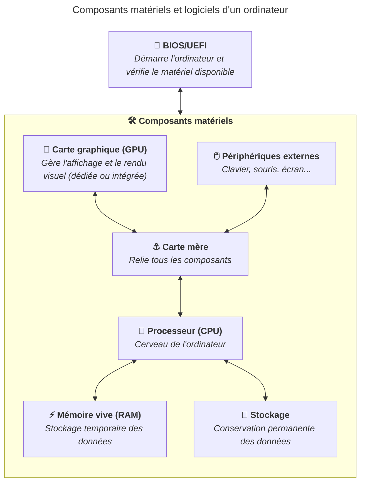

import { Aside } from "@astrojs/starlight/components";

Le BIOS (Basic Input/Output System) et son successeur l'UEFI (Unified Extensible
Firmware Interface) sont des logiciels intégrés directement dans la carte mère.
Ils constituent le premier programme exécuté lorsque l'ordinateur est mis sous
tension.

Leur rôle principal est de vérifier que les composants matériels fonctionnent
correctement, puis de lancer le système d'exploitation installé sur le disque de
stockage.

Le BIOS/UEFI peut être considéré comme un composant matériel et logiciel, car il
est stocké directement sur la carte mère mais fonctionne comme un logiciel qui
interagit avec le matériel.

## Séquence de démarrage (boot)

Lorsque l'ordinateur démarre, il suit une séquence précise :

1. Le BIOS/UEFI s'exécute et effectue un test rapide des composants (appelé
   POST - Power-On Self Test). Il vérifie que le processeur, la mémoire, la
   carte graphique et les autres composants essentiels sont disponibles et
   fonctionnent correctement (dans la limite de ses capacités). Si une erreur
   survient, le BIOS/UEFI peut émettre des bips sonores ou afficher un message
   d'erreur à l'écran pour indiquer le problème.
2. Il recherche un périphérique de démarrage (disque dur, SSD, clé USB...) selon
   un ordre configurable.
3. Il lance le chargeur d'amorçage (bootloader), qui à son tour charge le
   système d'exploitation.

## Différences entre BIOS et UEFI

Le BIOS est l'ancienne technologie, présente sur les ordinateurs depuis les
années 1980. L'UEFI est son successeur moderne, introduit progressivement à
partir des années 2010. Aujourd'hui, tous les ordinateurs récents utilisent
l'UEFI.

Les principales améliorations apportées par l'UEFI sont :

- Une interface graphique plus conviviale (parfois avec support de la souris).
- La prise en charge de disques de grande capacité (au-delà de 2 To).
- Un démarrage plus rapide.
- Des mécanismes de sécurité renforcés (Secure Boot).

## Accéder au BIOS/UEFI

Pour accéder au BIOS/UEFI, il faut généralement appuyer sur une touche
spécifique lors du démarrage de l'ordinateur. Les touches les plus courantes
sont `F2`, `F10`, `Del` ou `Esc`. Le message indiquant la touche à presser
s'affiche souvent à l'écran au moment du démarrage.

Sur macOS, l'accès au BIOS/UEFI dépend de l'architecture du Mac. Sur les Mac
Intel, il faut maintenir la touche `Option` (ou `Alt`) enfoncée au démarrage
pour accéder au menu de démarrage. Sur les Mac Apple Silicon, il faut maintenir
le bouton d'alimentation enfoncé jusqu'à ce que les options de démarrage
apparaissent (source :
[Apple Support](https://support.apple.com/en-us/guide/security/sec10869885b/web)).

## Paramétrer le BIOS/UEFI

Le BIOS/UEFI permet de configurer divers paramètres matériels, tels que l'ordre
de démarrage, la fréquence de la mémoire, les options de sécurité et bien plus
encore. Il est important de manipuler ces paramètres avec précaution, car des
modifications incorrectes peuvent empêcher l'ordinateur de démarrer
correctement. A l'inverse, certaines options permettent d'optimiser les
performances ou de résoudre des problèmes matériels qu'il est nécessaire de
connaître pour un usage avancé de l'ordinateur.

## Mettre à jour le BIOS/UEFI

Les fabricants de cartes mères publient parfois des mises à jour du BIOS/UEFI
pour corriger des bugs, améliorer la compatibilité avec de nouveaux composants
ou ajouter de nouvelles fonctionnalités.

Il est possible de mettre à jour le BIOS/UEFI en téléchargeant le fichier de
mise à jour depuis le site du fabricant et en suivant les instructions fournies.
Cependant, cette opération comporte des risques : une mise à jour incorrecte
peut rendre l'ordinateur inutilisable. Il est donc recommandé de ne mettre à
jour le BIOS/UEFI que si cela est nécessaire (par exemple pour résoudre un
problème spécifique ou pour ajouter la compatibilité avec un nouveau matériel).

## Résumé

Le BIOS/UEFI est le logiciel de base qui initialise le matériel de l'ordinateur
et lance le système d'exploitation. L'UEFI est la version moderne du BIOS,
offrant des fonctionnalités avancées et une meilleure compatibilité avec les
systèmes récents.

```mermaid
---
title: Composants matériels et logiciels d'un ordinateur
---
flowchart
  CPU["`
    **🧠 Processeur (CPU)**
    _Cerveau de l'ordinateur_
  `"]
  RAM["`
    **⚡ Mémoire vive (RAM)**
    _Stockage temporaire des données_
  `"]
  Storage["`
    **💾 Stockage**
    _Conservation permanente des données_
  `"]
  Motherboard["`
    **⚓ Carte mère**
    _Relie tous les composants_
  `"]
  GPU["`
    **🎨 Carte graphique (GPU)**
    _Gère l'affichage et le rendu visuel (dédiée ou intégrée)_
  `"]
  Peripherals["`
    **🖱️ Périphériques externes**
    _Clavier, souris, écran..._
  `"]
  BIOS_UEFI["`
    **🔗 BIOS/UEFI**
    _Démarre l'ordinateur et vérifie le matériel disponible_
  `"]

  subgraph Hardware["`**🛠️ Composants matériels**`"]
    direction TB

    CPU <--> RAM
    CPU <--> Storage
    Motherboard <--> CPU
    GPU <--> Motherboard
    Peripherals <--> Motherboard
  end

  BIOS_UEFI <--> Hardware
```

## À vous de jouer !

<Aside type="tip">

Ces exercices sont là pour vous aider. Bien qu'ils ne soient pas notés, il est
fortement recommandé de les réaliser pour vous familiariser avec l'environnement
de la HEIG-VD.

Si vous avez des questions ou des difficultés, n'hésitez pas à demander de
l'aide au corps enseignant.

</Aside>

### Exercice pratique 1 - Accéder au BIOS/UEFI

Identifiez la touche à presser pour accéder au BIOS/UEFI de votre ordinateur.
Redémarrez votre ordinateur et appuyez sur cette touche pour entrer dans le
BIOS/UEFI. Explorez les différentes options disponibles, mais soyez prudent et
évitez de modifier des paramètres si vous n'êtes pas sûr·e de leur fonction.

### Exercice pratique 2 - Identifier la version du BIOS/UEFI

Identifiez la version du BIOS/UEFI de votre ordinateur. Cette information est
généralement affichée sur l'écran principal du BIOS/UEFI ou dans une section
nommée "Information système" ou "System Information". Notez cette version pour
référence future, surtout si vous envisagez de mettre à jour le BIOS/UEFI ou de
résoudre des problèmes matériels.

**Note** : si votre ordinateur ne rencontre pas de problème particulier, il
n'est pas nécessaire de mettre à jour le BIOS/UEFI.

### Exercice pratique 3 - Activer les options de virtualisation

Les options de virtualisation permettent à l'ordinateur d'exécuter des machines
virtuelles plus efficacement. Pour activer cette fonctionnalité, il faut
généralement accéder au BIOS/UEFI et chercher une option nommée "Intel VT-x",
"AMD-V" ou similaire, puis la mettre sur "Enabled".

### Exercice pratique 4 - Limiter la charge de la batterie sur les ordinateurs portables

Certains ordinateurs portables permettent de limiter la charge de la batterie
pour prolonger sa durée de vie. Cette option se trouve généralement dans le
BIOS/UEFI sous une section nommée "Battery" ou "Power Management".

Vous pouvez définir un seuil de charge, par exemple 80%, pour éviter de charger
la batterie à 100% en permanence, ce qui peut réduire sa capacité au fil du
temps.

Si vous utilisez votre ordinateur portable principalement branché sur secteur,
il est recommandé d'activer cette option pour préserver la santé de la batterie.

### Exercice pratique 5 - Limiter l'accès au BIOS/UEFI avec un mot de passe

Toute personne qui a accès au BIOS/UEFI peut modifier les paramètres de
l'ordinateur, ce qui peut poser des problèmes de sécurité, comme le démarrage
sur un périphérique externe pour contourner le système d'exploitation installé.

Il est donc recommandé de définir un mot de passe pour protéger l'accès au
BIOS/UEFI. Cette option se trouve généralement dans la section "Security" ou
"Password" du BIOS/UEFI. Il est important de choisir un mot de passe fort et de
le stocker dans votre
[gestionnaire de mots de passe](/heig-vd-upinfo-course/02-premiers-pas-a-la-heig-vd/07-installer-et-configurer-un-gestionnaire-de-mots-de-passe/),
car si vous l'oubliez, vous pourriez être bloqué·e hors du BIOS/UEFI et perdre
l'accès à certaines fonctionnalités de votre ordinateur.
