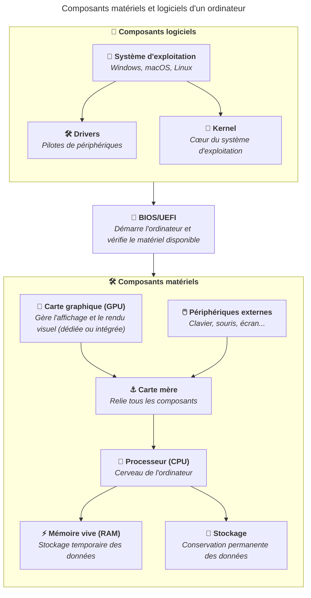

import { Aside } from "@astrojs/starlight/components";

Un système d'exploitation est composé de plusieurs éléments logiciels, dont les
**drivers** et le **kernel**. Ces composants sont essentiels pour assurer la
communication entre le matériel et le logiciel.

## Drivers

Les drivers, ou pilotes de périphériques, sont des programmes qui permettent au
système d'exploitation de communiquer avec le matériel de l'ordinateur. Chaque
composant matériel, comme la carte graphique, la carte réseau ou l'imprimante,
nécessite un driver spécifique pour fonctionner correctement.

Le système d'exploitation embarque généralement un ensemble de drivers pour les
composants matériels les plus courants. Cependant, il peut être nécessaire
d'installer des drivers supplémentaires pour certains périphériques ou pour
bénéficier de fonctionnalités avancées.

Ces aspects de drivers sont particulièrement importants pour le système
d'exploitation Windows, qui nécessite souvent l'installation de drivers
spécifiques pour certains périphériques comme les cartes graphiques ou les
imprimantes.

## Kernel

Le kernel, ou noyau, est le cœur du système d'exploitation. Il gère les
ressources du système, coordonne les activités des différents composants et
fournit une interface entre le matériel et les logiciels. Le kernel est
responsable de la gestion de la mémoire, du planificateur de processus, du
système de fichiers et de la sécurité.

Sur Linux, le kernel fournit également une interface pour les drivers,
permettant aux développeur·euses de créer des pilotes pour différents
périphériques.

Ainsi, le kernel et les drivers travaillent ensemble pour assurer le bon
fonctionnement du système d'exploitation et la communication entre le matériel
et les logiciels. Il est donc plus rare de devoir installer des drivers sur
Linux, car le kernel intègre déjà de nombreux pilotes pour les périphériques
courants.

Les distributions Linux combinent ce noyau avec des logiciels et des outils pour
créer un système complet.

## Résumé

Les drivers et le kernel sont des composants essentiels d'un système
d'exploitation. Les drivers permettent la communication entre le système
d'exploitation et le matériel, tandis que le kernel gère les ressources du
système et fournit une interface entre le matériel et les logiciels.

