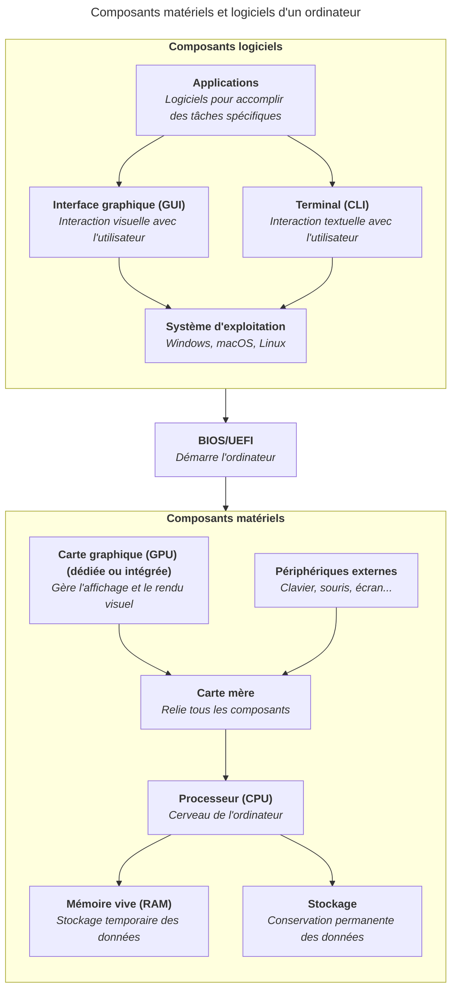

import { Aside } from "@astrojs/starlight/components";

<Aside type="caution">
	Ce contenu est encore en cours de rédaction. Il est amené à évoluer tout
	prochainement. Merci de revenir plus tard.
</Aside>

Une application (ou logiciel) est un programme qui permet à l'utilisateur·trice
d'effectuer des tâches précises : rédiger un document, naviguer sur internet,
écouter de la musique, développer du code, etc.

## Types d'applications

Il existe plusieurs types d'applications :

- Les applications natives sont installées directement sur l'ordinateur et
  s'exécutent via le système d'exploitation (ex. : un éditeur de texte, un
  lecteur multimédia).
- Les applications web s'exécutent dans un navigateur internet et ne nécessitent
  pas d'installation (ex. : Gmail, Google Docs).
- Les applications mobiles sont conçues pour smartphones et tablettes (iOS et
  Android).

## Installer et désinstaller des applications

Sur les systèmes d'exploitation modernes, les applications s'installent
généralement via :

- Un installateur téléchargé depuis le site officiel de l'éditeur.
- Une boutique d'applications (Microsoft Store, Mac App Store).
- Un gestionnaire de paquets en ligne de commande (pour Linux ou les
  environnements de développement).

Il est important de toujours télécharger les applications depuis des sources
officielles pour éviter les logiciels malveillants.

## Comment créer une application ?

Pour créer une application, il est nécessaire de connaître un langage de
programmation et d'utiliser un environnement de développement adapté. Le
processus de création d'une application comprend généralement les étapes
suivantes :

1. Définir les fonctionnalités et l'interface utilisateur.
2. Écrire le code source en utilisant un langage de programmation.
3. Compiler ou interpréter le code pour le rendre exécutable sur l'ordinateur.

### Langages de programmation

Comme vu dans le contenu
[Processeur (CPU)](/heig-vd-upinfo-course/03-composants-materiels-et-logiciels-dun-ordinateur/02-processeur-cpu),
le processeur ne comprend que le langage machine, constitué de 0 et de 1. Les
langages de programmation permettent aux développeur·euses d'écrire du code plus
compréhensible pour les humains.

Un langage de programmation est un ensemble de règles et de syntaxe qui permet
de créer des programmes informatiques. Il existe de nombreux langages de
programmation, chacun ayant ses propres caractéristiques et usages. Parmi les
langages les plus populaires, on peut citer Python, JavaScript, Java, C++, et
bien d'autres. Chaque langage a ses avantages et ses inconvénients, et le choix
du langage dépend souvent du type d'application que l'on souhaite développer et
des préférences de la personne qui développe.

### Compilateurs et interpréteurs

Le langage de programmation est ensuite traduit en langage machine
compréhensible par le processeur grâce à un compilateur ou un interpréteur. Le
compilateur prend le code source écrit dans le langage de programmation et le
transforme en un fichier exécutable, tandis que l'interpréteur exécute
directement le code source ligne par ligne.

Nous verrons plus en détail les langages de programmation et les outils de
développement dans le contenu
[Travailler avec le terminal](/heig-vd-upinfo-course/08-travailler-avec-le-terminal/01-introduction-et-ressources).

## Logiciels libres vs logiciels propriétaires

Lorsque vous choisissez une application, il est important de connaître la
différence entre les logiciels libres et les logiciels propriétaires :

- Un logiciel propriétaire est développé par une entreprise qui en contrôle le
  code source. Son utilisation est soumise à une licence et peut être payante
  (ex. : Microsoft Office, Adobe Photoshop).
- Un logiciel libre (open source) met son code source à disposition de toutes et
  tous. N'importe quelle personne peut l'étudier, le modifier et le redistribuer
  (ex. : LibreOffice, VLC, Firefox).

Dans une démarche de sobriété numérique et d'ouverture, les logiciels libres
sont souvent à privilégier lorsqu'ils répondent aux besoins.

## Résumé

Une application est un programme qui permet d'effectuer des tâches spécifiques
sur un ordinateur. Les applications peuvent être natives, web ou mobiles. Elles
sont créées à l'aide de langages de programmation et traduites en langage
machine pour être exécutées par le processeur.

