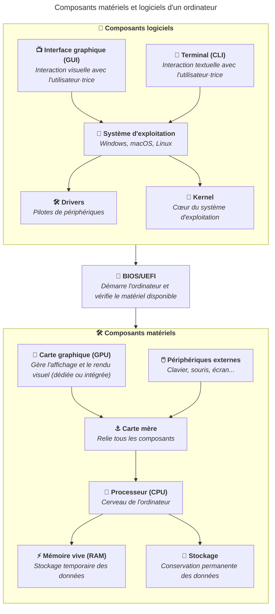

Nous sommes habitué·es à utiliser des ordinateurs avec une interface graphique
(des fenêtres, des icônes, des menus). C'est l'interface que la plupart des
personnes utilisent au quotidien (un peu comme un smartphone ou une tablette).

Néanmoins, pendant très longtemps, les ordinateurs étaient uniquement
accessibles via un terminal (un écran noir et vert avec un curseur qui clignote,
comme dans les films).

Même aujourd'hui, les deux interfaces coexistent : l'interface graphique (GUI)
et le terminal (CLI). Chacune a ses avantages et ses inconvénients, et il est
important de savoir quand utiliser l'une ou l'autre.

## Interface graphique (GUI)

L'interface graphique, ou GUI (Graphical User Interface), est le mode
d'interaction visuel avec l'ordinateur : fenêtres, boutons, icônes, menus. C'est
l'interface que la plupart des personnes utilisent au quotidien.

Elle est intuitive et ne nécessite pas de mémoriser des commandes : il suffit de
cliquer, glisser ou appuyer sur des touches pour interagir avec les
applications.

Bien que conviviale, l'interface graphique peut être moins efficace pour
certaines tâches, notamment celles qui nécessitent de répéter des actions ou de
configurer finement le système. C'est là que le terminal peut s'avérer plus
puissant.

## Terminal (CLI)

Le terminal, aussi appelé interface en ligne de commande (Command Line Interface
(CLI)), permet d'interagir avec l'ordinateur en saisissant des commandes
textuelles. Il n'y a pas de souris, uniquement du texte.

Malgré son apparence austère, le terminal est un outil très puissant et
efficace. Il permet d'automatiser des tâches, de configurer finement son
système, de travailler sur des serveurs distants et d'utiliser de nombreux
outils de développement.

Pour les personnes qui débutent, le terminal peut sembler intimidant. Cependant,
avec un peu de pratique, il devient un outil incontournable pour les
développeur·euses et les administrateur·trices système. Il est souvent beaucoup
efficace et fiable que l'interface graphique pour certaines tâches, notamment
celles liées à la programmation, à l'administration système et à
l'automatisation.

## Quand utiliser l'un ou l'autre ?

Il n'y a pas de règle stricte, mais voici quelques indications :

- L'interface graphique est idéale pour les tâches du quotidien : navigation
  web, traitement de texte, édition de photos.
- Le terminal est préférable pour les tâches techniques et répétitives :
  développement, administration système, automatisation.

Dans le cadre de vos études, vous serez amené·e à utiliser les deux. Le terminal
sera abordé en détail dans le contenu
[Travailler avec le terminal](/heig-vd-upinfo-course/08-travailler-avec-le-terminal/01-introduction-et-ressources).

Lorsque nous sommes habitué·es à l'interface graphique, il peut être difficile
de se familiariser avec le terminal. Cependant, il est important de comprendre
que le terminal est un outil puissant et efficace. Il est donc recommandé de se
familiariser avec les deux interfaces pour devenir un·e utilisateur·trice
compétent·e et polyvalent·e.

## Résumé

L'interface graphique (GUI) et le terminal (CLI) sont deux modes d'interaction
avec l'ordinateur. L'interface graphique est conviviale et intuitive, tandis que
le terminal est puissant et efficace pour les tâches techniques.

