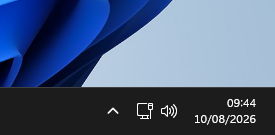
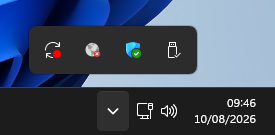
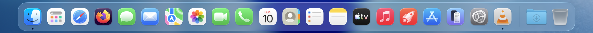
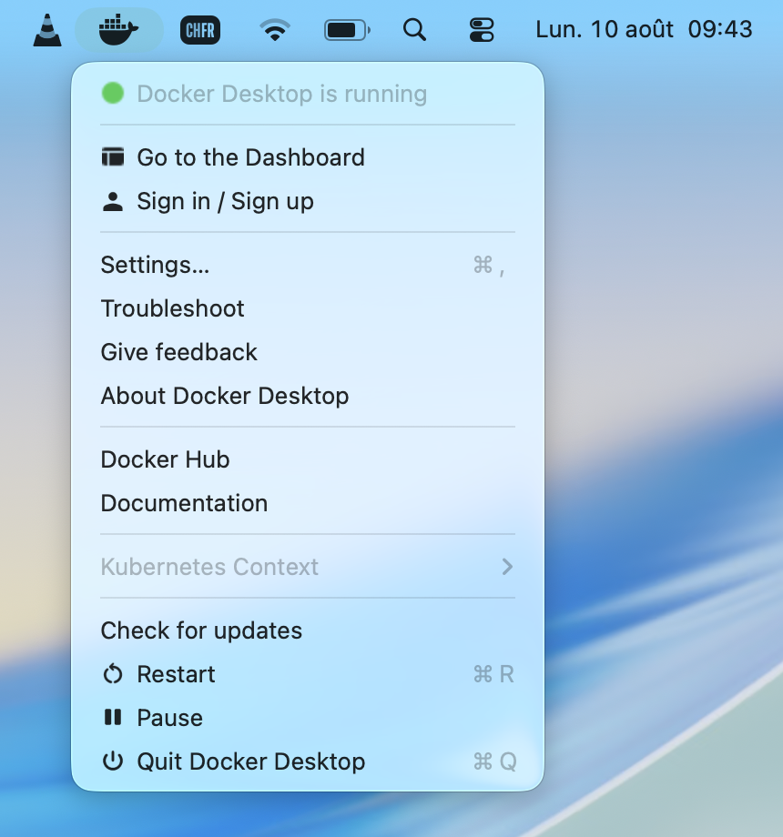
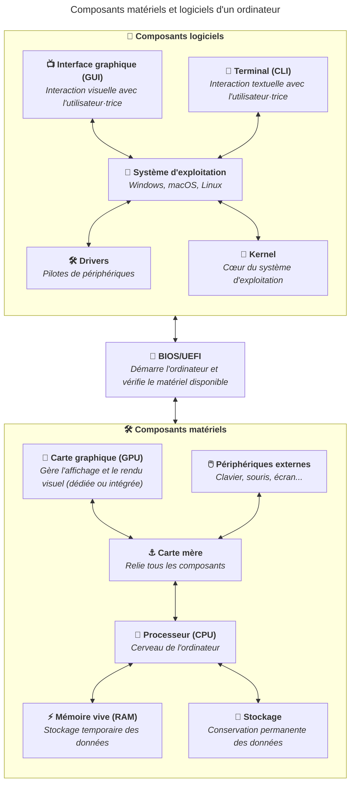

import { Aside, TabItem, Tabs } from "@astrojs/starlight/components";

Nous sommes habitué·es à utiliser des ordinateurs avec une interface graphique
(des fenêtres, des icônes, des menus). C'est l'interface que la plupart des
personnes utilisent au quotidien (un peu comme un smartphone ou une tablette).

Néanmoins, pendant très longtemps, les ordinateurs étaient uniquement
accessibles via un terminal (un écran noir et vert avec un curseur qui clignote,
comme dans les films).

Même aujourd'hui, les deux interfaces coexistent : l'interface graphique (GUI)
et le terminal (CLI). Chacune a ses avantages et ses inconvénients, et il est
important de savoir quand utiliser l'une ou l'autre.

## Interface graphique (GUI)

L'interface graphique, ou GUI (Graphical User Interface), est le mode
d'interaction visuel avec l'ordinateur : fenêtres, boutons, icônes, menus. C'est
l'interface que la plupart des personnes utilisent au quotidien.

Elle est intuitive et ne nécessite pas de mémoriser des commandes : il suffit de
cliquer, glisser ou appuyer sur des touches pour interagir avec les
applications.

Bien que conviviale, l'interface graphique peut être moins efficace pour
certaines tâches, notamment celles qui nécessitent de répéter des actions ou de
configurer finement le système. C'est là que le terminal peut s'avérer plus
puissant.

## Terminal (CLI)

Le terminal, aussi appelé interface en ligne de commande (Command Line Interface
(CLI)), permet d'interagir avec l'ordinateur en saisissant des commandes
textuelles. Il n'y a pas de souris, uniquement du texte.

Malgré son apparence austère, le terminal est un outil très puissant et
efficace. Il permet d'automatiser des tâches, de configurer finement son
système, de travailler sur des serveurs distants et d'utiliser de nombreux
outils de développement.

Pour les personnes qui débutent, le terminal peut sembler intimidant. Cependant,
avec un peu de pratique, il devient un outil incontournable pour les
développeur·euses et les administrateur·trices système. Il est souvent beaucoup
plus efficace et fiable que l'interface graphique pour certaines tâches,
notamment celles liées à la programmation, à l'administration système et à
l'automatisation.

## Quand utiliser l'un ou l'autre ?

Il n'y a pas de règle stricte, mais voici quelques indications :

- L'interface graphique est idéale pour les tâches du quotidien : navigation
  web, traitement de texte, édition de photos.
- Le terminal est préférable pour les tâches techniques et répétitives :
  développement, administration système, automatisation.

Dans le cadre de vos études, vous serez amené·e à utiliser les deux. Le terminal
sera abordé en détail dans le contenu
[Travailler avec le terminal](/heig-vd-upinfo-course/08-travailler-avec-le-terminal/01-introduction-et-ressources/).

Lorsque nous sommes habitué·es à l'interface graphique, il peut être difficile
de se familiariser avec le terminal. Cependant, il est important de comprendre
que le terminal est un outil puissant et efficace. Il est donc recommandé de se
familiariser avec les deux interfaces pour devenir un·e utilisateur·trice
compétent·e et polyvalent·e.

## Zones principales de l'interface graphique

L'interface graphique dispose de zones dédiées qui affichent en un coup d'œil
les applications ouvertes ou actives. Ce sont aussi les endroits où se cachent
les applications qui tournent en **arrière-plan**, c'est-à-dire sans fenêtre
visible à l'écran.

<Tabs syncKey="operating-system">
<TabItem label="Windows" icon="seti:windows">

### Windows

Sur **Windows**, la **barre des tâches** (en bas de l'écran) affiche les
applications ouvertes et épinglées. À droite se trouve la **zone de
notification** (aussi appelée _system tray_) avec les icônes système et les
applications en arrière-plan. Certaines de ces icônes sont **masquées** et
regroupées derrière un chevron `^`.

Pour afficher les icônes masquées, cliquez sur le **chevron `^`** situé à gauche
de la zone de notification. Un panneau s'ouvre alors avec les applications qui
tournent en arrière-plan mais dont l'icône n'est pas affichée en permanence.

Vous pouvez personnaliser les icônes affichées en permanence via
**Paramètres** > **Personnalisation** > **Barre des tâches** > **Autres icônes
de la barre d'état système**.

Pour voir précisément ce qui s'exécute et, au besoin, arrêter une application,
ouvrez le **Gestionnaire des tâches** (`Ctrl+Shift+Esc`). L'onglet **Processus**
liste les applications et les processus en cours d'exécution, y compris ceux en
arrière-plan.

</TabItem>
<TabItem label="macOS" icon="apple">

### macOS

Sur **macOS**, la **barre des menus** (en haut de l'écran) contient les menus de
l'application active à gauche et, à droite, des **icônes de statut** (le _menu
extras_ : Wi-Fi, batterie, volume, ainsi que des applications en arrière-plan).
Le **Dock** (en bas de l'écran) affiche les applications épinglées et ouvertes ;
un **point** sous une icône indique que l'application est en cours d'exécution.

Les applications en arrière-plan ajoutent souvent une **icône de statut** dans
la partie droite de la barre des menus. Cliquez sur ces icônes pour accéder aux
options de l'application correspondante.

Pour retrouver ou fermer une application qui ne répond plus, utilisez **Forcer à
quitter** (`Cmd+Option+Esc`). Pour une vue détaillée de toutes les applications
et de leur consommation de ressources, ouvrez le **Moniteur d'activité** (dans
_Applications_ > _Utilitaires_).

</TabItem>
<TabItem label="Linux" icon="linux">

### Linux

L'emplacement des icônes d'arrière-plan dépend de votre environnement de bureau
: la barre supérieure sous GNOME, ou la zone d'état de la barre des tâches sous
KDE Plasma. Certaines applications peuvent nécessiter une extension pour
afficher leur icône de statut.

Pour voir les applications et processus en cours, ouvrez le **moniteur système**
de votre environnement (par exemple _Moniteur système_ sous GNOME).

</TabItem>
</Tabs>

<Aside type="tip">

Si une application que vous pensiez avoir fermée continue d'apparaître dans ces
zones, elle est peut-être configurée pour se lancer automatiquement. Consultez
la page
[Applications au démarrage](/heig-vd-upinfo-course/05-configurer-son-systeme-dexploitation-et-ses-applications/09-applications-au-demarrage/)
pour contrôler ce qui démarre avec votre système.

</Aside>

## Résumé

L'interface graphique (GUI) et le terminal (CLI) sont deux modes d'interaction
avec l'ordinateur. L'interface graphique est conviviale et intuitive, tandis que
le terminal est puissant et efficace pour les tâches techniques.

```mermaid
---
title: Composants matériels et logiciels d'un ordinateur
---
flowchart
  CPU["`
    **🧠 Processeur (CPU)**
    _Cerveau de l'ordinateur_
  `"]
  RAM["`
    **⚡ Mémoire vive (RAM)**
    _Stockage temporaire des données_
  `"]
  Storage["`
    **💾 Stockage**
    _Conservation permanente des données_
  `"]
  Motherboard["`
    **⚓ Carte mère**
    _Relie tous les composants_
  `"]
  GPU["`
    **🎨 Carte graphique (GPU)**
    _Gère l'affichage et le rendu visuel (dédiée ou intégrée)_
  `"]
  Peripherals["`
    **🖱️ Périphériques externes**
    _Clavier, souris, écran..._
  `"]
  BIOS_UEFI["`
    **🔗 BIOS/UEFI**
    _Démarre l'ordinateur et vérifie le matériel disponible_
  `"]
  OS["`
    **🐧 Système d'exploitation**
    _Windows, macOS, Linux_
  `"]
  Drivers["`
    **🛠️ Drivers**
    _Pilotes de périphériques_
  `"]
  Kernel["`
    **🧩 Kernel**
    _Cœur du système d'exploitation_
  `"]
  GUI["`
    **📺 Interface graphique (GUI)**
    _Interaction visuelle avec l'utilisateur·trice_
  `"]
  CLI["`
    **📜 Terminal (CLI)**
    _Interaction textuelle avec l'utilisateur·trice_
  `"]

  subgraph Software["`**🔢 Composants logiciels**`"]
    direction TB

    OS <--> Drivers

    OS <--> Kernel

    GUI <--> OS
    CLI <--> OS
  end

  subgraph Hardware["`**🛠️ Composants matériels**`"]
    direction TB

    CPU <--> RAM
    CPU <--> Storage
    Motherboard <--> CPU
    GPU <--> Motherboard
    Peripherals <--> Motherboard
  end

  Software <--> BIOS_UEFI <--> Hardware
```

## À vous de jouer !

<Aside type="tip">

Ces exercices sont là pour vous aider. Bien qu'ils ne soient pas notés, il est
fortement recommandé de les réaliser pour vous familiariser avec l'environnement
de la HEIG-VD.

Si vous avez des questions ou des difficultés, n'hésitez pas à demander de
l'aide au corps enseignant.

</Aside>

### Exercice pratique - Explorer votre barre des tâches ou barre des menus

1. Repérez la barre des tâches (Windows), la barre des menus et le Dock (macOS)
   sur votre ordinateur.
2. Affichez les icônes masquées (chevron `^` sur Windows) ou observez les icônes
   de statut de la barre des menus (macOS).
3. Identifiez au moins une application qui tourne en arrière-plan et retrouvez
   où la gérer (Gestionnaire des tâches sur Windows, Moniteur d'activité sur
   macOS).
