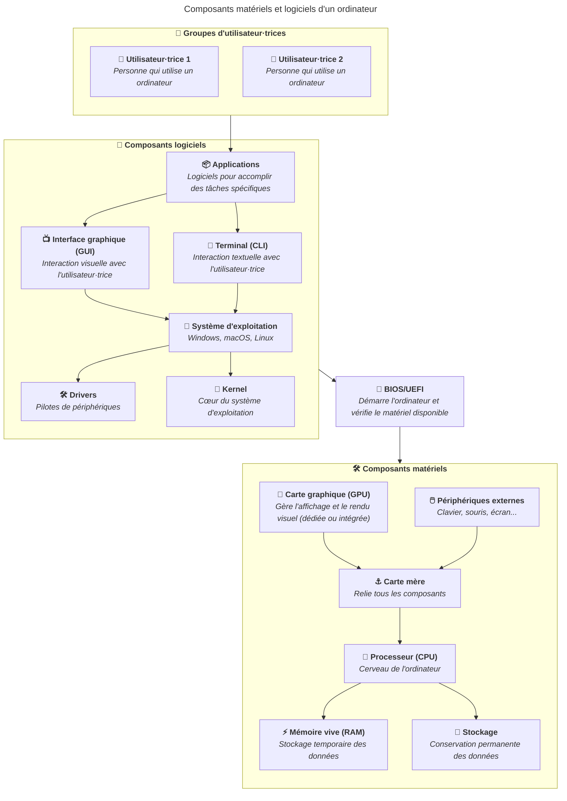

import { Aside, Steps } from "@astrojs/starlight/components";

Un·e utilisateur·trice est une personne qui utilise un ordinateur ou un système
informatique pour effectuer des tâches spécifiques.

Un système d'exploitation peut avoir plusieurs comptes d'utilisateur·trice,
chacun avec des privilèges différents.

Ces comptes peuvent être regroupés en groupes, qui permettent de gérer les
droits et permissions de plusieurs comptes d'utilisateur·trice en même temps.

## Comptes administrateurs par défaut

Lors de l'installation d'un système d'exploitation, un compte par défaut est
créé. Ce compte a des privilèges élevés (= il est capable de tout faire) et peut
effectuer des tâches telles que l'installation de logiciels, la modification des
paramètres système et la gestion des comptes d'utilisateur·trice.

Sur Windows, cet utilisateur est souvent appelé "Administrateur" et il s'agit
d'un compte caché par défaut.

Sur macOS et Linux, il est généralement appelé "root" ou
"superutilisateur·trice".

En parallèle, un compte d'utilisateur·trice standard est créé pour l'utilisation
quotidienne de l'ordinateur.

## Comptes standards supplémentaires

Lors de l'installation d'un système d'exploitation, un compte
d'utilisateur·trice standard est également créé.

**Sur Windows, ce compte a également des privilèges élevés**, signifiant qu'il
est, lui-aussi, capable d'effectuer des tâches administratives telles que
l'installation de logiciels et la modification des paramètres système.

Il est possible de créer un second compte d'utilisateur·trice standard pour
l'utilisation quotidienne de l'ordinateur. Ce compte a des privilèges limités et
ne peut pas effectuer certaines tâches administratives, telles que
l'installation de logiciels ou la modification des paramètres système.

Lorsque ce compte standard doit effectuer une tâche nécessitant des privilèges
élevés, il peut être invité à entrer le mot de passe du compte administrateur
pour autoriser l'action.

Ceci peut être une mesure de sécurité pour éviter que des logiciels malveillants
ou des personnes non autorisées n'apportent des modifications importantes au
système.

**Sur macOS et Linux, tout autre compte que root a des privilèges limités** et
ne peut pas effectuer certaines tâches administratives, telles que
l'installation de logiciels ou la modification des paramètres système.

Lorsque ce compte standard doit effectuer une tâche nécessitant des privilèges
élevés, il doit utiliser la commande `sudo` pour effectuer la tâche avec les
privilèges de root. La personne sera invitée à entrer le mot de passe du compte
pour autoriser l'action.

Il s'agit du comportement par défaut sur ces systèmes d'exploitation pour des
raisons de sécurité, afin de protéger le système contre les modifications non
autorisées.

C'est une des raisons pour lesquelles les systèmes UNIX (comme macOS et Linux)
sont considérés comme plus sécurisés que Windows, car ils limitent les actions
des utilisateur·trices standard par défaut et nécessitent une authentification
pour les actions administratives.

Un système d'exploitation peut avoir plusieurs comptes d'utilisateur·trice,
chacun avec des privilèges différents.

## Permissions

Sur un système d'exploitation, les permissions sont des règles qui déterminent
quels comptes ou groupes d'de peuvent accéder à des fichiers, des dossiers ou
des ressources spécifiques et quelles actions ils peuvent effectuer sur ces
éléments.

En effet, chaque fichier et dossier sur un système d'exploitation a des
permissions associées qui définissent qui peut lire, écrire ou exécuter ces
fichiers.

Ainsi, les permissions permettent de contrôler l'accès aux ressources du système
et de protéger les données contre les accès non autorisés.

Il est possible de changer les permissions d'un fichier ou d'un dossier pour
accorder ou restreindre l'accès à certains comptes ou groupes
d'utilisateur·trice.

Sur Windows, les permissions peuvent être modifiées via l'onglet "Sécurité" dans
les propriétés d'un fichier ou d'un dossier.

Sur macOS et Linux, les permissions peuvent être modifiées via le terminal en
utilisant des commandes telles que `chmod` et `chown`. Nous y reviendrons dans
le contenu
[Travailler avec le terminal](/heig-vd-upinfo-course/08-travailler-avec-le-terminal/01-introduction-et-ressources/).

<Aside type="caution">

Il est important de noter que les permissions sont appliquées au niveau du
système d'exploitation lorsqu'il est en cours d'exécution.

Ainsi, si une personne récupère le disque d'un ordinateur, elle peut accéder aux
fichiers et dossiers de ce disque, même si elle n'a pas les permissions
nécessaires sur le système d'exploitation.

Pour se protéger contre ce type d'accès non autorisé, il est recommandé de
chiffrer le disque. Le chiffrement protège les données en les rendant illisibles
sans la clé de déchiffrement appropriée.

Nous y reviendrons dans le contenu
[Chiffrer ses données](/heig-vd-upinfo-course/05-configurer-son-systeme-dexploitation-et-ses-applications/10-chiffrer-ses-donnees/).

</Aside>

## Mécanismes de sécurité supplémentaires

### Clic droit et "Exécuter en tant qu'administrateur" sur Windows

Il est possible d'exécuter un programme avec des privilèges élevés sur Windows
en faisant un clic droit sur le programme et en sélectionnant "Exécuter en tant
qu'administrateur".

### Contrôle de compte d'utilisateur (UAC) sur Windows

macOS et Linux disposent de mécanismes de sécurité par défaut qui limitent les
actions des comptes d'utilisateur·trice standard et nécessitent une
authentification pour les actions administratives. Ils sont ainsi considérés
comme plus sécurisés que Windows, qui permet aux comptes d'utilisateur·trice
standard d'effectuer certaines actions administratives par défaut.

Windows met à disposition un mécanisme de sécurité appelé **Contrôle de compte
d'utilisateur (UAC)**.

Introduit dans Windows Vista, le Contrôle de compte d'utilisateur (UAC) est un
mécanisme de sécurité qui demande une confirmation ou un mot de passe lorsqu'une
action nécessitant des privilèges élevés est effectuée.

Cela permet de protéger le système contre les modifications non autorisées et
ainsi reproduire le comportement par défaut des systèmes UNIX (comme macOS et
Linux) qui limitent les actions des comptes d'utilisateur·trice standard et
nécessitent une authentification pour les actions administratives.

## Définir un mot de passe pour chaque compte d'utilisateur·trice

Nous vous recommandons de définir un mot de passe pour chaque compte
d'utilisateur·trice sur votre ordinateur.

Vous pouvez définir un mot de passe pour chaque compte d'utilisateur·trice via
les paramètres du système d'exploitation.

Windows propose un système de code pin entre de 4 et 6 chiffres pour se
connecter à un compte d'utilisateur·trice.

**Nous vous recommandons de ne pas utiliser ce système de code pin**, car il est
moins sécurisé qu'un mot de passe long (voir le contenu
[Installer et configurer un gestionnaire de mots de passe](/heig-vd-upinfo-course/02-premiers-pas-a-la-heig-vd/07-installer-et-configurer-un-gestionnaire-de-mots-de-passe/)).
Une empreinte digitale peut être utilisée comme alternative plus sécurisée.

## Éviter les incidents de sécurité

La règle d'or pour éviter les incidents de sécurité est de ne jamais faire
confiance à ce que vous trouvez/utilisez sur un ordinateur. Même si un logiciel
semble provenir d'une source fiable, il peut contenir des logiciels
malveillants.

Voici quelques conseils pour éviter les incidents de sécurité :

- Ne téléchargez jamais de logiciels depuis des sources non fiables.
- Ne cliquez jamais sur des liens suspects dans des e-mails ou sur des sites
  web.
- Ne partagez jamais vos mots de passe avec qui que ce soit.
- Ne laissez jamais votre ordinateur sans surveillance lorsque vous êtes
  connecté·e à un compte administrateur.

## Résumé

Les utilisateur·trices sont des personnes qui utilisent un ordinateur ou un
système informatique pour effectuer des tâches spécifiques.

Il existe différents types de comptes d'utilisateur·trice, tels que les comptes
administrateurs et les comptes standard, chacun ayant des privilèges différents.

Les permissions sont des règles qui déterminent quels comptes ou groupes
d'utilisateur·trice peuvent accéder à des fichiers, des dossiers ou des
ressources spécifiques et quelles actions ils peuvent effectuer sur ces
éléments.

## À vous de jouer !

### Exercice pratique 1 : identifier les comptes d'utilisateur·trice sur votre ordinateur

Identifiez les comptes d'utilisateur·trice sur votre ordinateur.

Pour cela, rendez-vous dans les paramètres de votre système d'exploitation et
recherchez la section "Comptes" ou "Utilisateurs".

Notez les noms d'utilisateur·trice et les privilèges de chaque compte. Vous
pouvez également vérifier si des groupes d'utilisateur·trice sont présents et
quels comptes en font partie.

<Aside type="note">

Le nom d'utilisateur·trice et le nom affiché ne sont pas forcément identiques :

- Le nom d'utilisateur·trice est le nom utilisé par le système d'exploitation
  pour identifier le compte
- Le nom affiché est celui qui est visible pour l'utilisateur·trice dans
  l'interface graphique.

Par exemple, sur Windows, le nom d'utilisateur·trice peut être "JohnDoe" tandis
que le nom affiché peut être "John Doe". Sur macOS et Linux, le nom
d'utilisateur·trice peut être "janedoe" tandis que le nom affiché peut être
"Jane Doe".

</Aside>

Identifiez les emplacements sur le disque où les fichiers de chaque compte
d'utilisateur·trice sont stockés. Sur Windows, les fichiers sont généralement
stockés dans le dossier `C:\Users\`. Sur macOS, les fichiers sont généralement
stockés dans le dossier `/Users/`. Sur Linux, les fichiers sont généralement
stockés dans le dossier `/home/`.

### Exercice pratique 2 : créer un compte d'utilisateur·trice standard sur Windows (optionnel)

Si vous le souhaitez, vous pouvez créer un compte d'utilisateur·trice standard
pour vous-même et l'utiliser pour vos activités quotidiennes sur votre
ordinateur (Windows uniquement).

### Exercice pratique 3 : modifier le niveau de sécurité du contrôle de compte d'utilisateur (UAC) sur Windows (optionnel)

Comme présenté dans le contenu, le Contrôle de compte d'utilisateur (UAC) est un
mécanisme de sécurité qui demande une confirmation ou un mot de passe lorsqu'une
action nécessitant des privilèges élevés est effectuée.

Son implémentation laisse cependant à désirer. En effet, lors que chaque action
nécessitant des privilèges élevés, une fenêtre pop-up apparaît pour demander la
confirmation de l'action. Cela habitue les utilisateur·trices à cliquer sur
"Oui" par habitude, jusqu'au jour où un logiciel malveillant tente de modifier
le système et que l'utilisateur·trice clique sur "Oui" sans réfléchir,
autorisant ainsi l'action malveillante.

Avec le temps, j'ai (Ludovic) tendance à modifier le niveau de sécurité du
Contrôle de compte d'utilisateur (UAC) sur mes machines Windows pour éviter ces
interruptions contre-productives et n'avoir une fenêtre pop-up que lorsque c'est
vraiment nécessaire. Cela permet de réduire le nombre d'interruptions et de
rendre l'expérience utilisateur plus fluide.

Les étapes qui suivent sont optionnelles mais si, comme moi, vous trouvez que le
Contrôle de compte d'utilisateur (UAC) est trop intrusif, vous pouvez modifier
son niveau de sécurité pour réduire le nombre de fenêtres pop-up.

<Steps>

1. Ouvrez le menu Démarrer et recherchez "UAC" ou "Contrôle de compte
   d'utilisateur".

2. Cliquez sur "Modifier les paramètres de contrôle de compte d'utilisateur".

3. Dans la fenêtre qui s'ouvre, vous verrez un curseur avec différents niveaux
   de sécurité. Vous pouvez le déplacer vers le bas pour réduire le niveau de
   sécurité et ainsi diminuer le nombre de fenêtres pop-up (pour information,
   j'ai tendance à le désactiver complètement car je suis le seul
   utilisateur·trice de mes machines et je fais attention à ce que
   j'installe/j'utilise).

4. Cliquez sur "OK" pour enregistrer les modifications.

</Steps>

Vous devriez maintenant avoir moins de fenêtres pop-up du Contrôle de compte
d'utilisateur (UAC) lors de l'exécution d'actions nécessitant des privilèges
élevés.
