# Composants matériels et logiciels d'un ordinateur

<!--
_class: lead
_paginate: false
-->

[ `github.com/heig-vd-upinfo-course`](https://github.com/heig-vd-upinfo-course/heig-vd-upinfo-course)

[Visualiser le contenu complet sur le site dédié][contenu-complet].

<small>L. Delafontaine et V. Guidoux, avec l'aide de
[GitHub Copilot](https://github.com/features/copilot).</small>

<small>Ce travail est sous licence [CC BY-SA 4.0][license].</small>

![bg opacity:0.05][illustration-principale]

## Retrouvez le contenu complet de cette présentation sur le site dédié

<!-- _class: lead -->

_Cette présentation est un résumé du contenu complet disponible sur le site
dédié._

_Pour plus de détails, retrouvez le [contenu complet][contenu-complet] ou en
cliquant sur l'en-tête de ce document._

## Introduction

<!-- _class: lead -->

Cette partie présente les principaux composants d'un ordinateur, aussi bien
matériels que logiciels, et comment ils fonctionnent ensemble pour faire tourner
vos applications quotidiennes.

## Processeur (CPU)

Le composant central d'un ordinateur : il exécute les instructions des
programmes (calculs, comparaisons, déplacements de données).

Imaginez-le comme le **cerveau** de l'ordinateur.

![bg right:40%][illustration-processeur-cpu]

### Langage machine

Un ordinateur est un composant électronique sans intelligence propre : il ne
comprend que le **langage machine**, constitué de 0 et de 1 (des bits).

Tout ce que vous faites sur un ordinateur est traduit en langage machine pour
être exécuté par le processeur.

![bg right:40%][illustration-processeur-cpu]

### Processeurs 32 bits et 64 bits

Les processeurs traitent les données par blocs de bits :

- **32 bits** (x86) : blocs de 32 bits.
- **64 bits** (x64/x86-64) : blocs de 64 bits (compatibles avec 32 bits).

La taille des blocs influence la mémoire utilisable et la performance.

![bg right:40%][illustration-processeur-cpu]

### Architectures x86/x64 et ARM

- **x86/x64** : la plus répandue (Intel, AMD), puissante mais plus énergivore.
- **ARM** : utilisée par Apple Silicon et les smartphones, économe en énergie et
  performante.

**Ces architectures ne sont pas compatibles entre elles.**

![bg right:40%][illustration-processeur-cpu]

### Résumé

Le processeur exécute toutes les applications et gère les calculs. C'est la
pièce maîtresse qui détermine en grande partie la vitesse de l'ordinateur.

Son architecture (x86/x64 ou ARM) influence la compatibilité des logiciels et
les performances.

## Mémoire vive (RAM) (1/3)

Stocke temporairement les données et programmes en cours d'utilisation par le
processeur.

Comme un tableau noir : on y écrit ce dont on a besoin, mais tout s'efface à
l'extinction.

![bg right:40%][illustration-memoire-vive-ram]

## Mémoire vive (RAM) (2/3)

- **Rapide** : le processeur y accède en quelques nanosecondes.
- **Volatile** : son contenu disparaît à l'extinction de l'ordinateur.

Une quantité insuffisante de RAM oblige l'ordinateur à arrêter des programmes.

![bg right:40%][illustration-memoire-vive-ram]

## Mémoire vive (RAM) (3/3)

Les tailles typiques en 2026 vont de 8 Go à 32 Go.

**Pour vos études, au moins 16 Go de RAM sont recommandés** pour un
fonctionnement fluide et efficace.

![bg right:40%][illustration-memoire-vive-ram]

### Résumé

La RAM est essentielle au fonctionnement rapide d'un ordinateur : elle stocke
temporairement les données et programmes en cours d'utilisation.

Une quantité suffisante est cruciale pour éviter les ralentissements.


## Stockage

Conserve les données et programmes de manière **permanente**, contrairement à la
RAM.

- **HDD** (disque dur) : plateaux magnétiques, grande capacité, coût bas, plus
  lent.
- **SSD** (disque SSD) : puces de mémoire, plus rapide, plus coûteux par Go.

![bg right:40%][illustration-stockage-1]
![bg right:40% vertical][illustration-stockage-2]

### Tailles de stockage

Les tailles typiques varient de 256 Go à plusieurs To.

1 To = 1 024 Go, 1 Go = 1 024 Mo. Un octet = 8 bits (plus petite unité
d'information : 0 ou 1).

**Pour vos études, au moins 512 Go sont recommandés** pour le système, les
logiciels et vos fichiers/projets.

![bg right:40% contain][illustration-stockage-1]

### Partitions

Un disque peut être divisé en plusieurs **partitions** : des zones indépendantes
qui se comportent comme des disques séparés.

Comme un placard divisé en plusieurs espaces, chacun pouvant être utilisé
différemment (fichiers personnels, système d'exploitation, sauvegarde...).

![bg right:40%][illustration-stockage-2]

### Systèmes de fichiers

Chaque partition est formatée avec un système de fichiers qui définit comment
les données sont organisées :

- **NTFS** : Windows.
- **APFS** : macOS.
- **ext4** : la plupart des distributions Linux.
- **FAT32 / exFAT** : formats universels (clés USB, cartes SD).

### Sensibilité à la casse

Distingue (ou non) majuscules et minuscules dans les noms de fichiers/dossiers :

- **Linux et macOS** (systèmes par défaut) : sensibles à la casse
  (`Document.txt` ≠ `document.txt`).
- **Windows** : insensible à la casse (traités comme un seul fichier).

Important à garder à l'esprit en travail d'équipe ou entre systèmes différents.

### Fichiers et dossiers

- Un **fichier** contient des données (document, image, vidéo, programme...).
- Un **dossier** (répertoire) contient des fichiers ou d'autres dossiers.
- Le **dossier racine** (_"root"_) est le dossier principal d'un disque ou
  projet.

Recommandé : minuscules sans accents, espaces, tirets (`-`), underscores (`_`)
et chiffres pour nommer vos fichiers/dossiers.

### Arborescence et chemins d'accès

Les fichiers/dossiers sont organisés en une structure hiérarchique :
l'**arborescence**, représentée par des chemins d'accès.

- **Chemin absolu** : depuis la racine (ex. `/home/sam/rapport.pdf`).
- **Chemin relatif** : depuis le répertoire courant (ex.
  `documents/rapport.pdf`).

`.` = dossier courant, `..` = dossier parent.

Nous y reviendrons dans un futur contenu.

### Différences entre les systèmes de fichiers

<small>

| Système de fichiers | Compatibilité                 | Sensible à la casse |
| ------------------- | ----------------------------- | ------------------- |
| NTFS                | Windows (macOS/Linux limités) | Non                 |
| APFS                | macOS, iOS                    | Oui                 |
| ext4                | Linux (Windows/macOS limités) | Oui                 |
| FAT32               | Windows, macOS, Linux         | Non                 |
| exFAT               | Windows, macOS, Linux         | Non                 |

</small>

### Résumé

Le stockage conserve durablement les données. Il existe différents types (HDD,
SSD), organisés en partitions et systèmes de fichiers.

Les fichiers et dossiers sont organisés en arborescence ; il est important de
comprendre l'encodage, la sensibilité à la casse et les chemins d'accès pour
bien naviguer.


## Carte mère

Le circuit imprimé principal d'un ordinateur : elle relie entre eux tous les
composants :

- Processeur.
- RAM.
- Stockage.
- Carte graphique.
- Périphériques et autres.

![bg right:40%][illustration-carte-mere]

### Connecteurs et interfaces pour le stockage

- **SATA** : disques durs et SSD.
- **NVMe** : interface moderne plus rapide pour les SSD. De plus en plus
  répandu.
- **USB** : clés USB et disques externes.

![bg right:40%][illustration-carte-mere]

### Résumé

La carte mère est le composant central qui relie tous les autres.

Elle ne propose pas de logique de traitement, mais permet aux composants de
communiquer entre eux.


## Carte graphique (GPU)

Responsable du rendu visuel (interface, vidéos, jeux...).

Elle décharge le processeur (CPU) de ce travail et est spécialisée dans le
traitement des images et calculs graphiques.

![bg right:40%][illustration-carte-graphique-gpu]

### GPU intégré vs GPU dédié

- **GPU intégré (iGPU)** : inclus dans le processeur, suffisant pour un usage
  quotidien (web, bureautique, vidéo).
- **GPU dédié** : carte séparée, plus puissante, pour les tâches exigeantes
  (jeux, création graphique, montage vidéo).

![bg right:40%][illustration-carte-graphique-gpu]

### Résumé

La carte graphique (GPU) est responsable du rendu visuel. Intégrée ou dédiée,
elle est utilisée pour les jeux, la création graphique et d'autres tâches
orientées traitement visuel.


## Périphériques externes

Des dispositifs matériels qui étendent les fonctionnalités de l'ordinateur :

- Périphériques d'**entrée**.
- Périphériques de **sortie**.

![bg right:40%][illustration-peripheriques-externes]

### Entrée et sortie

**Entrée** : clavier, souris/trackpad, microphone, webcam, scanner.

**Sortie** : écran, haut-parleurs/casque, imprimante.

![bg right:40%][illustration-peripheriques-externes]

### Connectique

- **USB** : le port le plus courant (USB-A, USB-C, micro-USB).
- **HDMI / DisplayPort** : écrans.
- **Jack audio 3.5 mm** : casques et haut-parleurs.
- **Bluetooth / Wi-Fi** : connexions sans fil.
- **PCIe** : cartes d'extension internes (graphique, réseau...).

![bg right:40%][illustration-peripheriques-externes]

### Résumé

Les périphériques externes sont essentiels pour interagir avec un ordinateur :
ils permettent de transmettre des informations (entrée) et d'en restituer
(sortie).


## BIOS/UEFI

Logiciels intégrés à la carte mère, premier programme exécuté à la mise sous
tension. Ils vérifient le matériel puis lancent le système d'exploitation.

Le BIOS/UEFI est à la fois matériel (stocké sur la carte mère) et logiciel
(interagit avec le matériel).

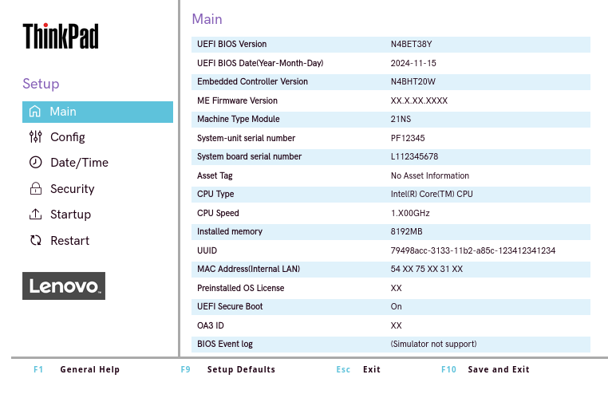

### Séquence de démarrage (boot)

1. **POST** (Power-On Self Test) : test rapide des composants essentiels.
2. Recherche d'un périphérique de démarrage selon un ordre configurable.
3. Lancement du chargeur d'amorçage (bootloader), qui charge le système
   d'exploitation.

### BIOS vs UEFI

Le **BIOS** existe depuis les années 1980 ; l'**UEFI** est son successeur
moderne (depuis les années 2010). Tous les ordinateurs récents utilisent l'UEFI.

Améliorations de l'UEFI : interface plus conviviale, disques de grande capacité
(>2 To), démarrage plus rapide, sécurité renforcée (Secure Boot).

### Accéder et paramétrer le BIOS/UEFI

Touches courantes au démarrage : `F2`, `F10`, `Del`, `Esc`, `Enter`.

Sur Mac Intel : `Option`.

Sur Apple Silicon : bouton d'alimentation.

Permet de configurer l'ordre de démarrage, la fréquence mémoire, la sécurité...

**À manipuler avec précaution** : des modifications incorrectes peuvent empêcher
le démarrage.

### Mettre à jour le BIOS/UEFI

Les fabricants publient parfois des mises à jour (corrections de bugs,
compatibilité, nouvelles fonctionnalités).

Opération à risque : une mise à jour incorrecte peut rendre l'ordinateur
inutilisable. À faire uniquement si nécessaire.

### Résumé

Le BIOS/UEFI initialise le matériel et lance le système d'exploitation.

L'UEFI est la version moderne, avec des fonctionnalités avancées et une
meilleure compatibilité.

Entre le matériel et le logiciel, il joue un rôle crucial dans le démarrage et
la configuration de l'ordinateur.


## Système d'exploitation

Le logiciel fondamental qui fait l'intermédiaire entre le matériel et les
applications.

Il gère les ressources (CPU, RAM, stockage), le système de fichiers, la sécurité
et l'interface.

![bg right:40%][illustration-windows] ![bg right:40%][illustration-macos]
![bg right:40% vertical][illustration-linux]

### Familles de systèmes d'exploitation

Il existe quatre grandes familles de systèmes d'exploitation :

- **Windows** : développé par Microsoft, le plus répandu au monde.
- **macOS** : développé par Apple, exclusif aux Mac.
- **Linux** : libre et open source, disponible en nombreuses distributions
  (Ubuntu, Debian, Fedora...), très utilisé sur serveurs et par les
  développeur·euses.
- **UNIX** : système historique des années 1970, reconnu pour sa stabilité et sa
  sécurité. macOS et Linux sont dérivés d'UNIX.

#### Windows

Développé par Microsoft, le plus répandu au monde.

Variantes : Home, Pro, Server, IoT, LTSC. **Pour vos études : Windows 11 Pro**
est recommandé.

⚠️ Le support de Windows 10 a pris fin le 14 octobre 2025.

![bg right:40%][illustration-windows]

#### macOS

Développé par Apple, exclusif aux ordinateurs Mac (MacBook, iMac, Mac Mini...).

Apprécié pour sa stabilité, son interface fluide et son écosystème intégré
(iPhone, iPad, Apple Watch).

![bg right:40%][illustration-macos]

#### Linux

Libre et open source, disponible en nombreuses distributions (Ubuntu, Debian,
Fedora...). Très utilisé sur serveurs et par les développeur·euses.

Linux est gratuit, personnalisable et réputé pour sa sécurité.

![bg right:40% vertical][illustration-linux]

#### UNIX

UNIX est un système historique des années 1970, reconnu pour sa stabilité et sa
sécurité.

Il a inspiré de nombreux systèmes modernes, dont macOS et Linux.

Il est commun d'appeler "UNIX-like" les systèmes qui partagent des
caractéristiques avec UNIX, même s'ils ne sont pas directement dérivés de
celui-ci.

### Lequel choisir ?

Le choix dépend des besoins, du matériel et des préférences :

- **Windows** : jeux et logiciels grand public.
- **macOS** : écosystème Apple, expérience fluide.
- **Linux** : développement, flexibilité, sécurité.

**Il n'y a pas de meilleur système d'exploitation** : chacun a ses avantages et
inconvénients.

Vous serez amené·e à utiliser les trois durant votre cursus.

### Arborescence des systèmes d'exploitation

- **Windows** : une racine par disque (`C:\`, `D:\`...), séparateur `\`.
- **macOS / Linux** : une seule racine `/`, séparateur `/`.
- Le **répertoire personnel** ("home") contient documents, configuration,
  téléchargements :

  - `C:\Users\nom` (Windows).
  - `/Users/nom` (macOS).
  - `/home/nom` (Linux).

### Résumé

Le système d'exploitation gère l'intermédiaire entre matériel et applications.

Les principales familles sont Windows, macOS et Linux, chacune avec ses
spécificités.


## Drivers et kernel

Deux composants logiciels essentiels du système d'exploitation, assurant la
communication entre matériel et logiciel.

![bg right:40%][illustration-drivers-et-kernel]

### Drivers

Les **drivers** (pilotes) permettent au système d'exploitation de communiquer
avec le matériel.

Chaque composant (carte graphique, réseau, imprimante...) nécessite un driver
spécifique.

Certains périphériques nécessitent une installation supplémentaire
(particulièrement sur Windows).

![bg right:40%][illustration-drivers-et-kernel]

### Kernel

Le **kernel** (noyau) est le cœur du système d'exploitation : il gère la
mémoire, le planificateur de processus, le système de fichiers et la sécurité.

Sur Linux, le kernel intègre déjà de nombreux drivers, ce qui rend leur
installation manuelle plus rare que sur Windows.

![bg right:40%][illustration-drivers-et-kernel]

### Résumé

Les drivers permettent la communication entre le système d'exploitation et le
matériel.

Le kernel gère les ressources du système et sert d'interface entre matériel et
logiciels.


## Interface graphique (GUI) et terminal (CLI)

Deux modes d'interaction avec l'ordinateur qui coexistent depuis toujours :

- L'interface graphique visuelle.
- Le terminal textuel.

![bg right:40%][illustration-interface-graphique]
![bg right:40% vertical][illustration-terminal]

### Interface graphique (GUI)

Fenêtres, boutons, icônes, menus : le mode d'interaction que la plupart des gens
utilisent au quotidien. Intuitive, elle ne nécessite pas de mémoriser des
commandes.

Moins efficace pour les tâches répétitives ou la configuration fine du système.

![bg right:40%][illustration-interface-graphique]

### Terminal (CLI)

Permet d'interagir en saisissant des commandes textuelles. Malgré son apparence
austère, c'est un outil puissant pour automatiser des tâches, configurer
finement le système et travailler sur des serveurs distants.

Peut sembler intimidant au début, mais devient vite incontournable.

![bg right:40% vertical][illustration-terminal]

### Quand utiliser l'un ou l'autre ?

- **GUI** : tâches du quotidien (navigation web, traitement de texte, photos).
- **CLI** : tâches techniques et répétitives (développement, administration,
  automatisation).

Nous reviendrons sur le terminal dans un futur contenu.

![bg right:40%][illustration-interface-graphique]
![bg right:40% vertical][illustration-terminal]

### Résumé

L'interface graphique est conviviale et intuitive.

Le terminal est puissant et efficace pour les tâches techniques.

Il est recommandé de se familiariser avec les deux.


## Applications

Un programme qui permet d'effectuer des tâches précises : rédiger un document,
naviguer sur internet, développer du code, etc.

Elles peuvent être utilisées via l'interface graphique ou le terminal, selon
leur conception.

![bg right:40%][illustration-interface-graphique]
![bg right:40% vertical][illustration-terminal]

### Types d'applications

- **Natives** : installées sur l'ordinateur, via le système d'exploitation.
- **Web** : s'exécutent dans un navigateur, sans installation.
- **Mobiles** : conçues pour smartphones et tablettes.

![bg right:40%][illustration-interface-graphique]
![bg right:40% vertical][illustration-terminal]

### Installer des applications

- Un installateur téléchargé depuis le site officiel.
- Une boutique d'applications.
- Un gestionnaire de paquets en ligne de commande.

**Toujours télécharger depuis des sources officielles.**

![bg right:40%][illustration-interface-graphique]
![bg right:40% vertical][illustration-terminal]

### Comment créons-nous une application ?

Processus habituel :

1. Définir les fonctionnalités et l'interface utilisateur.
2. Écrire le code source dans un langage de programmation.
3. Compiler ou interpréter le code pour le rendre exécutable.

![bg right:40%][illustration-interface-graphique]
![bg right:40% vertical][illustration-terminal]

### Langages, compilateurs et interpréteurs

Un **langage de programmation** est plus proche du langage humain que du langage
machine (Python, JavaScript, Java, C++...).

- Un **compilateur** transforme le code source en fichier exécutable.
- Un **interpréteur** exécute directement le code, ligne par ligne.

Un **environnement de développement** regroupe éditeur, compilateur ou
interpréteur, et outils de test/déploiement.

### Logiciels propriétaires vs logiciels libres

**Propriétaire** : code contrôlé par une entreprise, licence souvent payante
(Microsoft Office, Adobe Photoshop).

**Libre (open source)** : code source ouvert, modifiable et redistribuable
(LibreOffice, VLC, Firefox).

![bg right:40%][illustration-interface-graphique]
![bg right:40% vertical][illustration-terminal]

### Résumé

Une application permet d'effectuer des tâches spécifiques.

Elle peut être native, web ou mobile, créée via un langage de programmation
traduit en langage machine.


## Utilisateur·trices, groupes et permissions

Un·e utilisateur·trice est une personne qui utilise un ordinateur.

Un système d'exploitation peut avoir plusieurs comptes, regroupés en **groupes**
pour gérer droits et permissions.

![bg right:40%][illustration-utilisateur-trices-groupes-et-permissions]

### Comptes administrateurs par défaut

Un compte à privilèges élevés est créé à l'installation :

- **Windows** : "Administrateur" (compte caché par défaut).
- **macOS / Linux** : "root" ou superutilisateur·trice.

![bg right:40%][illustration-utilisateur-trices-groupes-et-permissions]

### Comptes standards

**Sur Windows**, le compte standard créé par défaut a aussi des privilèges
élevés. Un second compte à privilèges limités peut être créé ; il demande le mot
de passe administrateur pour les tâches sensibles.

**Sur macOS et Linux**, tout compte autre que root a des privilèges limités par
défaut. La commande `sudo` permet d'exécuter une tâche avec les privilèges de
root après authentification.

C'est une des raisons pour lesquelles UNIX est considéré plus sécurisé que
Windows par défaut.

### Permissions

Règles qui déterminent quels comptes/groupes peuvent accéder à un
fichier/dossier et quelles actions ils peuvent y effectuer (lire, écrire,
exécuter).

- **Windows** : onglet "Sécurité" des propriétés.
- **macOS / Linux** : commandes `chmod` et `chown` (terminal).

⚠️ Les permissions s'appliquent au niveau de l'OS en cours d'exécution :
chiffrez votre disque pour vous protéger d'un accès direct hors système.

### Mécanismes de sécurité supplémentaires

**Windows** propose l'exécution "en tant qu'administrateur" et le **Contrôle de
compte d'utilisateur (UAC)** : une confirmation ou un mot de passe est demandé
pour toute action à privilèges élevés.

L'UAC reproduit le comportement par défaut de macOS/Linux, qui limitent
nativement les actions des comptes standards.

### Définir un mot de passe pour chaque compte d'utilisateur·trice

Définissez un mot de passe pour chaque compte. **Évitez le code PIN** proposé
par Windows, moins sécurisé qu'un mot de passe long (ou une empreinte digitale).

Nous avons quelques expériences avec des personnes qui n'ont pas défini de mot
de passe sur leur compte administrateur et qui ont été victimes d'attaques ou de
blagues de leurs collègues.

### Éviter les incidents de sécurité

**Règle d'or** : ne faites jamais confiance à ce que vous trouvez ou utilisez
sur un ordinateur, même si la source semble fiable.

- Ne téléchargez jamais de logiciels depuis des sources non fiables.
- Ne cliquez jamais sur des liens suspects dans des e-mails ou sur des sites
  web.
- Ne partagez jamais vos mots de passe avec qui que ce soit.
- Ne laissez jamais votre ordinateur sans surveillance lorsque vous êtes
  connecté·e à un compte administrateur.

### Résumé

Les utilisateur·trices utilisent l'ordinateur via des comptes (administrateur ou
standard) ayant des privilèges différents.

Les permissions déterminent qui peut accéder aux fichiers/dossiers et quelles
actions y effectuer.


## Questions

<!-- _class: lead -->

Est-ce que vous avez des questions ?

## Et maintenant ?

- Identifier les composants de votre ordinateur :
  - CPU.
  - RAM.
  - Stockage.
- Repérer la version de votre système d'exploitation et expérimenter avec
  d'autres systèmes.
- Identifier vos comptes utilisateur·trice et leurs permissions.

**But** : mieux connaître votre ordinateur et son fonctionnement.

## À vous de jouer !

Appliquez le contenu "[Composants matériels et logiciels d'un
ordinateur][contenu-complet]" :

- Lisez le contenu et les instructions.
- Appliquez les exercices pratiques.
- Si vous ne finissez pas en classe, finissez le contenu à la maison.

N'hésitez pas à vous entraidez ou nous solliciter si vous avez des difficultés.

[![contenu-complet-qr-code]][contenu-complet]

[heig-vd-upinfo-course.github.io/heig-vd-upinfo-course][contenu-complet]

## Sources (1/2)

- [Illustration principale][illustration-principale] par
  [Growtika](https://unsplash.com/@growtika) sur
  [Unsplash](https://unsplash.com/photos/a-computer-with-a-keyboard-and-mouse-yGQmjh2uOTg).
- [Illustration][illustration-processeur-cpu] par
  [Badar ul islam Majid](https://unsplash.com/@bemajid9596) sur
  [Unsplash](https://unsplash.com/photos/black-and-silver-audio-mixer-VwwSO1s5m68).
- [Illustration][illustration-memoire-vive-ram] par
  [Badar ul islam Majid](https://unsplash.com/@bemajid9596) sur
  [Unsplash](https://unsplash.com/photos/black-and-silver-audio-mixer-VwwSO1s5m68).
- [Illustration][illustration-stockage-1] par
  [Ian Talmacs](https://unsplash.com/@iantalmacs) sur
  [Unsplash](https://unsplash.com/photos/a-close-up-of-a-computer-chip-7PSKG7iAh7g).
- [Illustration][illustration-stockage-2] par
  [Samsung Memory](https://unsplash.com/@samsungmemory) sur
  [Unsplash](https://unsplash.com/photos/a-keyboard-and-a-pen-on-a-table-_6OjWguC8zI).
- [Illustration][illustration-carte-mere] par
  [Sadshah.](https://unsplash.com/@thesadshah) sur
  [Unsplash](https://unsplash.com/photos/red-and-black-computer-tower-cR0bLCSpGfw).
- [Illustration][illustration-carte-graphique-gpu] par
  [Bruno Yamazaky](https://unsplash.com/@mryamazukino) sur
  [Unsplash](https://unsplash.com/photos/black-and-silver-graphics-card-2jX9K0x8J6s).
- [Illustration][illustration-peripheriques-externes] par
  [Triyansh Gill](https://unsplash.com/@triyansh) sur
  [Unsplash](https://unsplash.com/photos/black-ipad-beside-black-computer-keyboard-on-white-table-IuN3sQ1fO4Y).

## Sources (2/2)

- [Illustration][illustration-windows] par
  [MicAmel Majanovicrosoft](https://unsplash.com/@just_amelo) sur
  [Unsplash](https://unsplash.com/photos/white-painted-wall-close-up-photography-r8r2I7FsaIE).
- [Illustration][illustration-macos] par
  [an_vision](https://unsplash.com/@anvision) sur
  [Unsplash](https://unsplash.com/photos/red-apple-fruit-gDPaDDy6_WE).
- [Illustration][illustration-linux] par
  [Pam Ivey](https://unsplash.com/@pamivey) sur
  [Unsplash](https://unsplash.com/photos/two-penguin-standing-c0Y30cWbyEc).
- [Illustration][illustration-drivers-et-kernel] par
  [Haupes](https://unsplash.com/@haupes) sur
  [Unsplash](https://unsplash.com/photos/assorted-shoe-tool-kit-I7iJOE4fsYo).
- [Illustration][illustration-interface-graphique] par
  [Ralph Olazo](https://unsplash.com/@ralpholazo) sur
  [Unsplash](https://unsplash.com/photos/a-close-up-of-a-cell-phone-with-social-icons-on-it-x2N00Q-Zd1Y).
- [Illustration][illustration-terminal] par
  [Gabriel Heinzer](https://unsplash.com/@6heinz3r) sur
  [Unsplash](https://unsplash.com/photos/text-4Mw7nkQDByk).
- [Illustration][illustration-utilisateur-trices-groupes-et-permissions] par
  [Ryoji Iwata](https://unsplash.com/@ryoji__iwata) sur
  [Unsplash](https://unsplash.com/photos/aerial-view-photography-of-group-of-people-walking-on-gray-and-white-pedestrian-lane-n31JPLu8_Pw).

<!-- URLs -->

[license]:
	https://github.com/heig-vd-upinfo-course/heig-vd-upinfo-course/blob/main/LICENSE.md
[contenu-complet]:
	https://heig-vd-upinfo-course.github.io/heig-vd-upinfo-course/03-composants-materiels-et-logiciels-dun-ordinateur/01-introduction-et-ressources/
[contenu-complet-qr-code]:
	https://quickchart.io/qr?format=png&ecLevel=Q&size=300&margin=1&text=https://heig-vd-upinfo-course.github.io/heig-vd-upinfo-course/03-composants-materiels-et-logiciels-dun-ordinateur/01-introduction-et-ressources/

<!-- Illustrations -->

[illustration-principale]:
	https://images.unsplash.com/photo-1537498425277-c283d32ef9db?fit=crop&h=720
[illustration-processeur-cpu]:
	https://images.unsplash.com/photo-1616401014465-0e9f6e4695e0?fit=crop&h=720
[illustration-memoire-vive-ram]:
	https://images.unsplash.com/photo-1666868213704-1677b7f04c30?fit=crop&h=720
[illustration-stockage-1]:
	https://images.unsplash.com/photo-1703756291643-df456ffc8079?fit=crop&h=720
[illustration-stockage-2]:
	https://images.unsplash.com/photo-1721333091278-8b73e1f7392f?fit=crop&h=720
[illustration-carte-mere]:
	https://images.unsplash.com/photo-1573053986275-840ffc7cc685?fit=crop&h=720
[illustration-carte-graphique-gpu]:
	https://images.unsplash.com/photo-1621164071312-67bb68821b3f?fit=crop&h=720
[illustration-peripheriques-externes]:
	https://images.unsplash.com/photo-1627405085366-ee229985ecda?fit=crop&h=720
[illustration-windows]:
	https://images.unsplash.com/photo-1563693998336-93c10e5d8f91?fit=crop&h=720
[illustration-macos]:
	https://images.unsplash.com/photo-1568702846914-96b305d2aaeb?fit=crop&h=720
[illustration-linux]:
	https://images.unsplash.com/photo-1514125067037-8e669dd37638?fit=crop&h=720
[illustration-drivers-et-kernel]:
	https://images.unsplash.com/photo-1554825959-e9a6670d4f18?fit=crop&h=720
[illustration-interface-graphique]:
	https://images.unsplash.com/photo-1710870509663-16f20f75d758?fit=crop&h=720
[illustration-terminal]:
	https://images.unsplash.com/photo-1629654297299-c8506221ca97?fit=crop&h=720
[illustration-utilisateur-trices-groupes-et-permissions]:
	https://images.unsplash.com/photo-1513171920216-2640b288471b?fit=crop&h=720
