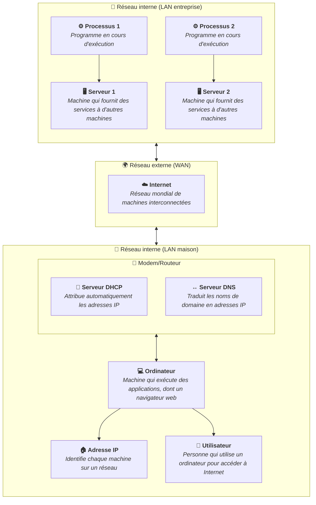

Cette section présente les bases des communications réseau et d'Internet. Vous y
découvrirez comment les ordinateurs communiquent entre eux, comment ils
s'identifient sur un réseau et comment fonctionne le web que vous utilisez
chaque jour.

Les thématiques abordées sont les suivantes :

- Les ordinateurs, serveurs et Internet : comment les machines sont reliées
  entre elles à l'échelle mondiale.
- L'adresse IP, qui identifie chaque machine sur un réseau.
- Le serveur DHCP, qui attribue automatiquement les adresses IP.
- Le serveur DNS, qui traduit les noms de domaine en adresses IP.
- La définition d'un processus : qu'est-ce qui s'exécute réellement sur votre
  machine.
- Les communications inter-processus : comment les programmes échangent des
  données, localement ou à distance.
- Effectuer une recherche sur Internet : outils et bonnes pratiques.

