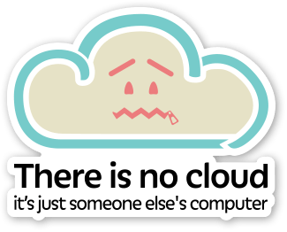
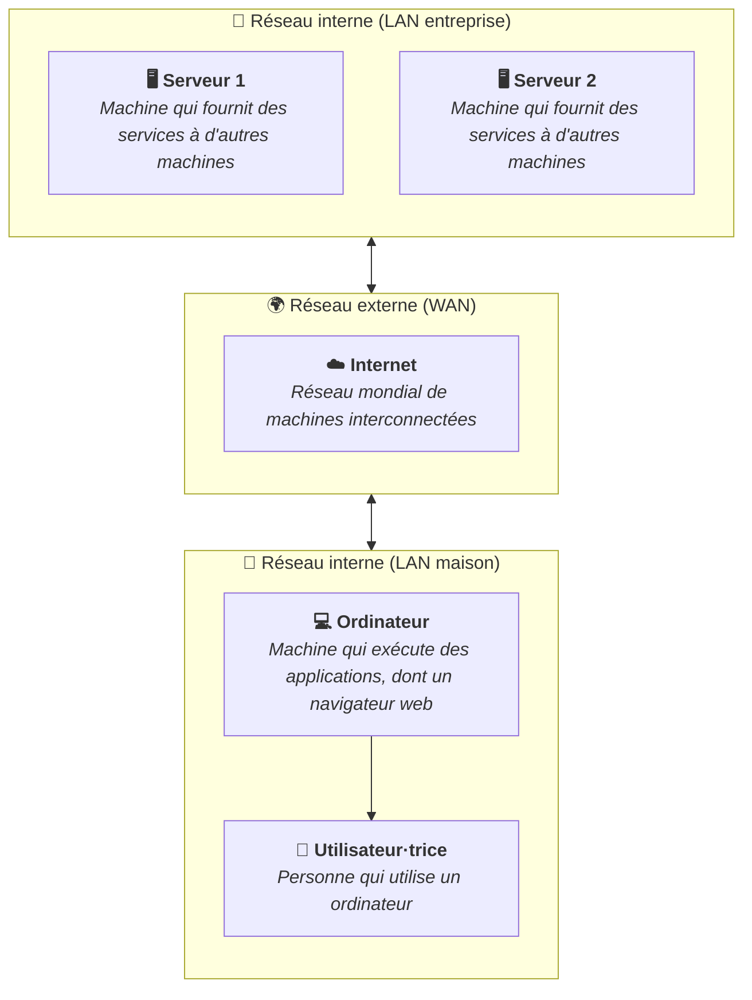

Internet est un réseau mondial qui relie des milliards d'ordinateurs entre eux.
Pour comprendre son fonctionnement, il est utile de distinguer les différents
rôles que peuvent jouer ces machines.

## Ordinateurs clients

Un ordinateur client est une machine que vous utilisez directement pour
consommer des services : naviguer sur le web, envoyer un e-mail, regarder une
vidéo. Dans la communication réseau, le client est celui qui initie une requête
et attend une réponse.

Votre ordinateur portable ou votre smartphone sont des clients lorsqu'ils
demandent une page web à un serveur.

## Serveurs

Un serveur est un ordinateur (ou une application) qui répond aux requêtes des
clients. Il met des ressources à disposition : pages web, fichiers, bases de
données, services de messagerie, etc.

Un serveur peut être une machine dédiée pour exécuter des applications, mais
aussi une application qui tourne sur votre propre ordinateur.

La notion de serveur est avant tout fonctionnelle : un serveur attend des
connexions et y répond.

Il existe de nombreux types de serveurs selon leur rôle :

- Serveur web : fournit des pages et des ressources accessibles via un
  navigateur.
- Serveur de fichiers : stocke et partage des fichiers sur un réseau, comme vu
  dans le contenu
  [Se connecter aux partages réseau](/heig-vd-upinfo-course/02-premiers-pas-a-la-heig-vd/15-se-connecter-aux-partages-reseaux/).
- Serveur de messagerie : gère l'envoi et la réception des e-mails.
- Serveur de base de données : stocke et interroge des données structurées.

La plupart du temps, ces serveurs sont regroupés dans des centres de données
(datacenters) par les entreprises ou les fournisseurs de services Internet.

Par exemple, vous pourriez très bien avoir un serveur chez vous, pour un usage
personnel ou professionnel.

Sur celui-ci, vous pourriez avoir un serveur Minecraft, qui stocke votre monde
et toutes les informations de la partie pour que des personnes sur votre réseau
le rejoignent. Si votre famille est intéressée par la photographie, vous
pourriez avec un serveur de fichiers qui stocke toutes les photos et vidéos de
la famille, et qui permet à chacun d'y accéder depuis son ordinateur ou son
smartphone.

Rappelez-vous que le terme "serveur" peut désigner à la fois le rôle de la
machine et le logiciel qui fournit le service.

## Internet

Internet est un réseau mondial qui relie des ordinateurs de machines entre
elles. Ces ordinateurs sont interconnectés grâce à des protocoles de
communication standardisés, permettant l'échange de données et l'accès à des
services en ligne.

Du matériel physique (câbles, routeurs, serveurs) et des logiciels (protocoles,
applications) travaillent ensemble pour assurer la transmission des informations
à travers le réseau mondial.

Un abus de langage courant consiste à confondre Internet avec le "cloud".

Lorsque nous parlons du "cloud", nous faisons référence à des services
accessibles via Internet, mais qui sont hébergés sur des serveurs distants dans
des centres de données.

Il ne faut pas oublier que ces serveurs sont simplement des machines mises à
disposition par des entreprises pour fournir des services à distance. Le "cloud"
n'est pas magique : il s'agit de serveurs physiques situés quelque part dans le
monde, et vous y accédez via Internet.

## Réseau local (LAN) et réseau étendu (WAN)

Un réseau local (LAN, Local Area Network) relie des machines proches
géographiquement sur un même réseau : les ordinateurs d'une salle de cours, d'un
bureau, d'un foyer. Les données circulent rapidement à l'intérieur d'un LAN.

Un réseau étendu (WAN, Wide Area Network) relie des réseaux locaux entre eux sur
de grandes distances. Internet est le plus grand WAN du monde : c'est un réseau
de réseaux interconnectés à l'échelle planétaire.

## Résumé

Internet est un réseau mondial reliant des clients et des serveurs qui
communiquent grâce à des protocoles communs. Comprendre cette architecture
client-serveur est fondamental pour tout développeur·euse ou
administrateur·trice système.

