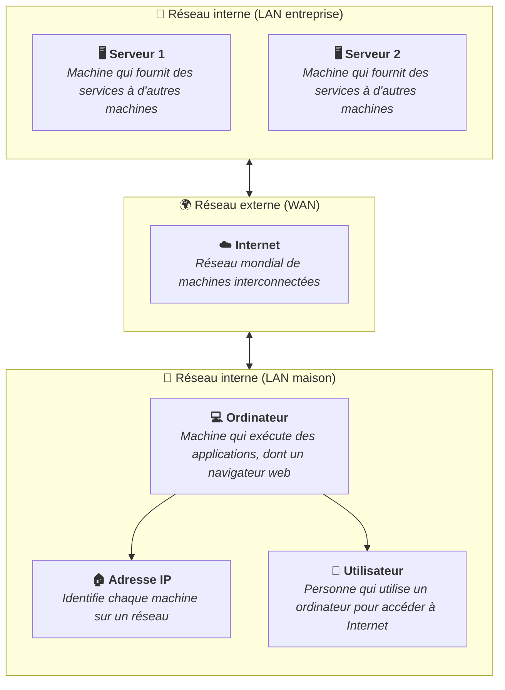

Une adresse IP (Internet Protocol) est un identifiant numérique unique attribué
à chaque appareil connecté à un réseau. Elle joue le même rôle qu'une adresse
postale : elle permet de savoir où envoyer les données et d'où elles
proviennent.

## Fonctions principales

Une adresse IP permet à deux appareils de communiquer entre eux sur un réseau.
Elle identifie l'expéditeur et le destinataire des données échangées. Sans
adresse IP, un appareil ne pourrait pas envoyer ou recevoir d'informations sur
un réseau.

## Versions IPv4 et IPv6

Il existe deux versions principales d'adresses IP : IPv4 et IPv6.

### IPv4

La version la plus répandue est IPv4. Une adresse IPv4 est composée de quatre
nombres séparés par des points, chacun compris entre 0 et 255 :

```text
192.168.1.42
```

Avec IPv4, il est possible de former environ 4.3 milliards d'adresses uniques.
Ce chiffre est devenu insuffisant avec la croissance d'Internet et de l'Internet
des objets (IoT).

### IPv6

IPv6 est la version suivante, conçue pour pallier le manque d'adresses IPv4. Une
adresse IPv6 est composée de huit groupes de quatre chiffres hexadécimaux
séparés par des deux-points :

```text
2001:0db8:85a3:0000:0000:8a2e:0370:7334
```

IPv6 offre un espace d'adressage quasi illimité. Sa transition est progressive :
la plupart des réseaux modernes supportent les deux versions en parallèle.

## Adresses IP réservées

Certaines adresses IP sont réservées à des usages spécifiques et ne peuvent pas
être attribuées à des appareils sur Internet.

### Adresse locale

L'adresse `127.0.0.1` est réservée à la machine locale (aussi appelée
_"localhost"_, l'hôte local). Cette adresse représente l'ordinateur lui-même et
est utilisée pour tester les applications réseau sans avoir besoin d'une
connexion Internet.

### Adresses publiques et privées

Toutes les adresses IP ne sont pas accessibles depuis Internet. On distingue :

- Les **adresses publiques** : uniques sur Internet, elles identifient un réseau
  ou un appareil accessible depuis n'importe où dans le monde.
- Les **adresses privées** : réservées aux réseaux locaux, elles ne sont pas
  routables sur Internet. Les plages les plus courantes sont :
  - `192.168.x.x` (de `192.168.0.0` à `192.168.255.255`)
  - `172.16.x.x` à `172.31.x.x` (de `172.16.0.0` à `172.31.255.255`)
  - `10.x.x.x` (de `10.0.0.0` à `10.255.255.255`)

## Attribution manuelle et automatique

Chaque appareil sur un réseau doit avoir une adresse IP unique. Il existe deux
méthodes pour attribuer une adresse IP à un appareil :

- **Manuellement** : l'utilisateur configure lui-même l'adresse IP sur son
  appareil. Cette méthode est souvent utilisée pour les serveurs ou les
  imprimantes réseau.
- **Automatiquement** : un serveur DHCP (Dynamic Host Configuration Protocol)
  attribue automatiquement une adresse IP à chaque appareil qui se connecte au
  réseau. C'est la méthode la plus courante pour les ordinateurs, smartphones et
  tablettes. Nous y reviendrons dans le contenu
  [Serveur DHCP](/heig-vd-upinfo-course/04-communications-reseaux-et-internet/05-serveur-dhcp).

## Trouver son adresse IP

Pour connaître votre adresse IP locale sur votre machine, vous pouvez utiliser
la commande suivante dans un terminal :

- Sur Windows : `ipconfig`
- Sur macOS / Linux : `ip addr` ou `ifconfig`

Pour connaître votre adresse IP publique, vous pouvez visiter un site comme
[whatismyip.com](https://www.whatismyip.com).

## Résumé

Une adresse IP est l'identifiant réseau d'un appareil. IPv4 (quatre nombres
séparés par des points) reste la plus utilisée, mais IPv6 prend de plus en plus
de place. Les adresses privées sont utilisées à l'intérieur des réseaux locaux,
tandis que les adresses publiques sont visibles sur Internet.

Une adresse IP permet à deux appareils de communiquer entre eux sur un réseau,
en identifiant l'expéditeur et le destinataire des données échangées.


