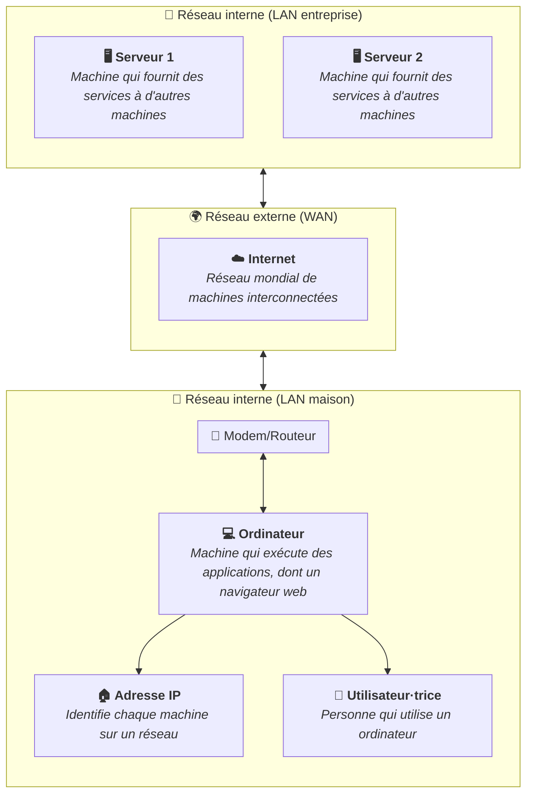

Le modem-routeur Wi-Fi est un appareil qui permet à plusieurs appareils de se
connecter à Internet via une connexion sans fil (Wi-Fi) ou filaire (Ethernet).

Il s'agit de l'équipement le plus couramment utilisé dans les foyers pour
fournir un accès Internet à plusieurs appareils, tels que les ordinateurs, les
smartphones, les tablettes et les objets connectés.

Un autre nom pour désigner cet appareil est "la box Internet", car il est
souvent fourni par les fournisseurs d'accès à Internet (FAI) sous forme de
boîtier.

## Fonctions principales

Le modem-routeur Wi-Fi est généralement connecté à la ligne Internet (ADSL,
fibre optique, câble, etc.) et distribue la connexion aux appareils du réseau
local (LAN) via le Wi-Fi ou des câbles Ethernet.

Lorsque vous vous connectez à votre box Internet depuis chez vous, votre
ordinateur reçoit une adresse privée (ex. : `192.168.1.42`). Votre box, elle,
possède une adresse publique pour communiquer avec Internet.

## Sécurité

Le modem-routeur Wi-Fi est également responsable de la sécurité du réseau local.

En mettant à disposition un accès Wi-Fi sécurisé par un mot de passe (sauvegardé
dans votre
[gestionnaire de mots de passe](/heig-vd-upinfo-course/02-premiers-pas-a-la-heig-vd/07-installer-et-configurer-un-gestionnaire-de-mots-de-passe)
évidemment), il empêche les personnes non autorisées d'accéder à votre réseau et
à vos appareils.

De plus, cette connexion sécurisée protège vos données lorsqu'elles transitent
sur Internet, en les chiffrant pour éviter qu'elles ne soient interceptées par
des personnes malveillantes.

Il existe plusieurs types de sécurité Wi-Fi, tels que WPA2 et WPA3, qui offrent
différents niveaux de protection. Il est recommandé d'utiliser le protocole le
plus récent et le plus sécurisé disponible sur votre modem-routeur Wi-Fi mais
cela peut empêcher certains appareils plus anciens de se connecter au réseau.

## Résumé

Le modem-routeur permet de connecter plusieurs appareils à Internet via une
connexion sans fil (Wi-Fi) ou filaire (Ethernet). Il combine les fonctions d'un
modem et d'un routeur, et est souvent fourni par les fournisseurs d'accès à
Internet sous forme de boîtier appelé "box Internet".

