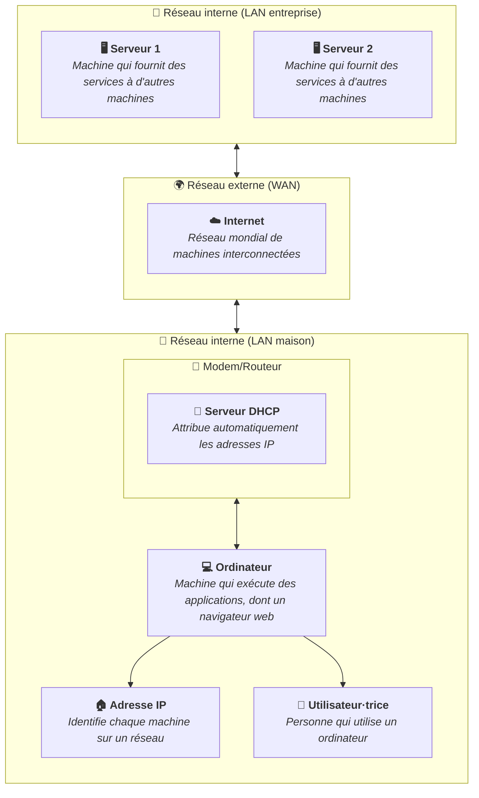

Lorsque vous vous connectez à un réseau Wi-Fi ou branchez un câble réseau, votre
ordinateur obtient automatiquement une adresse IP sans que vous ayez à la saisir
manuellement. C'est le rôle du serveur DHCP (Dynamic Host Configuration
Protocol).

## Fonctions principales

DHCP est un protocole réseau qui permet à un serveur d'attribuer automatiquement
une configuration réseau aux appareils qui se connectent.

Le processus d'attribution DHCP se déroule en quatre étapes :

1. **Discover** : l'appareil qui rejoint le réseau envoie un message en
   diffusion sur le réseau pour trouver un serveur DHCP.
2. **Offer** : le serveur DHCP répond avec une proposition de configuration
   (adresse IP disponible et d'autres paramètres).
3. **Request** : l'appareil accepte la proposition et en informe le serveur.
4. **Acknowledge** : le serveur confirme l'attribution. L'appareil peut
   désormais utiliser la configuration.

Ainsi, lorsque vous vous connectez à un réseau, votre appareil reçoit
automatiquement une adresse IP et d'autres informations nécessaires pour
communiquer sur le réseau.

## Où se trouve le serveur DHCP ?

Dans un réseau domestique, c'est votre box Internet ou votre routeur qui joue le
rôle de serveur DHCP. Dans un réseau d'entreprise ou universitaire, il s'agit
généralement d'un serveur dédié géré par les équipes informatiques.

## Résumé

Le serveur DHCP automatise l'attribution des adresses IP et de la configuration
réseau sur un réseau. Sans lui, il faudrait configurer manuellement chaque
appareil, ce qui serait peu pratique à grande échelle.

