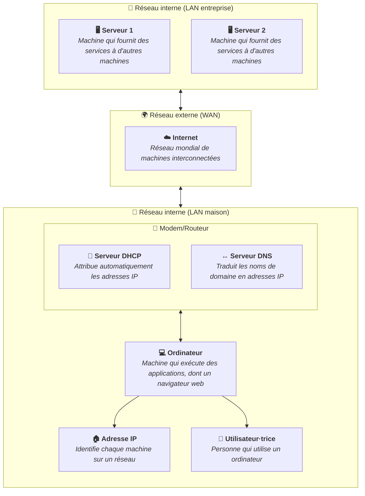

Nous avons appris dans le contenu
[Adresse IP](/heig-vd-upinfo-course/04-communications-reseaux-et-internet/03-adresse-ip)
que chaque appareil connecté à un réseau possède une adresse IP unique.

Les ordinateurs et les serveurs utilisent ces adresses IP pour communiquer entre
eux et ne peuvent pas comprendre une autre forme d'identification que les
adresses IP.

Cependant, il est difficile pour les humains de mémoriser ces adresses
numériques. C'est là qu'intervient le serveur DNS (Domain Name System).

## Fonctions principales

DNS est un système qui traduit les noms de domaine lisibles par les humains
(comme `heig-vd.ch`) en adresses IP comprises par les machines (comme
`193.134.218.50`).

On compare souvent le DNS à un annuaire téléphonique : vous connaissez le nom de
la personne, l'annuaire vous donne son numéro. Une fois que vous avez le numéro,
vous pouvez appeler la personne. De la même manière, une fois que votre
ordinateur connaît l'adresse IP d'un site web, il peut se connecter à ce site.

## Changer de serveurs DNS

Il est possible de changer les serveurs DNS utilisés par votre appareil ou votre
réseau. Par défaut, la plupart des appareils utilisent les serveurs DNS fournis
par votre fournisseur d'accès à Internet (FAI) grâce à votre box Internet ou
votre routeur.

Cependant, vous pouvez configurer votre appareil pour utiliser d'autres serveurs
DNS, ce qui peut améliorer la vitesse de résolution des noms de domaine ou
renforcer la confidentialité.

Vous pouvez utiliser des serveurs DNS publics à la place de ceux de votre
fournisseur d'accès. Les plus connus sont :

- `8.8.8.8` et `8.8.4.4` : serveurs DNS de Google.
- `1.1.1.1` et `1.0.0.1` : serveurs DNS de Cloudflare.
- `9.9.9.9` : serveur DNS de Quad9, axé sur la sécurité.

Changer de serveur DNS peut améliorer la vitesse de résolution ou renforcer
votre confidentialité.

## Résumé

Le DNS traduit les noms de domaine en adresses IP. C'est un service invisible
mais indispensable : sans lui, vous devriez mémoriser des adresses IP pour
accéder à chaque site web.

