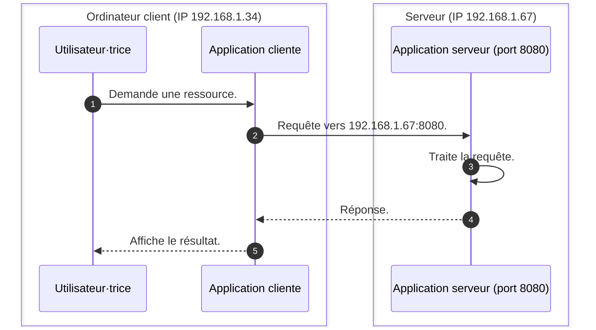

Dans de nombreuses applications, une machine envoie une demande et une autre
machine répond. C'est le principe de l'architecture client-serveur.

Un client se connecte à un serveur pour demander une ressource ou un service.

Par exemple, un navigateur web (client) contacte un serveur web pour afficher
une page.

## Client et serveur

Le client est l'application utilisée par la personne qui fait une action.

Le serveur est la machine ou le service qui traite la demande et renvoie une
réponse.

Ce modèle est très courant : site web, messagerie, stockage en ligne,
applications mobiles, jeux en réseau, etc.

## Adresse IP et port

Pour contacter un serveur, le client doit connaître son adresse réseau.

Cette adresse est composée de deux parties :

- une adresse IP pour identifier la machine.
- un port pour identifier le service sur cette machine.

On note généralement une adresse et un port sous la forme `adresse:port`, par
exemple `192.168.1.1:80` ou `localhost:3000` (où `localhost` est un alias pour
l'adresse IP `127.0.0.1` qui désigne la machine locale).

Une même machine peut proposer plusieurs services en même temps, chacun sur un
port différent.

Une analogie pour comprendre cette situation est celle d'un immeuble avec
plusieurs appartements : l'adresse de l'immeuble correspond à l'adresse IP,
tandis que le numéro de l'appartement correspond au port.

Chaque appartement (port) peut être occupé par un locataire différent (une
application réseau), et les visiteur·euses (clients) doivent connaître le numéro
de l'appartement pour savoir où frapper et entamer une conversation avec le
locataire (l'application réseau associée) approprié.

## Séquence de connexion

Quand la personne utilise le client, celui-ci envoie une requête au serveur. Le
serveur traite la requête puis renvoie une réponse.

## Résumé

L'architecture client-serveur décrit un échange simple : un client contacte un
serveur à une adresse `adresse:port`, envoie une requête et reçoit une réponse.
Comprendre ce schéma aide à mieux lire et concevoir des applications connectées.
