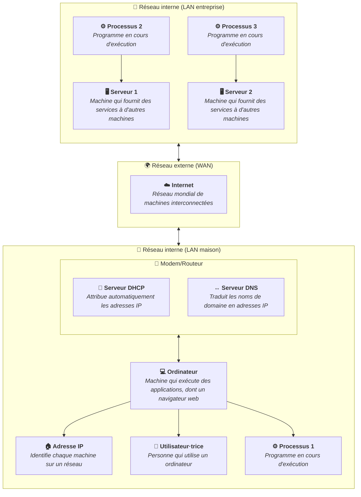
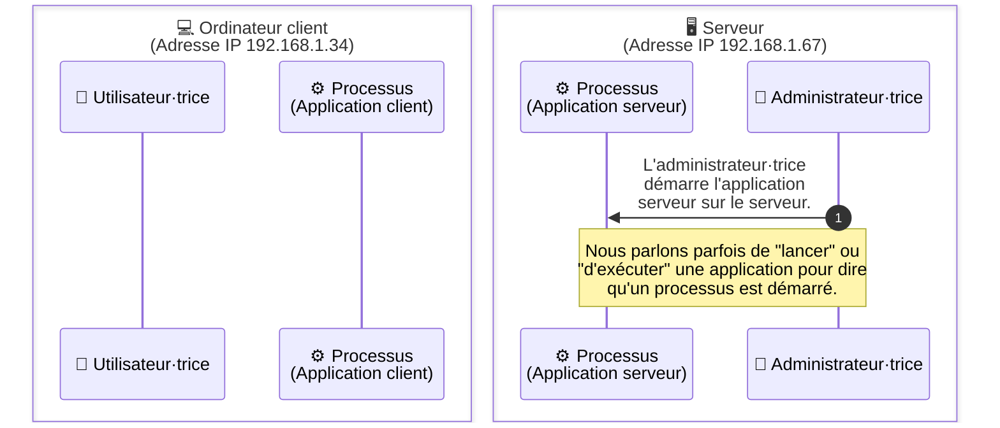

Un processus est un programme en cours d'exécution. C'est l'unité fondamentale
de travail gérée par le système d'exploitation.

## Programme vs processus

Un **programme** est un fichier statique stocké sur le disque : c'est une suite
d'instructions écrites par un·e développeur·euse. Un **processus** est ce même
programme chargé en mémoire vive et en cours d'exécution.

La différence est importante : on peut lancer plusieurs processus à partir d'un
même programme. Par exemple, si vous ouvrez deux fenêtres de votre navigateur
web, deux processus distincts (ou plus) peuvent être en cours d'exécution, mais
ils utilisent les mêmes fichiers du programme.

## Voir les processus en cours

Vous pouvez consulter les processus actifs sur votre machine :

- Sur **Windows** : ouvrez le Gestionnaire des tâches (`Ctrl+Shift+Échap`).
- Sur **macOS** : utilisez le Moniteur d'activité (Activity Monitor).
- Sur **Linux** : utilisez la commande `ps`, `top` ou `htop` dans un terminal.

Ces outils vous montrent, pour chaque processus, son PID (Process ID, son
identifiant unique), sa consommation de processeur et de mémoire, et
l'utilisateur·trice qui l'a lancé.

## Résumé

Un processus est un programme en cours d'exécution, géré par le système
d'exploitation. Il possède un identifiant unique (PID) et des ressources
propres. Comprendre la notion de processus est essentiel pour appréhender
comment les applications et les services fonctionnent sur une machine.

