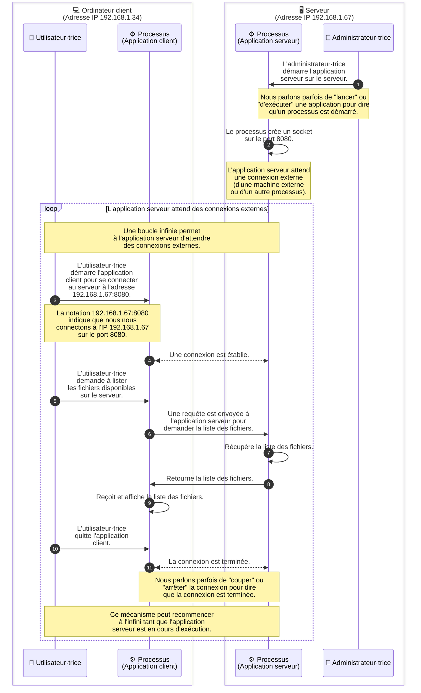

Des processus distincts, qu'ils s'exécutent sur la même machine ou sur des
machines différentes, ont souvent besoin d'échanger des données. C'est ce qu'on
appelle les **communications inter-processus** (IPC, Inter-Process
Communication).

En effet, un processus exécuté seul sur une machine ne peut pas accomplir
grand-chose. Il a besoin de communiquer avec d'autres processus pour accomplir
des tâches plus complexes. Par exemple, un navigateur web (processus) doit
communiquer avec un serveur web (autre processus) pour récupérer des pages et
des ressources. De même, un processus peut avoir besoin de communiquer avec
d'autres processus sur la même machine pour partager des données ou coordonner
des actions.

## Communications inter-processus entre deux machines

Il existe de nombreux mécanismes pour permettre à des processus de communiquer
entre eux, que ce soit sur la même machine (via des pipes (`|`) par exemple) ou
sur des machines différentes (via des sockets réseau par exemple).

Dans ce cours, nous allons nous concentrer sur les communications
inter-processus entre deux machines distinctes, en utilisant le réseau. Pour
cela, nous allons utiliser des **sockets réseau**, qui sont une abstraction
logicielle permettant d'établir une connexion entre deux processus.

### Sockets réseau

Un socket est un élément logiciel qui permet à un processus d'envoyer et de
recevoir des données sur le réseau. Pour envoyer et recevoir des données, un
processus doit créer un socket.

Lors du démarrage d'un processus, celui-ci peut créer un socket et l'associer à
une adresse IP et un numéro de port. Il sera alors en mesure d'écouter les
connexions entrantes sur ce port et de recevoir des données de la part d'autres
processus.

De même, un autre processus peut créer un socket et se connecter à l'adresse IP
et au port du premier processus pour envoyer des données.

Tant que le processus est en cours d'exécution, il peut continuer à écouter les
connexions entrantes et à recevoir des données.

### Port

En plus de l'adresse IP qui identifie la machine sur le réseau comme étudié dans
le contenu
[Adresse IP](/heig-vd-upinfo-course/04-communications-reseaux-et-internet/03-adresse-ip),
chaque socket est identifié par un numéro de port.

Ainsi, lorsqu'un processus démarre sur un serveur, il peut écouter sur un port
spécifique (un numéro entre 0 et 65535) pour recevoir des connexions de clients.

Les clients, quant à eux, se connectent à ce port pour envoyer des requêtes et
recevoir des réponses. Cela permet à plusieurs services de coexister sur la même
machine, chacun étant accessible via son propre port.

Une analogie pour comprendre cette situation est celle d'un immeuble avec
plusieurs appartements : l'adresse de l'immeuble correspond à l'adresse IP,
tandis que le numéro de l'appartement correspond au port.

Chaque appartement (port) peut être occupé par un locataire différent (processus
qui utilise un socket), et les visiteur·euses (clients) doivent connaître le
numéro de l'appartement pour savoir où frapper et entamer une conversation avec
le locataire (processus et le socket associé) approprié.

Il n'est pas possible que deux sockets écoutent sur le même port à un moment
donné. Si un autre socket tente d'écouter sur le même port, il recevra une
erreur indiquant que le port est déjà utilisé.

On note généralement une adresse et un port sous la forme `adresse:port`, par
exemple `192.168.1.1:80` ou `localhost:3000` où `localhost` est un alias pour
l'adresse IP `127.0.0.1` qui désigne la machine locale (notre propre machine).

### Protocoles de communication

Pour que des machines puissent se comprendre, elles doivent respecter des règles
communes appelées protocoles. Un protocole définit le format des messages,
l'ordre des échanges et la gestion des erreurs.

Il existe de nombreux protocoles de communication, chacun ayant ses propres
caractéristiques et usages (IP, TCP, UDP, HTTP, etc.).

Vous étudierez plus en détail ces protocoles durant votre formation, mais pour
l'instant, il est important de comprendre que les communications inter-processus
reposent sur des protocoles bien définis pour assurer une communication fiable
et efficace.

## Résumé

Les communications inter-processus permettent à des programmes distincts
d'échanger des données, localement ou via le réseau. Les sockets et le protocole
HTTP sont les mécanismes les plus utilisés dans le développement web et
applicatif. Comprendre ces mécanismes est indispensable pour développer des
applications qui communiquent entre elles.

