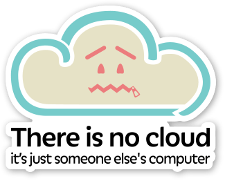
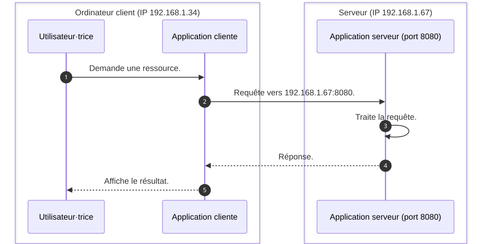

# Communications réseaux et Internet

<!--
_class: lead
_paginate: false
-->

[ `github.com/heig-vd-upinfo-course`](https://github.com/heig-vd-upinfo-course/heig-vd-upinfo-course)

[Visualiser le contenu complet sur le site dédié][contenu-complet].

<small>L. Delafontaine et V. Guidoux, avec l'aide de
[GitHub Copilot](https://github.com/features/copilot).</small>

<small>Ce travail est sous licence [CC BY-SA 4.0][license].</small>

![bg opacity:0.05][illustration-principale]

## Retrouvez le contenu complet de cette présentation sur le site dédié

<!-- _class: lead -->

_Cette présentation est un résumé du contenu complet disponible sur le site
dédié._

_Pour plus de détails, retrouvez le [contenu complet][contenu-complet] ou en
cliquant sur l'en-tête de ce document._

## Introduction

<!-- _class: lead -->

Cette partie présente les bases des communications réseau et d'Internet :
comment les ordinateurs communiquent entre eux, comment ils s'identifient sur un
réseau et comment fonctionne le web que vous utilisez chaque jour.

### Ordinateurs clients

Un ordinateur **client** est une machine que vous utilisez directement pour
consommer des services.

Dans la communication réseau, le client est celui qui **initie une requête** et
attend une réponse.

Votre ordinateur ou votre smartphone sont des clients lorsqu'ils demandent une
page web à un serveur.

![bg right:40%][illustration-ordinateurs-clients]

### Serveurs

Un **serveur** est un ordinateur (ou une application) qui répond aux requêtes
des clients : il met des services ou des ressources à disposition.

La notion de serveur est avant tout **fonctionnelle** : un serveur attend des
connexions et y répond. Le terme désigne aussi bien la machine que le logiciel
qui fournit le service.

![bg right:40%][illustration-serveurs]

### Types de serveurs

- **Serveur web** : fournit des pages et ressources via un navigateur.
- **Serveur de fichiers** : stocke et partage des fichiers sur un réseau.
- **Serveur de messagerie** : gère l'envoi et la réception des e-mails.
- **Serveur de base de données** : stocke et interroge des données structurées.

Ces serveurs sont le plus souvent regroupés dans des **centres de données**
(datacenters), mais vous pourriez tout à fait héberger le vôtre à la maison.

### Internet (1/2)

Internet est un réseau mondial qui relie des ordinateurs entre eux grâce à des
**protocoles de communication standardisés**.

Du matériel (câbles, routeurs, serveurs) et des logiciels (protocoles,
applications) travaillent ensemble pour transmettre les informations.

![bg right:40%][illustration-internet]

### Internet (2/2)

Un abus de langage courant consiste à confondre Internet avec le **"cloud"** :
ce ne sont que des serveurs physiques situés quelque part dans le monde,
auxquels vous accédez via Internet.



### Réseau local (LAN) et réseau étendu (WAN)

- **LAN** (Local Area Network) : relie des machines proches géographiquement
  (une salle de cours, un bureau, un foyer). Les données y circulent rapidement.
- **WAN** (Wide Area Network) : relie des réseaux locaux entre eux sur de
  grandes distances.

Internet est le plus grand WAN du monde : un **réseau de réseaux**
interconnectés à l'échelle planétaire.

### Résumé

Internet relie des **clients** et des **serveurs** qui communiquent grâce à des
protocoles communs.

Comprendre cette architecture est fondamental pour tout·e développeur·euse ou
administrateur·trice système.



## Adresse IP

Une **adresse IP** (Internet Protocol) est un identifiant numérique unique
attribué à chaque appareil connecté à un réseau.

Elle joue le rôle d'une **adresse postale** : elle indique où envoyer les
données et d'où elles proviennent.

![bg right:40%][illustration-ordinateurs-clients]

### Fonctions principales

Une adresse IP permet à deux appareils de **communiquer** entre eux sur un
réseau. Elle identifie l'**expéditeur** et le **destinataire** des données.

Sans adresse IP, un appareil ne pourrait ni envoyer ni recevoir d'informations
sur un réseau.

Vous pouvez voir l'adresse IP comme une adresse postale : pour envoyer ou
recevoir une lettre, vous devez connaître l'adresse du destinataire ou de
l'expéditeur·trice.

### Versions IPv4 et IPv6

Il existe deux versions principales d'adresses IP :

- **IPv4**.
- **IPv6**.

Chacune de ces versions a ses propres caractéristiques et formats pour
représenter les adresses.

![bg right:40%][illustration-adresse-ipv4]
![bg right:40% vertical][illustration-adresse-ipv6]

#### IPv4

La version la plus répandue. Une adresse IPv4 est composée de quatre nombres
séparés par des points, chacun entre 0 et 255 :

```text
192.168.1.42
```

IPv4 permet environ **4.3 milliards** d'adresses uniques, devenues
insuffisantes. IPv6 résoud cela.

![bg right:40%][illustration-adresse-ipv4]

#### IPv6

Une adresse IPv6 est composée de huit groupes de quatre chiffres hexadécimaux
séparés par des deux-points :

```text
2001:0db8:85a3:0000:0000:8a2e:0370:7334
```

IPv6 offre un espace d'adressage **quasi illimité**. Son adaptation est
progressive.

![bg right:40%][illustration-adresse-ipv6]

### Adresses IP réservées

Certaines adresses sont **réservées** à des usages spécifiques et ne peuvent pas
être attribuées à des appareils sur Internet :

- Adresse locale.
- Adresses publiques et privées.

![bg right:40%][illustration-adresse-ipv4]
![bg right:40% vertical][illustration-adresse-ipv6]

#### Adresse locale

L'adresse `127.0.0.1` est réservée à la machine locale (aussi appelée
_"localhost"_).

Elle représente l'ordinateur lui-même et sert à tester des applications réseau
sans connexion Internet.

![bg right:40%][illustration-ordinateurs-clients]

#### Adresses publiques et privées

- **Publiques** : uniques sur Internet, elles identifient un réseau ou un
  appareil accessible depuis n'importe où.
- **Privées** : réservées aux réseaux locaux, non utilisables sur Internet.
  Plages courantes :
  - `192.168.0.0` à `192.168.255.255`
  - `172.16.0.0` à `172.31.255.255`
  - `10.0.0.0` à `10.255.255.255`

### Attribution manuelle et automatique

Chaque appareil doit avoir une adresse IP **unique** sur le réseau. Deux
méthodes d'attribution :

- **Manuellement** : l'utilisateur·trice configure l'adresse (souvent pour des
  serveurs ou imprimantes réseau).
- **Automatiquement** : un serveur **DHCP** attribue une adresse à chaque
  appareil qui se connecte (la méthode la plus courante). Nous y reviendrons.

### Trouver son adresse IP

Adresse IP **locale**, dans un terminal :

- Windows : `ipconfig`
- macOS / Linux : `ip addr` ou `ifconfig`

Adresse IP **publique** : visitez un site comme
[whatismyip.com](https://www.whatismyip.com).

![bg right:40% vertical][illustration-terminal]

### Résumé

Une adresse IP est l'**identifiant réseau** d'un appareil. IPv4 reste la plus
utilisée, mais IPv6 prend de plus en plus de place.

Les adresses **privées** servent à l'intérieur des réseaux locaux, les
**publiques** sont visibles sur Internet.



## Modem-routeur Wi-Fi

Un appareil qui permet à plusieurs appareils de se connecter à Internet en
**sans fil** (Wi-Fi) ou en **filaire** (Ethernet).

C'est l'équipement le plus courant dans les foyers, souvent fourni par les
fournisseurs d'accès à Internet (FAI) sous forme de boîtier : la **"box
Internet"**.

![bg right:40%][illustration-modem-routeur-wi-fi]

### Fonctions principales

Le modem-routeur est connecté à la ligne Internet (ADSL, fibre, câble...) et
**distribue** la connexion aux appareils du réseau local via Wi-Fi ou Ethernet.

Chez vous, votre ordinateur reçoit une **adresse privée** (ex. `192.168.1.42`),
tandis que la box possède une **adresse publique** pour communiquer avec
Internet.

### Sécurité

Le modem-routeur assure aussi la **sécurité** du réseau local :

- Un accès Wi-Fi **protégé par mot de passe** (à conserver dans votre
  gestionnaire de mots de passe) empêche les intrusions.
- Le **chiffrement** protège vos données en transit contre l'interception.

Utilisez le protocole le plus récent (**WPA3**, sinon WPA2) - au risque
d'exclure certains appareils anciens.

### Résumé

Le modem-routeur connecte plusieurs appareils à Internet en Wi-Fi ou en
Ethernet.

Il combine les fonctions d'un **modem** et d'un **routeur**, et est souvent
fourni par les FAI sous forme de "box Internet".



## Serveur DHCP

Quand vous rejoignez un réseau Wi-Fi ou branchez un câble, votre ordinateur
obtient **automatiquement** une adresse IP sans la saisir manuellement.

C'est le rôle du serveur **DHCP** (Dynamic Host Configuration Protocol).

![bg right:40%][illustration-modem-routeur-wi-fi]

### Fonctions principales

DHCP attribue automatiquement une configuration réseau aux appareils.

Ainsi, quand vous vous connectez à un réseau, votre appareil reçoit
automatiquement une adresse IP et d'autres informations nécessaires pour
communiquer.

### Où se trouve le serveur DHCP ?

- **Réseau domestique** : c'est votre **box Internet** ou votre routeur qui joue
  ce rôle.
- **Réseau d'entreprise ou universitaire** : un **serveur dédié**, géré par les
  équipes informatiques.

![bg right:40%][illustration-modem-routeur-wi-fi]
![bg right:40% vertical][illustration-serveurs]

### Résumé

Le serveur DHCP **automatise** l'attribution des adresses IP et de la
configuration réseau.

Sans lui, il faudrait configurer manuellement chaque appareil - peu pratique à
grande échelle.



## Serveur DNS

Chaque appareil possède une adresse IP unique, et les machines ne comprennent
que ces adresses numériques.

Mais elles sont **difficiles à mémoriser** pour les humains. C'est là
qu'intervient le serveur **DNS** (Domain Name System).

![bg right:40%][illustration-modem-routeur-wi-fi]

### Fonctions principales

Le DNS **traduit** les noms de domaine lisibles par les humains (`heig-vd.ch`)
en adresses IP comprises par les machines (`193.134.218.50`).

On le compare souvent à un **annuaire téléphonique** : vous connaissez le nom,
l'annuaire vous donne le numéro. Une fois l'adresse IP connue, votre ordinateur
peut se connecter au site.

### Changer de serveurs DNS

Par défaut, vos appareils utilisent les serveurs DNS de votre FAI. Vous pouvez
en choisir d'autres pour gagner en **vitesse** ou en **confidentialité**.

Serveurs DNS publics connus :

- `8.8.8.8` / `8.8.4.4` : Google.
- `1.1.1.1` / `1.0.0.1` : Cloudflare.
- `9.9.9.9` : Quad9 (axé sécurité).

### Résumé

Le DNS **traduit les noms de domaine en adresses IP**.

C'est un service invisible mais indispensable : sans lui, vous devriez mémoriser
une adresse IP pour chaque site web.



## Architecture client-serveur

Dans de nombreuses applications, une machine envoie une demande et une autre
répond : c'est le principe de l'architecture **client-serveur**.

Un client se connecte à un serveur pour demander une ressource. Par exemple, un
navigateur web (client) contacte un serveur web pour afficher une page.

### Client et serveur

- Le **client** est l'application utilisée par la personne qui fait une action.
- Le **serveur** est la machine ou le service qui traite la demande et renvoie
  une réponse.

Ce modèle est partout : site web, messagerie, stockage en ligne, applications
mobiles, jeux en réseau...

### Adresse IP et port (1/2)

Pour contacter un serveur, le client doit connaître son **adresse réseau**,
composée de deux parties :

- Une **adresse IP** pour identifier la machine.
- Un **port** pour identifier le service sur cette machine.

On la note `adresse:port`, par exemple `192.168.1.1:80` ou `localhost:3000`
(`localhost` = `127.0.0.1`, la machine locale).

### Analogie de l'immeuble

Une même machine peut proposer plusieurs services en même temps, chacun sur un
**port différent**.

Imaginez un immeuble : l'**adresse de l'immeuble** correspond à l'adresse IP, et
le **numéro d'appartement** au port.

Chaque appartement héberge un·e locataire (une application) ; les visiteur·euses
doivent connaître le bon numéro pour frapper à la bonne porte.

### Séquence de connexion

Un échange typique entre un client et un serveur se déroule ainsi :

1. Quand la personne utilise le client, celui-ci **envoie une requête** au
   serveur.
2. Le serveur **reçoit** la requête.
3. Le serveur **traite** la requête.
4. Le serveur **renvoie une réponse**.



### Résumé

L'architecture client-serveur décrit un échange simple : un client contacte un
serveur à une adresse `adresse:port`, envoie une requête et reçoit une réponse.

Comprendre ce schéma aide à mieux lire et concevoir des applications connectées.

![bg right:40%][illustration-ordinateurs-clients]
![bg right:40% vertical][illustration-serveurs]

## Effectuer une recherche sur Internet

Savoir chercher une information sur Internet est une compétence **fondamentale**
pour toute personne travaillant avec des outils numériques.

Trouver rapidement une réponse fiable fait gagner un temps considérable.

![bg right:40%][illustration-internet]

### Documentation officielle

La **première source** à consulter est toujours la documentation officielle : la
plus à jour, précise et fiable.

Exemples :

- [developer.mozilla.org (MDN)](https://developer.mozilla.org) : HTML, CSS,
  JavaScript.
- [docs.python.org](https://docs.python.org) : Python.
- [docs.docker.com](https://docs.docker.com) : Docker.

### Livres et articles académiques

Pour des sujets approfondis, les **livres techniques** et **articles
académiques** sont des ressources solides.

Accessibles via la bibliothèque de la HEIG-VD ou des plateformes comme :

- [O'Reilly Learning](https://learning.oreilly.com) (via certaines
  institutions).
- [Google Scholar](https://scholar.google.com) pour les articles de recherche.

### Moteur de recherche

Quand la documentation ne suffit pas, un moteur de recherche aide à trouver
réponses et tutoriels. Quelques conseils :

- **Mots-clés précis** : technologie, version, message d'erreur exact.
- Formulez en **anglais** (majorité des ressources).
- **Guillemets** pour une phrase exacte : `"connection refused"`.
- Filtrez par **date** pour des ressources récentes.

### Sites fréquemment utiles

- [Stack Overflow](https://stackoverflow.com) : forum de questions-réponses
  techniques.
- [GitHub](https://github.com) : code source, issues et discussions open source.
- [dev.to](https://dev.to) et [Medium](https://medium.com) : articles de la
  communauté (à lire avec un regard critique, la qualité varie).

### Outils d'intelligence artificielle (1/2)

Les assistants IA (ChatGPT, GitHub Copilot, Gemini...) aident à comprendre un
concept, reformuler une erreur ou générer un exemple. À utiliser avec **esprit
critique** :

- Ils génèrent ~~souvent~~ parfois des informations **incorrectes ou obsolètes**
  avec assurance.
- **Vérifiez toujours** avec la documentation officielle.
- Ils **explorent** un sujet, mais ne remplacent pas votre compréhension.

### Outils d'intelligence artificielle (2/2)

⚠️ Un outil d'IA devrait être la **dernière** ressource à consulter - après la
documentation officielle, les livres et articles académiques, et les forums
spécialisés.

Il ne doit **pas** être utilisé comme source principale d'information.

### Esprit critique et fiabilité

Rien ne garantit l'exactitude d'une information trouvée sur Internet. Il est
crucial de la **vérifier entre plusieurs sources** avant de l'utiliser.

Partez du principe que **toute information trouvée sur Internet est
potentiellement fausse** jusqu'à preuve du contraire - y compris les réponses
d'IA, articles de blog, forums et certains tutoriels.

### Intégrité académique et personnelle

L'utilisation des ressources disponibles sur Internet est encouragée, dans le
respect des règles académiques et éthiques :

- **Citez vos sources** (code, article, réponse de forum).
- **Comprenez ce que vous utilisez** : copier-coller sans comprendre ne fait pas
  progresser.
- **Respectez les licences** du code. Tout code trouvé sur Internet n'est pas
  forcément libre de droits.
- **Utilisez l'IA de manière transparente** selon les consignes.

### Obtenir de l'aide : la bibliothèque

La **bibliothèque de la HEIG-VD** vous oriente vers des ressources fiables, vous
montrent comment utiliser les bases de données et les outils de recherche
académique, et vous aident à **citer correctement** vos sources.

N'hésitez pas à la solliciter !

![bg right:40%][illustration-obtenir-de-laide-la-bibliotheque]

### Résumé

Bien chercher sur Internet est une compétence qui s'apprend et s'améliore avec
la pratique.

Privilégiez les **sources officielles**, formulez des **requêtes précises** et
adoptez un **regard critique** face à toute information - forum, article ou
outil d'IA.

## Questions

<!-- _class: lead -->

Est-ce que vous avez des questions ?

## Et maintenant ?

- Continuez la configuration de votre ordinateur.

## À vous de jouer !

<div class="two-thirds-one-third-columns">
<div>

Appliquez le contenu "[Communications réseaux et Internet][contenu-complet]" :

- Lisez le contenu et les instructions.
- Appliquez les exercices pratiques.
- Si vous ne finissez pas en classe, finissez le contenu à la maison.

N'hésitez pas à vous entraidez ou nous solliciter si vous avez des difficultés.

</div>
<div class="center">

[![contenu-complet-qr-code]][contenu-complet]

[heig-vd-upinfo-course.github.io/heig-vd-upinfo-course][contenu-complet]

</div>
</div>

## Sources (1/2)

- [Illustration principale][illustration-principale] par
  [Growtika](https://unsplash.com/@growtika) sur
  [Unsplash](https://unsplash.com/photos/a-computer-with-a-keyboard-and-mouse-yGQmjh2uOTg).
- [Illustration][illustration-ordinateurs-clients] par
  [Howard Bouchevereau](https://unsplash.com/@howardbouchevereau) sur
  [Unsplash](https://unsplash.com/photos/open-macbook-air-on-wooden-desk-RSCirJ70NDM).
- [Illustration][illustration-serveurs] par
  [Taylor Vick](https://unsplash.com/@tvick) sur
  [Unsplash](https://unsplash.com/photos/cable-network-M5tzZtFCOfs).
- [Illustration][illustration-internet] par [NASA](https://unsplash.com/@nasa)
  sur [Unsplash](https://unsplash.com/photos/photo-of-outer-space-Q1p7bh3SHj8).
- [Illustration][illustration-adresse-ipv4] par
  [Lucas van Oort](https://unsplash.com/@switch_dtp_fotografie) sur
  [Unsplash](https://unsplash.com/photos/black-and-yellow-arrow-sign-2ZmlkT3ACkU).
- [Illustration][illustration-adresse-ipv6] par
  [German Krupenin](https://unsplash.com/@hellaren) sur
  [Unsplash](https://unsplash.com/photos/a-wood-post-with-a-number-on-it-nVBKXcPXIkI).
- [Illustration][illustration-terminal] par
  [Gabriel Heinzer](https://unsplash.com/@6heinz3r) sur
  [Unsplash](https://unsplash.com/photos/text-4Mw7nkQDByk).
- [Illustration][illustration-modem-routeur-wi-fi] par
  [miguel pela-yo_ou_voce](https://unsplash.com/@mr_meegs_01) sur
  [Unsplash](https://unsplash.com/photos/a-bunch-of-wires-that-are-connected-to-a-computer-3Smj8VEHCoY).

## Sources (2/2)

- [Illustration][illustration-obtenir-de-laide-la-bibliotheque] par
  [enrico bet](https://unsplash.com/@henry_be) sur
  [Unsplash](https://unsplash.com/photos/library-shelf-near-black-wooden-ladder-lc7xcWebECc).

<!-- URLs -->

[license]:
	https://github.com/heig-vd-upinfo-course/heig-vd-upinfo-course/blob/main/LICENSE.md
[contenu-complet]:
	https://heig-vd-upinfo-course.github.io/heig-vd-upinfo-course/04-communications-reseaux-et-internet/01-introduction-et-ressources/
[contenu-complet-qr-code]:
	https://quickchart.io/qr?format=png&ecLevel=Q&size=300&margin=1&text=https://heig-vd-upinfo-course.github.io/heig-vd-upinfo-course/04-communications-reseaux-et-internet/01-introduction-et-ressources/

<!-- Illustrations -->

[illustration-principale]:
	https://images.unsplash.com/photo-1537498425277-c283d32ef9db?fit=crop&h=720
[illustration-ordinateurs-clients]:
	https://images.unsplash.com/photo-1541807084-5c52b6b3adef?fit=crop&h=720
[illustration-serveurs]:
	https://images.unsplash.com/photo-1558494949-ef010cbdcc31?fit=crop&h=720
[illustration-internet]:
	https://images.unsplash.com/photo-1451187580459-43490279c0fa?fit=crop&h=720
[illustration-adresse-ipv4]:
	https://images.unsplash.com/photo-1588528412803-c142aad481da?fit=crop&h=720
[illustration-adresse-ipv6]:
	https://images.unsplash.com/photo-1663249168363-b81130fdb0f9?fit=crop&h=720
[illustration-terminal]:
	https://images.unsplash.com/photo-1629654297299-c8506221ca97?fit=crop&h=720
[illustration-modem-routeur-wi-fi]:
	https://images.unsplash.com/photo-1693314184947-af516631ff1d?fit=crop&h=720
[illustration-obtenir-de-laide-la-bibliotheque]:
	https://images.unsplash.com/photo-1535905557558-afc4877a26fc?fit=crop&h=720
