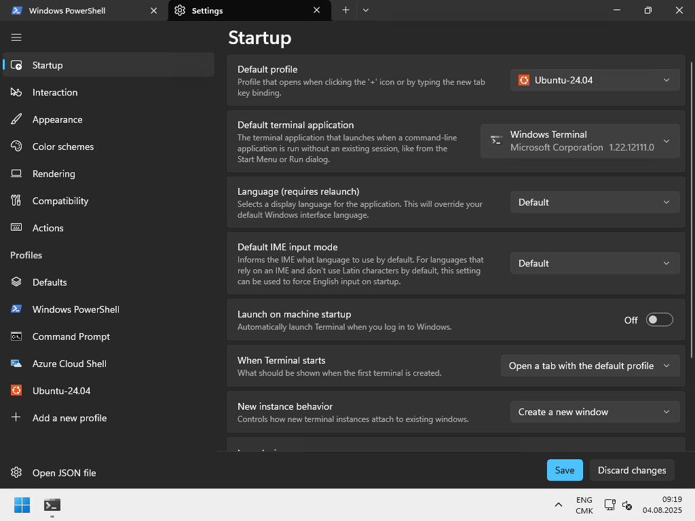
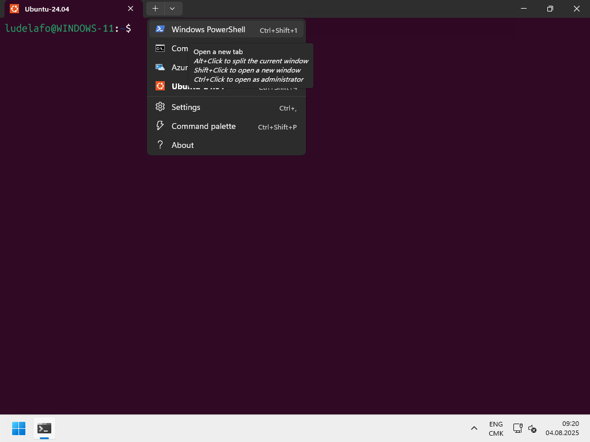

import { Aside } from "@astrojs/starlight/components";

Le terminal est une interface en ligne de commande qui permet d'interagir avec
l'ordinateur en saisissant des instructions textuelles. C'est un outil
indispensable pour tout·e personne qui souhaite être plus efficace dans
l'utilisation de son système d'exploitation, automatiser des tâches ou
travailler sur des serveurs distants.

## Terminal et shell : quelle différence ?

Le **terminal** (ou émulateur de terminal) est l'application qui affiche la
fenêtre dans laquelle vous tapez des commandes. Exemples : Terminal.app sur
macOS, Windows Terminal, GNOME Terminal sur Linux.

Le **shell** est le programme qui interprète les commandes que vous saisissez
dans le terminal. C'est le shell qui exécute les instructions et renvoie les
résultats.

Par abus de langage, on parle souvent de "terminal" pour désigner l'ensemble
terminal + shell, mais il est important de comprendre la distinction entre les
deux.

## Les shells les plus courants

- **Bash** (Bourne Again Shell) : le shell par défaut sur la plupart des
  distributions Linux. Très répandu et bien documenté.
- **Zsh** (Z Shell) : le shell par défaut sur macOS depuis Catalina. Compatible
  avec Bash, avec des fonctionnalités supplémentaires.
- **Fish** : shell moderne avec une autocomplétion intelligente, adapté aux
  débutant·es.
- **PowerShell** : shell de Microsoft, disponible sur Windows, macOS et Linux.
  Orienté objets plutôt que texte.
- **cmd.exe** : l'ancien shell de Windows, encore présent mais peu recommandé.

## Ouvrir un terminal

- **Windows** : rechercher "Windows Terminal" ou "PowerShell" dans le menu
  Démarrer. En faisant un clic droit sur l'application, vous pouvez choisir de
  l'ouvrir en tant qu'administrateur·trice.
- **macOS** : ouvrir l'application Terminal (dans Applications > Utilitaires) ou
  utiliser `⌘+Espace` et taper "Terminal".
- **Linux** : le raccourci `Ctrl+Alt+T` ouvre un terminal sur la plupart des
  distributions.

## Exécuter des commandes dans le terminal

Maintenant que nous sommes dans le terminal, nous pouvons exécuter des
commandes. Par exemple, pour afficher le répertoire courant, tapez la commande
suivante et appuyez sur `Entrée` :

```bash title="Terminal Bash/Zsh ou PowerShell"
pwd
```

La commande `pwd` (print working directory) affiche le chemin du répertoire dans
lequel vous vous trouvez actuellement.

Il est courant de voir des commandes avec des options ou des arguments qui sont
passés à la commande. Par exemple, pour lister les fichiers dans le répertoire
courant avec des détails, vous pouvez utiliser :

```bash title="Terminal Bash/Zsh ou PowerShell"
ls -l
```

La commande `ls` liste les fichiers et dossiers, et l'option `-l` affiche les
détails (permissions, propriétaire, taille, date de modification) sous la forme
d'une liste.

Pour afficher l'aide d'une commande, vous pouvez utiliser l'option `--help`
(valide pour une majorité de commandes) :

```bash title="Terminal Bash/Zsh ou PowerShell"
ls --help
```

L'aide affichera les différentes options disponibles pour la commande `ls`.

Dans ce cours et dans le reste de votre formation, vous allez devoir utiliser le
terminal pour exécuter des commandes où vous devrez parfois passer des options
et des arguments. Il est commun de retrouver la notation suivante pour indiquer
qu'une commande peut prendre des options et des arguments :

```bash title="Terminal Bash/Zsh ou PowerShell"
ls [-l] <chemin-du-dossier>
```

Ici, l'option `-l` est facultative (indiquée par les crochets `[]`) et
`<chemin-du-dossier>` est un argument obligatoire qui indique le chemin du
dossier à lister. **C'est à vous de remplacer les chevrons et le texte à
l'intérieur par la valeur réelle que vous souhaitez utiliser.** Par exemple,
pour lister les fichiers dans le dossier `/home/user/Documents`, vous pouvez
exécuter :

```bash title="Terminal Bash/Zsh ou PowerShell"
ls -l /home/user/Documents
```

## Personnaliser son shell

Pour les shells comme Bash et Zsh, il est possible de personnaliser l'apparence
et le comportement du shell en modifiant des fichiers de configuration. Ces
fichiers sont généralement situés dans le répertoire personnel de
l'utilisateur·trice et sont nommés `.bashrc`, `.bash_profile` pour Bash et
`.zshrc` pour Zsh.

Lorsque vous ouvrez un terminal, le shell lit ces fichiers de configuration et
applique les paramètres définis. Vous pouvez y ajouter des alias (raccourcis de
commandes) pour simplifier les commandes, définir des variables d'environnement,
ou encore personnaliser l'invite de commande (prompt).

Nous verrons les commandes de base du terminal en détail dans le contenu
[Travailler avec le terminal](/heig-vd-upinfo-course/08-travailler-avec-le-terminal/01-introduction-et-ressources).

## Résumé

Le terminal et le shell sont des outils fondamentaux d'un ordinateur.

Chaque système d'exploitation en propose une version.

Vous serez amené·e à utiliser le terminal pour exécuter des commandes,
configurer votre système et automatiser des tâches. Il est donc important de se
familiariser avec son utilisation dès le début.

## À vous de jouer !

### Exercice pratique 1 : installer et configurer Windows Terminal sur Windows

<Aside type="note">

Cette section est uniquement destinée aux utilisateur·trices de Windows. Si vous
utilisez macOS ou Linux, vous pouvez passer à la section suivante,
[Exercice pratique 2 : afficher un message dans le terminal](#exercice-pratique-2--afficher-un-message-dans-le-terminal).

</Aside>

#### Installer Windows Terminal

Windows est fourni avec une application de terminal appelée _"**Invite de
commandes**"_.

C'est une application de terminal très basique qui ne supporte pas beaucoup de
fonctionnalités disponibles dans les applications terminales modernes. Microsoft
a développé une nouvelle application de terminal appelée Windows Terminal
disponible pour les utilisateur·trices Windows 10+.

Windows Terminal est une nouvelle application de terminal moderne, rapide,
efficace, puissante et productive pour les utilisateur·trices d'outils en ligne
de commande et de shells comme Invite de commandes, PowerShell et WSL.

Vous pouvez la télécharger depuis le Microsoft Store :
[Windows Terminal](https://www.microsoft.com/p/windows-terminal/9n0dx20hk701).

Installez-la et ouvrez-la.

#### Configurer Windows Terminal

Par défaut, Windows Terminal ouvre PowerShell. Vous pouvez le configurer pour
ouvrir un autre shell par défaut, par exemple WSL (Windows Subsystem for Linux),
que nous verrons dans un futur contenu.

Accédez aux paramètres en cliquant sur la flèche déroulante dans la barre de
titre et en sélectionnant _"Paramètres"_. Définissez les deux paramètres
suivants :

- **Profil par défaut** : Le shell que vous souhaitez ouvrir par défaut (par
  exemple, Ubuntu si vous avez installé WSL).
- **Application de terminal par défaut** : Windows Terminal

Cliquez sur **Enregistrer** pour enregistrer les paramètres.



Fermez Windows Terminal et ouvrez-le à nouveau. Il devrait maintenant ouvrir le
shell que vous avez défini par défaut.

Vous disposez maintenant d'une application de terminal moderne qui supporte
plusieurs onglets, plusieurs shells et de nombreuses autres fonctionnalités.

Vous pouvez toujours ouvrir un autre shell (par exemple PowerShell) en cliquant
sur la flèche déroulante dans la barre de titre et en sélectionnant _"Windows
PowerShell"_.

Vous pouvez exécuter un terminal PowerShell en tant qu'administrateur·trice en
cliquant sur la flèche déroulante dans la barre de titre et en sélectionnant
_"Windows PowerShell"_ tout en maintenant la touche `Ctrl` enfoncée.



### Exercice pratique 2 : afficher un message dans le terminal

Ouvrez un terminal sur votre système d'exploitation et exécutez la commande
suivante pour vérifier que tout fonctionne correctement :

```bash title="Terminal Bash/Zsh ou PowerShell"
# Affiche un message de bienvenue dans le terminal
echo "Hello, world!"
```

Cette commande affiche le message "Hello, world!" dans le terminal. C'est un bon
moyen de vérifier que votre terminal et votre shell fonctionnent correctement.
