import { Aside } from "@astrojs/starlight/components";

Les services de synchronisation en ligne permettent d'accéder à ses fichiers
depuis n'importe quel appareil et de les synchroniser automatiquement dans le
cloud. C'est une forme de sauvegarde passive, complémentaire à une stratégie de
sauvegarde active.

## Principaux services

Les services les plus répandus sont :

- [**OneDrive**](https://www.onedrive.com) (Microsoft) : intégré à Windows,
  inclus dans les abonnements Microsoft 365.
- [**iCloud Drive**](https://www.icloud.com) (Apple) : intégré à macOS et iOS.
  Moins pratique en dehors de l'écosystème Apple.
- [**Google Drive**](https://www.google.com/drive) : disponible sur toutes les
  plateformes, avec une suite bureautique en ligne (Docs, Sheets, Slides).
- [**Dropbox**](https://www.dropbox.com) : l'un des pionniers, multiplateforme,
  avec de bonnes intégrations dans les applications tierces.
- [**Syncthing**](https://syncthing.net) : open source, peer-to-peer, ne
  nécessite pas de serveur centralisé.

## Limites et précautions

Les services cloud ne remplacent pas une vraie stratégie de sauvegarde (nous
reviendrons sur ce point dans le contenu
[Sauvegarder et restaurer ses données](/heig-vd-upinfo-course/06-sauvegarder-et-restaurer-ses-donnees/01-introduction-et-ressources/))
:

- Si vous supprimez accidentellement un fichier synchronisé, il est supprimé
  partout (même si une corbeille existe souvent).
- Les fichiers que vous synchronisez sont stockés sur des serveurs distants,
  accessibles par le fournisseur du service. Vous devez donc faire confiance à
  ce fournisseur pour la confidentialité et la sécurité de vos données. Selon
  les conditions d'utilisation, le fournisseur peut avoir le droit de scanner
  vos fichiers pour des raisons de sécurité ou de publicité ciblée. Vos données
  ne sont donc pas totalement privées.
- Les fichiers sensibles ne devraient pas être stockés dans le cloud sans
  chiffrement préalable.
- Les services cloud peuvent être indisponibles temporairement (panne,
  maintenance, etc.).
- Les services cloud peuvent être compromis par des attaques informatiques. Il
  est donc recommandé d'activer l'authentification à deux facteurs (2FA) pour
  sécuriser votre compte.
- Soyez attentif·ve aux limites de stockage gratuites, souvent entre 5 et 15 Go.

## Développement et problèmes de synchronisation

De notre expérience, les services de synchronisation en ligne peuvent parfois
rencontrer des problèmes de synchronisation, surtout pour des projets de
développement ou des fichiers volumineux.

En effet, lorsque vous développez une application, vous pouvez avoir des
fichiers temporaires ou des fichiers de configuration qui changent fréquemment.
A chaque fois que vous construisez votre projet, des centaines de fichiers
peuvent être modifiés. Le service de synchronisation peut détecter ces
changements et tenter de synchroniser les fichiers modifiés alors que ce n'est
pas nécessaire. Cela peut entraîner des conflits de synchronisation, des
fichiers corrompus ou des performances dégradées et un gaspillage de ressources
énergétiques inutile.

Pour ces raisons, nous recommandons de **ne pas synchroniser vos projets de
développement avec un service cloud**. Il est préférable d'utiliser un système
de contrôle de version comme Git (voir contenu
[Git et GitHub](/heig-vd-upinfo-course/05-configurer-son-systeme-dexploitation-et-ses-applications/19-git-et-github/))
pour gérer vos projets.

## Est-ce obligatoire d'utiliser un service de synchronisation en ligne ?

Non, ce n'est pas obligatoire. Vous pouvez choisir de ne pas utiliser de service
de synchronisation en ligne et de gérer vos fichiers localement sur votre
ordinateur.

Cependant, l'utilisation d'un service de synchronisation en ligne peut être
pratique pour accéder à vos fichiers depuis différents appareils et pour avoir
une sauvegarde supplémentaire de vos fichiers importants.

Au travers de la HEIG-VD, vous bénéficiez d'un compte Microsoft 365 avec
OneDrive avec un espace de 100 Go à votre disposition, ce qui vous permet
d'utiliser ce service de synchronisation en ligne si vous le souhaitez.

iCloud propose un espace de 5 Go gratuitement.

## Configurer votre système d'exploitation pour utiliser ces services de manière efficace

Si les services de synchronisation en ligne semblent pratiques, nous avons vu
qu'ils ont des limites et des risques (ne remplacent pas une vraie stratégie de
sauvegarde, confidentialité, sécurité, problème de synchronisation, etc.).

Comment pouvons-nous alors les utiliser de manière efficace ?

Une recommandation que nous pouvons vous faire est d'utiliser ces services pour
ne synchroniser que certains fichiers que vous souhaitez partager avec d'autres
personnes (documents de cours, projets collaboratifs, etc.).

Il n'est en effet pas nécessaire de synchroniser tous vos fichiers personnels
avec un service de synchronisation en ligne. Vous pouvez choisir de ne
synchroniser que certains fichiers ou dossiers spécifiques, et de garder le
reste de vos fichiers locaux sur votre ordinateur.

Pour le moment, les étapes suivantes vous donnent des recommandations pour
configurer vos services de synchronisation en ligne liés à votre système
d'exploitation spécifique.

### OneDrive (Windows)

Selon la configuration de votre ordinateur, OneDrive peut être déjà installé et
configuré.

Recherchez l'icône OneDrive dans la barre des tâches (près de l'horloge - voir
contenu
[Interface graphique (GUI) et terminal (CLI)](/heig-vd-upinfo-course/03-composants-materiels-et-logiciels-dun-ordinateur/11-interface-graphique-gui-et-terminal-cli/)).

Si vous ne voyez pas l'icône OneDrive

Si vous ne voyez pas l'icône, vous pouvez rechercher "OneDrive" dans le menu
Démarrer et l'ouvrir. Ceci démarrera le processus de configuration.

Lors de la première configuration, vous serez invité·e à vous connecter avec
votre compte Microsoft.

Puis vous aurez la possibilité de choisir les dossiers que vous souhaitez
synchroniser. Nous vous recommandons de **ne pas synchroniser vos fichiers
personnels (Bureau, Documents, etc.)** de façon directe avec OneDrive.

Au lieu de cela, utilisez OneDrive comme espace séparé de votre ordinateur afin
d'avoir un meilleur contrôle de vos fichiers locaux et ceux synchronisés.

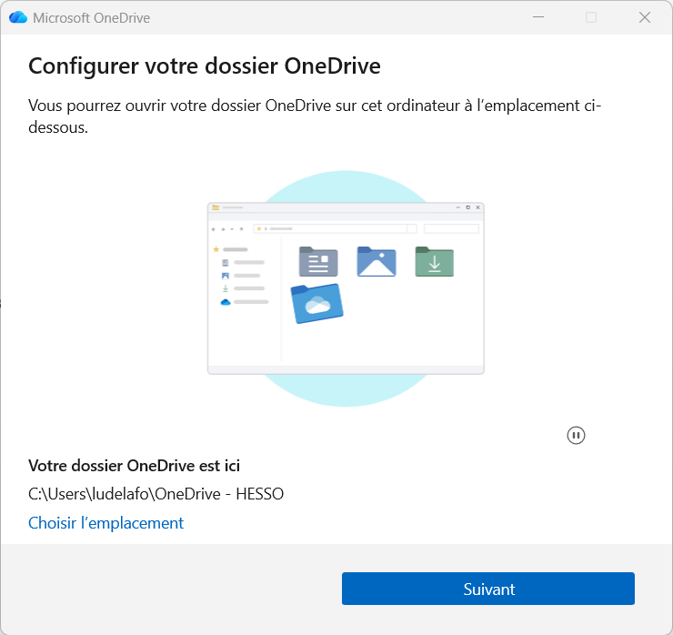

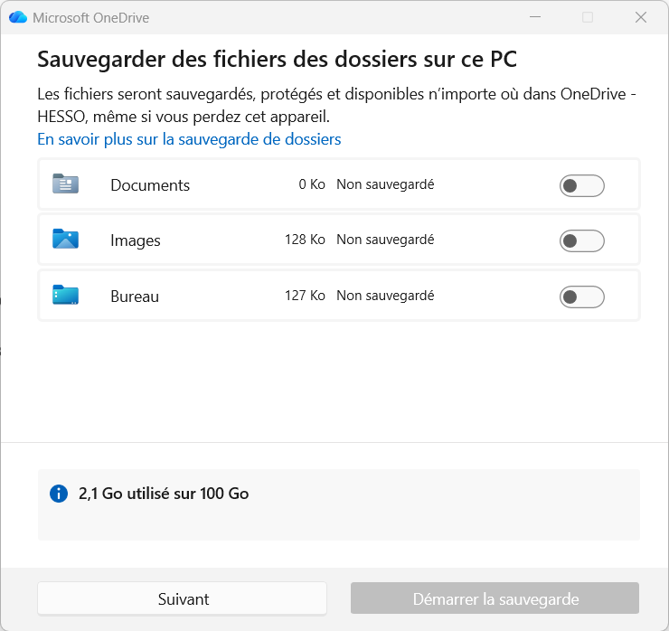

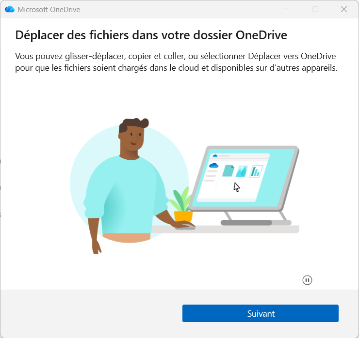

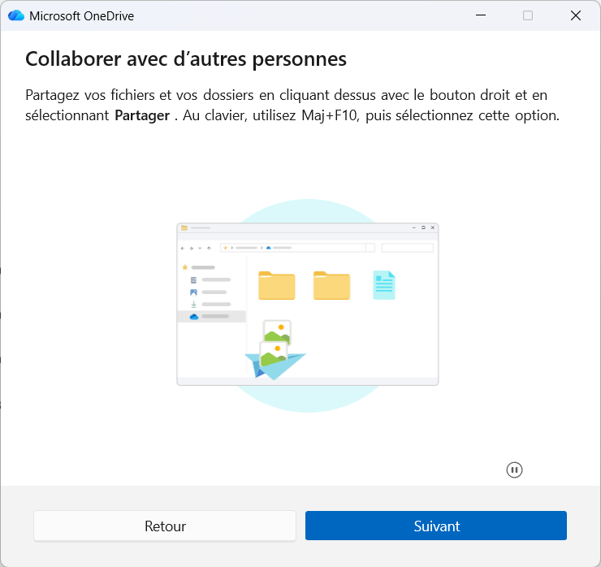

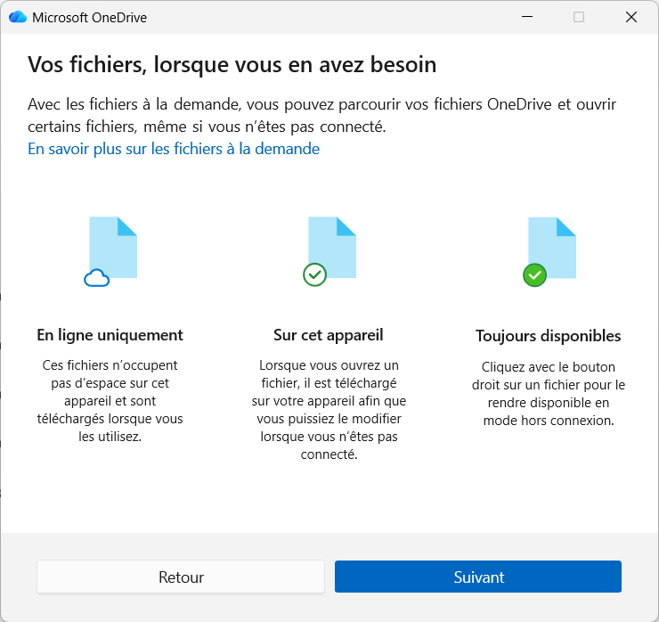

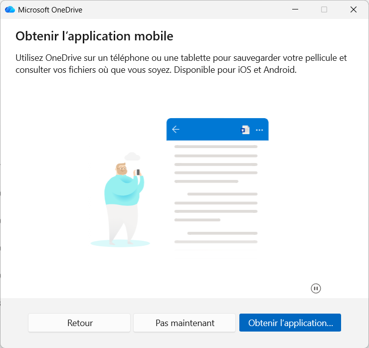

Si vous voyez l'icône OneDrive

Si vous voyez l'icône OneDrive, cliquez sur l'icône OneDrive dans la barre des
tâches (près de l'horloge), puis cliquez sur "Aide et paramètres" >
"Paramètres".

A l'aide du bouton "Gérer la sauvegarde", vous pouvez choisir les dossiers que
vous souhaitez synchroniser. Nous vous recommandons de **ne pas synchroniser vos
fichiers personnels (Bureau, Documents, etc.)** de façon directe avec OneDrive.

En enlevant la synchronisation de vos fichiers personnels, vous pouvez utiliser
OneDrive comme espace séparé de votre ordinateur afin d'avoir un meilleur
contrôle de vos fichiers locaux et ceux synchronisés.

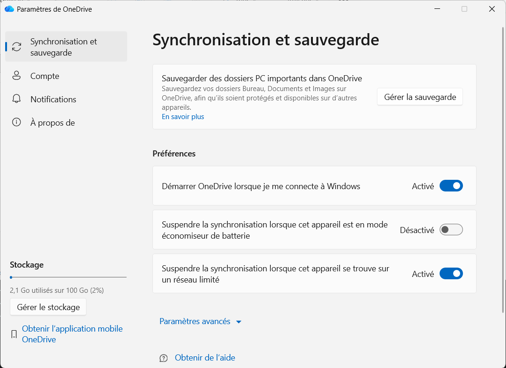

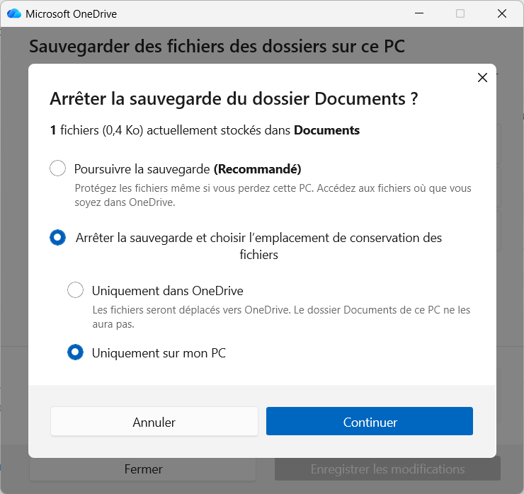

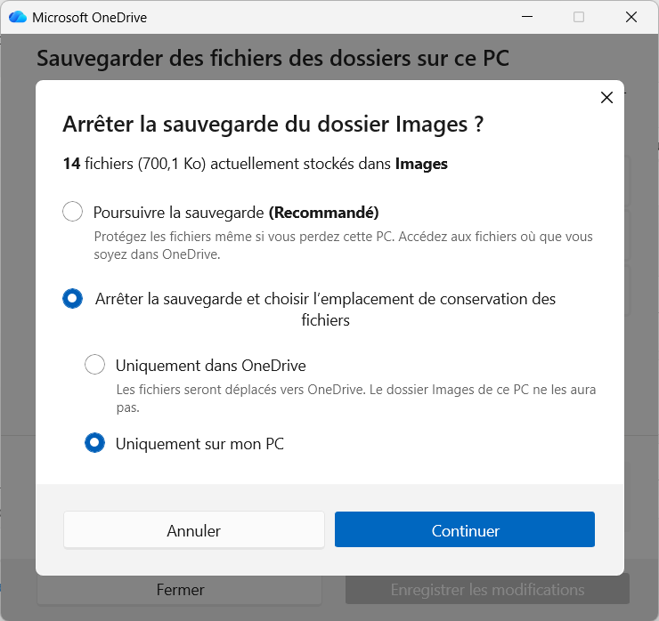

Vous pouvez maintenant passer à la section
[Organiser son espace de synchronisation](#organiser-son-espace-de-synchronisation)
pour configurer votre espace de synchronisation.

### iCloud Drive (macOS)

Selon la configuration de votre ordinateur, iCloud peut être déjà installé et
configuré.

Si vous accédez aux préférences système > iCloud, vous pouvez vérifier si vous
êtes connecté·e avec votre compte Apple et si iCloud Drive est activé.

Si vous n'êtes pas connecté·e, vous pouvez vous connecter avec votre compte
Apple.

Afficher la ou les captures d'écran qui illustrent l'étape

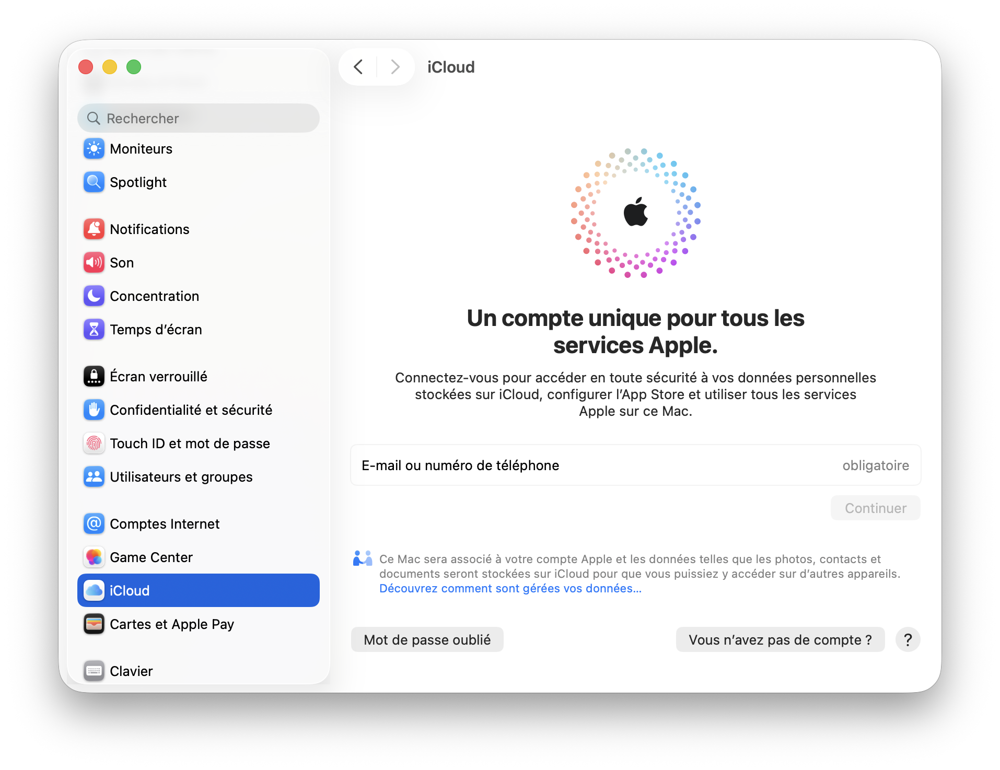

Une fois connecté·e, vous pouvez configurer iCloud avec les différentes
applications et services que vous souhaitez synchroniser.

Vous êtes libre de choisir les applications et services que vous souhaitez
synchroniser avec iCloud. Dans les captures d'écran ci-dessous, nous avons
choisi de désactiver la synchronisation tous les services Apple, sauf iCloud
Drive.

Particulièrement pour iCloud Drive, nous vous recommandons de **ne pas
synchroniser vos fichiers personnels (Bureau, Documents, etc.)** de façon
directe avec iCloud Drive. Au lieu de cela, utilisez iCloud Drive comme espace
séparé de votre ordinateur afin d'avoir un meilleur contrôle de vos fichiers
locaux et ceux synchronisés.

Pour cela, désactivez la synchronisation de vos fichiers personnels dans iCloud
Drive.

Afficher la ou les captures d'écran qui illustrent l'étape

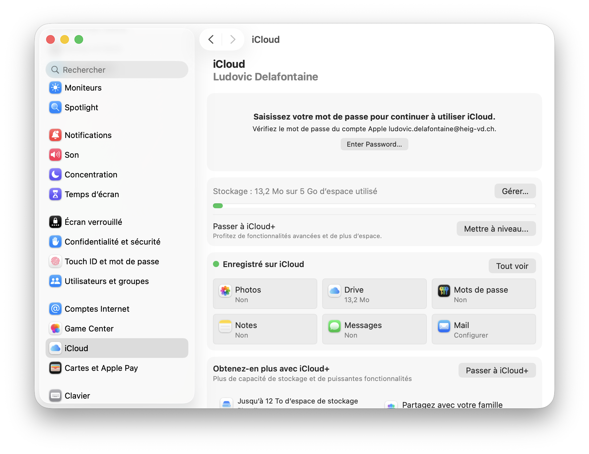

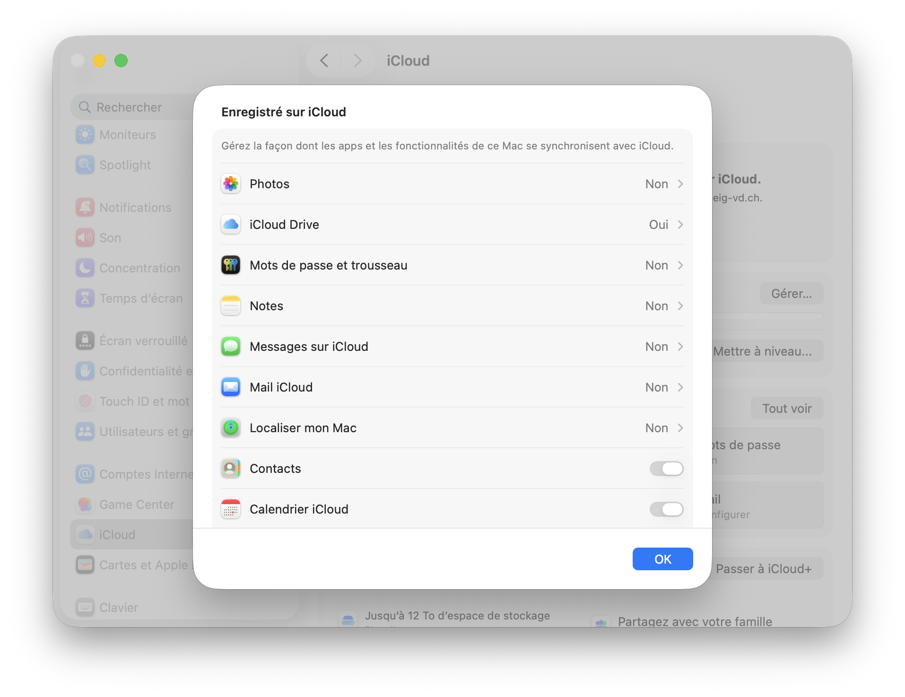

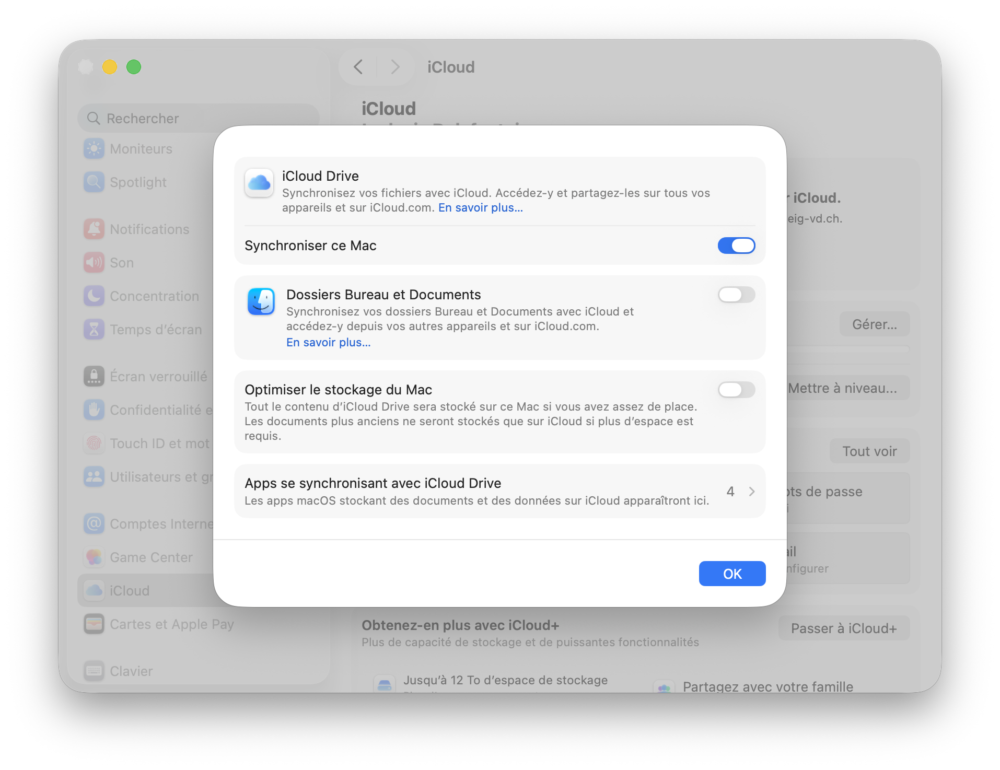

Vous pouvez maintenant passer à la section
[Organiser son espace de synchronisation](#organiser-son-espace-de-synchronisation)
pour configurer votre espace de synchronisation.

### Organiser son espace de synchronisation

Maintenant que vous avez configuré votre service de synchronisation en ligne,
vous pouvez organiser votre espace de synchronisation.

Nous vous recommandons de créer un dossier spécifique pour vos fichiers
synchronisés et un dossier spécifique pour vos sauvegardes.

Par exemple, vous pouvez créer un dossier "Synchronisation" et un dossier
"Sauvegardes" dans votre répertoire personnel.

Ainsi, lorsque vous souhaitez partager un fichier ou collaborer sur un fichier
avec d'autres personnes, vous pouvez le placer dans le dossier
"Synchronisation".

## Résumé

Les services de synchronisation en ligne facilitent l'accès à ses fichiers de
n'importe où et constituent un filet de sécurité contre la perte de données. Ils
ne remplacent pas une sauvegarde complète, mais sont un complément utile au
quotidien.

Identifier les fichiers locaux et les fichiers synchronisés vous permettent
d'avoir un meilleur contrôle sur vos fichiers et de ne partager que ce que vous
souhaitez partager avec d'autres personnes.
