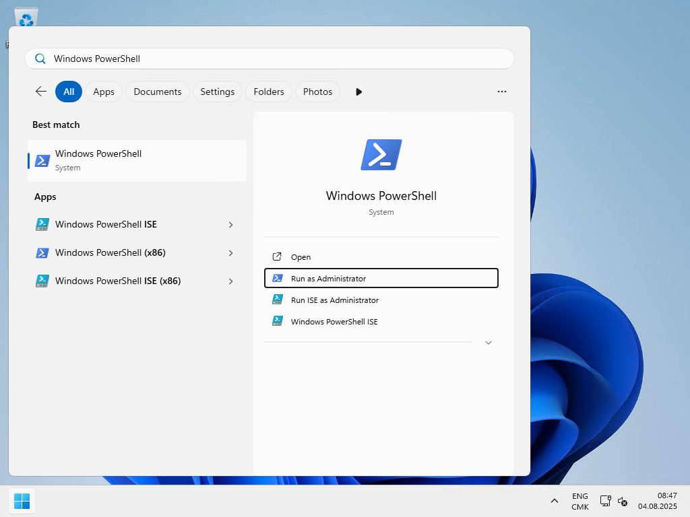
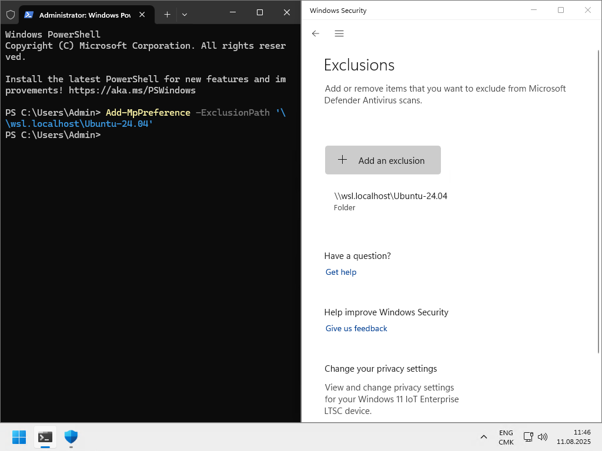
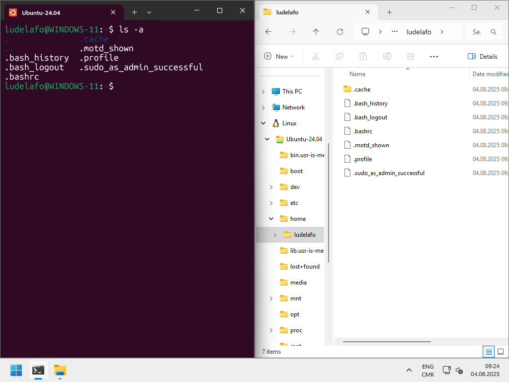

import { Aside } from "@astrojs/starlight/components";

WSL (Windows Subsystem for Linux) est une fonctionnalité de Windows qui permet
d'exécuter un environnement Linux directement sur Windows, sans machine
virtuelle ni double démarrage. C'est un outil particulièrement utile pour les
développeur·euses qui travaillent sous Windows mais ont besoin d'un terminal
Linux.

En effet, de nombreux outils de développement sont conçus pour Linux ou macOS et
fonctionnent mieux (ou uniquement) dans un environnement UNIX. WSL permet :

- D'utiliser un vrai shell Bash ou Zsh.
- D'installer des outils Linux (`git`, `curl`, `python`, etc.) via `apt`.
- De développer des applications destinées à tourner sur des serveurs Linux.

<Aside type="caution">

WSL est l'un des outils les plus importants de votre formation. Il est donc
fortement recommandé de l'installer et de le configurer correctement.

</Aside>

<Aside type="note">

Ce contenu est spécifique à Windows. Pour les utilisateur·trices de macOS et
Linux, ce contenu n'est pas applicable.

</Aside>

## Avant-propos

Ce guide est inspiré par les sources suivantes :

- [How to install Linux on Windows with WSL by Microsoft](https://learn.microsoft.com/windows/wsl/install)
- [Set up a WSL development environment by Microsoft](https://learn.microsoft.com/en-us/windows/wsl/setup/environment)

Si vous rencontrez des problèmes avec ce guide, consultez la section
[Dépannage](#dépannage). N'hésitez pas à demander de l'aide si vous avez des
problèmes, mais veuillez d'abord essayer la section [Dépannage](#dépannage)
avant de nous contacter.

Nous vous recommandons d'avoir suivi le contenu
[Terminal et shells](/heig-vd-upinfo-course/05-configurer-son-systeme-dexploitation-et-ses-applications/04-terminal-et-shells/)
avant de commencer l'installation de WSL.

## Mettre à jour Windows

Avant de commencer l'installation de l'environnement de développement,
assurez-vous que votre installation de Windows est à jour en suivant le contenu
[Gérer les mises à jour](/heig-vd-upinfo-course/05-configurer-son-systeme-dexploitation-et-ses-applications/05-gerer-les-mises-a-jour/).

## Installer WSL

Windows Subsystem for Linux (appelé _"WSL"_) est une couche de compatibilité
pour exécuter les exécutables binaires Linux nativement sur Windows. C'est un
outil très utile pour les développeur·euses qui souhaitent utiliser les outils
et utilitaires Linux sur Windows.

Pour installer WSL, recherchez _"**PowerShell**"_ dans le menu Démarrer, cliquez
dessus avec le bouton droit, et sélectionnez _"**Exécuter en tant
qu'administrateur·trice**"_ comme indiqué dans la capture d'écran suivante :



Ensuite, exécutez la commande suivante dans le terminal :

<Aside type="note">

Si la commande suivante affiche le message d'aide, passez à la section suivante,
[Mettre à jour WSL](#mettre-à-jour-wsl).

</Aside>

```powershell title="Terminal PowerShell (en tant qu'administrateur·trice)"
# Installer WSL sans spécifier de distribution
wsl --install --no-distribution
```

Le résultat devrait être similaire à ceci :

```text
Downloading: Windows Subsystem for Linux 2.5.9
Installing: Windows Subsystem for Linux 2.5.9
Windows Subsystem for Linux 2.5.9 has been installed.
Installing Windows optional component: VirtualMachinePlatform

Deployment Image Servicing and Management tool
Version: 10.0.26100.1150

Image Version: 10.0.26100.4770

Enabling feature(s)
[==========================100.0%==========================]
The operation completed successfully.
The requested operation is successful. Changes will not be effective until the system is rebooted.
The operation completed successfully.
```

Redémarrez votre ordinateur une fois l'installation terminée.

## Mettre à jour WSL

Les ordinateurs peuvent être livrés avec WSL version 1 ou 2. La version 2 de WSL
est la dernière version et elle est recommandée. Elle offre de meilleures
performances et plus de fonctionnalités que la version 1.

Comme WSL peut toujours être en version 1, vous devez le mettre à jour vers la
version 2.

Pour ce faire, ouvrez PowerShell en tant qu'administrateur·trice comme indiqué
dans la section précédente et exécutez la commande suivante dans le terminal :

```powershell title="Terminal PowerShell (en tant qu'administrateur·trice)"
# Vérifier les mises à jour de WSL
wsl --update --web-download
```

<Aside type="note">

Vous recevez une erreur 403 en essayant d'installer WSL ? Il est probable que
votre réseau bloque le téléchargement du paquet WSL. Vous pouvez essayer de vous
connecter à un autre réseau (par exemple, le partage de connexion de votre
téléphone mobile) pour contourner les restrictions réseau. Si vous le souhaitez,
vous pouvez ignorer cette erreur et continuer avec l' installation.

</Aside>

S'il y a des mises à jour disponibles, vous serez invité·e à les télécharger et
les installer.

Définissez la version par défaut de WSL sur 2 en exécutant la commande suivante
dans le terminal PowerShell en tant qu'administrateur·trice :

```powershell title="Terminal PowerShell (en tant qu'administrateur·trice)"
# Définir la version par défaut de WSL sur 2
wsl --set-default-version 2
```

Le résultat devrait être similaire à ceci :

```text
For information on key differences with WSL 2 please visit https://aka.ms/wsl2
The operation completed successfully.
```

## Installer une distribution Linux

WSL supporte plusieurs distributions Linux. Vous pouvez vérifier les
distributions disponibles en exécutant la commande suivante dans le terminal
PowerShell en tant qu'administrateur·trice :

```powershell title="Terminal PowerShell (en tant qu'administrateur·trice)"
# Lister les distributions Linux disponibles
wsl --list --online
```

Le résultat devrait être similaire à ceci :

```text
The following is a list of valid distributions that can be installed.
Install using 'wsl.exe --install <Distro>'.

NAME                            FRIENDLY NAME
AlmaLinux-8                     AlmaLinux OS 8
AlmaLinux-9                     AlmaLinux OS 9
AlmaLinux-Kitten-10             AlmaLinux OS Kitten 10
AlmaLinux-10                    AlmaLinux OS 10
Debian                          Debian GNU/Linux
FedoraLinux-42                  Fedora Linux 42
SUSE-Linux-Enterprise-15-SP6    SUSE Linux Enterprise 15 SP6
SUSE-Linux-Enterprise-15-SP7    SUSE Linux Enterprise 15 SP7
Ubuntu                          Ubuntu
Ubuntu-24.04                    Ubuntu 24.04 LTS
archlinux                       Arch Linux
kali-linux                      Kali Linux Rolling
openSUSE-Tumbleweed             openSUSE Tumbleweed
openSUSE-Leap-15.6              openSUSE Leap 15.6
Ubuntu-18.04                    Ubuntu 18.04 LTS
Ubuntu-20.04                    Ubuntu 20.04 LTS
Ubuntu-22.04                    Ubuntu 22.04 LTS
OracleLinux_7_9                 Oracle Linux 7.9
OracleLinux_8_10                Oracle Linux 8.10
OracleLinux_9_5                 Oracle Linux 9.5
```

Vous pouvez alors installer une distribution Linux de votre choix parmi la
liste. Nous recommandons d'installer Ubuntu si vous n'êtes pas familier·e avec
Linux car c'est une distribution très conviviale et largement utilisée.

En utilisant la liste des distributions disponibles sur votre ordinateur,
identifiez la dernière distribution Ubuntu disponible. Dans cet exemple, la
dernière distribution Ubuntu est `Ubuntu-24.04`. **La vôtre pourrait être plus
récente**.

<Aside type="caution">

Installez la dernière version d'Ubuntu disponible dans **votre** liste. La
version `Ubuntu-24.04` est la dernière version au moment de la rédaction de ce
guide, mais la vôtre pourrait être plus récente. Installez la dernière version
disponible dans **votre** liste en remplaçant `<latest-version>` par la version
que vous avez dans votre liste.

**N'installez pas la distribution `Ubuntu` sans numéro de version**. Elle
pourrait installer une version plus ancienne d'Ubuntu. Utilisez toujours le nom
de distribution avec version.

</Aside>

```powershell title="Terminal PowerShell (en tant qu'administrateur·trice)"
# Installer Ubuntu
wsl --install --distribution Ubuntu-<latest-version>
```

Une fois l'installation terminée, vous pouvez configurer un nom
d'utilisateur·trice et un mot de passe pour la distribution Ubuntu.

Enregistrez les informations de votre nom d'utilisateur·trice et de votre mot de
passe dans votre
[gestionnaire de mots de passe](/heig-vd-upinfo-course/02-premiers-pas-a-la-heig-vd/07-installer-et-configurer-un-gestionnaire-de-mots-de-passe/).

<Aside type="note">

Lors de la configuration de votre mot de passe, **il est normal que vous ne
voyez aucun caractère à l'écran**. C'est une fonctionnalité de sécurité du
terminal. Bien que vous ne voyiez pas les caractères que vous tapez (par
exemple, `p@ssw0rd`), ils sont toujours en cours de saisie. Assurez-vous de
sauvegarder votre mot de passe dans votre
[gestionnaire de mots de passe](/heig-vd-upinfo-course/02-premiers-pas-a-la-heig-vd/07-installer-et-configurer-un-gestionnaire-de-mots-de-passe/).

</Aside>

Nous recommandons d'utiliser le même nom d'utilisateur·trice (**sans espaces**)
et le même mot de passe que votre compte Windows pour simplicité.

Une fois que vous avez configuré votre nom d'utilisateur·trice et votre mot de
passe, Ubuntu sera lancé, et vous serez en mesure d'exécuter des commandes Linux
dans le terminal.

Le résultat devrait être similaire à ceci :

```text
Downloading: Ubuntu 24.04 LTS
Installing: Ubuntu 24.04 LTS
Distribution successfully installed. It can be launched via 'wsl.exe -d Ubuntu-24.04'
Launching Ubuntu-24.04...
Provisioning the new WSL instance Ubuntu-24.04
This might take a while...
Create a default Unix user account: ludelafo
New password:
Retype new password:
passwd: password updated successfully
To run a command as administrator (user "root"), use "sudo <command>".
See "man sudo_root" for details.

ludelafo@WINDOWS-11:/mnt/c/WINDOWS/system32$
```

## Mettre à jour Ubuntu

Avant de commencer l'installation de l'environnement de développement,
assurez-vous que votre installation Ubuntu est à jour. Vous pouvez mettre à jour
Ubuntu en exécutant les commandes suivantes dans le terminal. Vous devrez
peut-être entrer votre mot de passe lors de l'exécution des commandes :

<Aside type="note">

Pour rappel, la commande `sudo` est utilisée pour exécuter des commandes avec
les privilèges de superutilisateur·trice. Vous serez invité·e à entrer votre mot
de passe lors de l'exécution d'une commande avec `sudo`.

C'est une fonctionnalité de sécurité de Linux pour empêcher l'accès non autorisé
au système.

Consultez le contenu
[Utilisateur·trices et groupes](/heig-vd-upinfo-course/03-composants-materiels-et-logiciels-dun-ordinateur/13-utilisateur-trices-et-groupes/)
pour plus d'informations sur les droits et permissions sur Linux.

</Aside>

<Aside type="note">

Toutes les distributions Linux sont livrées avec un gestionnaire de paquets
utilisé pour installer, mettre à jour et supprimer des paquets. Le gestionnaire
de paquets pour Ubuntu s'appelle `apt`.

Le gestionnaire de paquets utilise une liste de paquets pour savoir quels
paquets sont disponibles pour l'installation. Vous pouvez ensuite installer
n'importe quel paquet de la liste des paquets en utilisant le gestionnaire de
paquets.

Consultez le contenu
[Gestionnaires de paquets](/heig-vd-upinfo-course/05-configurer-son-systeme-dexploitation-et-ses-applications/13-gestionnaires-de-paquets/)
pour plus d'informations sur les gestionnaires de paquets.

</Aside>

```sh
# Mettre à jour la liste des paquets
sudo apt update

# Mettre à jour les paquets installés
sudo apt upgrade
```

Appuyez sur `y` lorsque vous êtes invité·e à confirmer la mise à jour.

Tous les paquets seront mis à jour vers la dernière version.

Nous reviendrons plus en détail sur l'utilisation de WSL dans le contenu
[Travailler avec le terminal](/heig-vd-upinfo-course/08-travailler-avec-le-terminal/01-introduction-et-ressources/).

## Exclure WSL de votre logiciel antivirus

La section suivante vous guidera tout au long du processus d'exclusion de la
distribution WSL de votre logiciel antivirus.

C'est une étape importante pour améliorer les performances de WSL et éviter tout
problème avec votre environnement de développement intégré (IDE).

Cela vous permettra également d'utiliser WSL avec votre IDE préféré sans aucun
problème.

Cela ne devrait pas exposer votre système à des risques de sécurité car la
distribution WSL est isolée du reste du système.

<Aside type="note">

Pour le moment, seul Windows Defender est supporté. Si vous utilisez un autre
logiciel antivirus, vous devrez vérifier la documentation de votre logiciel
antivirus pour exclure WSL de celui-ci. Le chemin à exclure si vous avez
installé Ubuntu comme la principale distribution WSL est
`\\wsl.localhost\Ubuntu-<votre-version>`.

</Aside>

Pour exclure la distribution Ubuntu WSL de Windows Defender, vous pouvez
exécuter la commande suivante dans un terminal PowerShell en tant
qu'administrateur·trice comme vu dans la section précédente :

```powershell title="Terminal PowerShell (en tant qu'administrateur·trice)"
# Exclure la distribution WSL de Windows Defender
Add-MpPreference -ExclusionPath '\\wsl.localhost\Ubuntu-<votre-version>'
```



Vous devriez faire cela pour chaque distribution que vous avez installée.

## Configurer Windows Terminal pour ouvrir Ubuntu par défaut

Vous pouvez configurer Windows Terminal pour qu'il s'ouvre automatiquement dans
votre distribution Ubuntu.

Consultez le contenu
[Terminal et shells](/heig-vd-upinfo-course/05-configurer-son-systeme-dexploitation-et-ses-applications/04-terminal-et-shells/)
pour plus d'informations sur l'installation et la configuration de Windows
Terminal.

## Accéder à vos fichiers dans WSL depuis Windows et depuis Ubuntu

Lorsque vous accédez au terminal Ubuntu, vous serez dans le répertoire personnel
de votre utilisateur·trice Ubuntu. Votre répertoire personnel Ubuntu est situé
dans le répertoire `/home`. Le répertoire personnel est généralement abrégé en
`~`. Le symbole `~` représente le répertoire personnel de votre
utilisateur·trice Ubuntu.

Vous pouvez accéder à vos fichiers Windows dans le répertoire `/mnt`.

Par exemple, vous pouvez accéder à votre lecteur Windows `C:\Users` dans le
répertoire `/mnt/c/Users`.

Cependant, nous ne recommandons pas de manipuler vos fichiers depuis
l'explorateur de fichiers sous Windows. Consultez la section
[Conseils et astuces](#conseils-et-astuces) pour plus d'informations.

Windows a ajouté une entrée à la barre latérale de l'explorateur de fichiers
pour la distribution Ubuntu. Vous pouvez accéder à vos fichiers Ubuntu dans le
répertoire
`\\wsl.localhost\Ubuntu-<votre-version>\home\<votre-nom-utilisateur>`.

<Aside type="caution">

Nous recommandons vivement de **ne jamais manipuler vos fichiers depuis
l'explorateur de fichiers sur Windows**. Utilisez plutôt le terminal Ubuntu pour
éviter les problèmes de permissions et les comportements de fichiers bizarres.
Consultez la section [Conseils et astuces](#conseils-et-astuces) pour plus
d'informations.

</Aside>



## Conseils et astuces

### Ne manipulez pas vos fichiers depuis l'explorateur de fichiers sur Windows

Nous vous recommandons vivement de **ne jamais manipuler vos fichiers depuis
l'explorateur de fichiers sur Windows**. Utilisez plutôt le terminal Ubuntu pour
éviter les problèmes de permissions et les comportements de fichiers bizarres
pour copier/coller, déplacer ou supprimer des fichiers de votre environment WSL
vers/depuis Windows.

Nous reviendrons plus en détail sur l'utilisation de WSL dans le contenu
[Travailler avec le terminal](/heig-vd-upinfo-course/08-travailler-avec-le-terminal/01-introduction-et-ressources/).

### Libérer de l'espace disque

Par défaut, l'espace disque de WSL augmente au fur et à mesure que vous
l'utilisez, mais ne se réduit pas lorsque l'espace est libéré. Vous pouvez
réduire automatiquement l'image lorsque des fichiers sont supprimés en exécutant
la commande suivante dans un terminal PowerShell en tant qu'administrateur·trice
(basé sur la réponse [StackExchange](https://superuser.com/a/1612289) suivante)
:

```powershell title="Terminal PowerShell (en tant qu'administrateur·trice)"
# Arrêter le service WSL
wsl --shutdown

# Optimiser l'espace disque de WSL
wsl --manage Ubuntu --set-sparse true
```

Redémarrez ensuite votre ordinateur pour que les modifications prennent effet.

## Valider l'installation

Vous pouvez utiliser la liste de contrôle suivante pour valider l'installation :

- [x] Windows est à jour.
- [x] WSL est installé sur votre machine Windows.
- [x] WSL est à jour.
- [x] WSL est défini sur la version 2.
- [x] Ubuntu est installé dans WSL.
- [x] Ubuntu est à jour.
- [x] Windows Terminal est configuré pour ouvrir Ubuntu par défaut.
- [x] WSL est exclu de Windows Defender pour de meilleures performances.
- [x] Vous pouvez exécuter des commandes Linux dans le terminal Ubuntu.
- [x] Vous avez vérifié la section [Conseils et astuces](#conseils-et-astuces).
- [x] Vous avez maintenant une compréhension de la façon de gérer vos fichiers
      personnels dans WSL et en quoi ils diffèrent de ceux sur Windows.

À partir de maintenant, vous pouvez utiliser WSL comme votre environnement de
développement principal pour le reste de votre formation.

## Dépannage

L'installation de WSL peut échouer pour diverses raisons. Voici quelques
problèmes courants et leurs solutions. Veuillez suivre chacune des étapes
ci-dessous dans l'ordre pour vous assurer que WSL est installé correctement.
N'hésitez pas à demander de l'aide si vous êtes bloqué·e, mais nous ne vous
aiderons pas si vous n'avez pas essayé les étapes suivantes.

<Aside type="note">

Le dépannage de WSL peut être complexe et long. Nous avons créé une liste de
problèmes courants et de leurs solutions pour vous aider à dépanner votre
installation de WSL. Si vous rencontrez toujours des problèmes après avoir suivi
les étapes ci-dessous, veuillez demander de l'aide. Nous devrons peut-être
mettre à jour ce guide avec d'autres étapes de dépannage.

</Aside>

### Erreur 403 lors de la mise à jour ou de l'installation de WSL

Si vous recevez une erreur 403 en essayant d'installer WSL, il est probable que
votre réseau bloque le téléchargement du paquet WSL. Vous pouvez essayer de vous
connecter à un autre réseau (par exemple, le partage de connexion de votre
téléphone mobile) pour contourner les restrictions réseau. Si vous le souhaitez,
vous pouvez ignorer cette erreur et continuer avec l'installation.

### Vérifier votre numéro de version Windows

WSL n'est disponible que depuis Windows 10 version 1607. Vous pouvez vérifier
votre version de Windows en exécutant la commande suivante dans un terminal
PowerShell :

```powershell
# Vérifier votre version de Windows
systeminfo | Select-String "^OS Name","^OS Version"
```

Si votre version de Windows est inférieure à 1607, vous devrez mettre à jour
votre version de Windows.

### Vérifier les mises à jour Windows

Vous pouvez vérifier si votre installation de Windows est à jour en allant sur
**Paramètres > Mise à jour et sécurité > Windows Update**.

### Vérifier que toutes les fonctionnalités Windows requises sont activées

Vous pouvez vérifier si WSL est disponible sur votre installation de Windows en
exécutant la commande suivante dans un terminal PowerShell en tant
qu'administrateur·trice comme vu dans la section précédente :

```powershell
# Vérifier si WSL est disponible
dism.exe /online /get-features | Select-String "Microsoft-Windows-Subsystem-Linux" -Context 1
```

Si WSL n'est pas disponible, vous devrez l'activer en utilisant la commande
suivante :

```powershell
# Activer WSL
dism.exe /online /enable-feature /featurename:Microsoft-Windows-Subsystem-Linux /all /norestart
```

Vous pouvez vérifier si la plateforme de machine virtuelle est activée en
exécutant la commande suivante dans un terminal PowerShell en tant
qu'administrateur·trice comme vu dans la section précédente :

```powershell
# Vérifier si la plateforme de machine virtuelle est activée
dism.exe /online /get-features | Select-String "VirtualMachinePlatform" -Context 1
```

Si la plateforme de machine virtuelle n'est pas activée, vous devrez l'activer
en utilisant la commande suivante :

```powershell
# Activer la plateforme de machine virtuelle
dism.exe /online /enable-feature /featurename:VirtualMachinePlatform /all /norestart
```

### Activer la virtualisation

WSL nécessite que la virtualisation soit activée. Vous pouvez vérifier si la
virtualisation est activée en allant dans vos paramètres BIOS/UEFI.

Vous pouvez redémarrer dans les paramètres BIOS/UEFI en exécutant la commande
suivante dans un terminal PowerShell en tant qu'administrateur·trice comme vu
dans la section précédente :

```powershell
# Redémarrer dans les paramètres BIOS/UEFI
shutdown /r /fw
```

Ensuite, vous pouvez vérifier si la virtualisation est activée dans vos
paramètres BIOS/UEFI.

L'emplacement exact du paramètre dépendra de votre fabricant de carte mère.

Vous devez rechercher un paramètre appelé _"Virtualization"_, _"VT-x"_,
_"AMD-V"_, ou quelque chose de similaire et l'activer.

## Résumé

WSL permet aux utilisateur·trices de Windows d'accéder à un environnement Linux
complet sans quitter leur système. C'est un outil précieux pour le
développement, notamment pour reproduire les conditions des serveurs de
production qui tournent souvent sous Linux.
