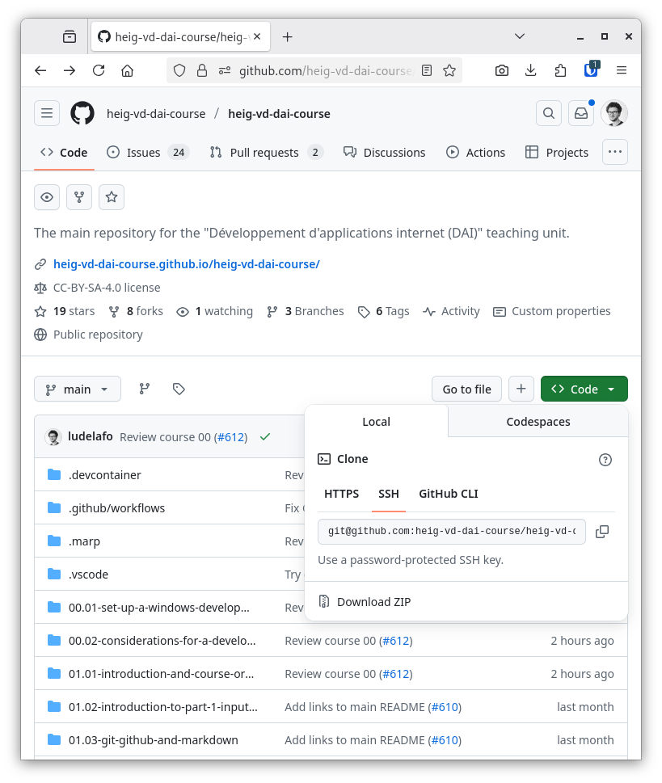

import { Aside, TabItem, Tabs, Steps } from "@astrojs/starlight/components";

Git est un outil qui permet de suivre dans le temps les modifications apportées
à un projet, de collaborer avec d'autres personnes et de gérer différentes
versions d'un projet. Il est largement utilisé dans le développement logiciel
pour faciliter la collaboration et la gestion de code source.

GitHub est une plateforme en ligne qui repose sur Git et qui permet de stocker,
partager et collaborer sur des projets de développement. Elle offre des
fonctionnalités supplémentaires telles que la gestion des problèmes (issues),
les demandes de tirage (pull requests) et l'intégration continue, facilitant
ainsi la collaboration entre développeurs.

Les projets sur GitHub sont appelés des "dépôts" (repositories). Chaque dépôt
contient l'historique complet des modifications du projet, ainsi que les
fichiers et dossiers associés.

Vous pouvez d'ailleurs retrouver ce cours sur GitHub :
[github.com/heig-vd-upinfo-course/heig-vd-upinfo-course](https://github.com/heig-vd-upinfo-course/heig-vd-upinfo-course).

Dans de futurs cours, vous utiliserez Git et GitHub pour collaborer avec vos
collègues et soumettre vos travaux pratiques. Il est donc important de les
installer et de les configurer correctement dès maintenant.

<Aside type="caution">

Git et GitHub sont les outils les plus importants de votre formation. Il est
donc fortement recommandé de les installer et de les configurer correctement.

</Aside>

## Première étape : GitHub

GitHub est une plateforme sociale qui héberge de nombreux projets open source.
Vous l'utiliserez pour publier votre travail et collaborer avec votre équipe.
C'est un excellent outil de visibilité pour votre carrière.

Dans cette section, vous allez créer et configurer votre compte GitHub. Si vous
en avez déjà un, assurez-vous qu'il est correctement configuré.

Évitez d'utiliser GitHub CLI/Desktop ou toute autre application pour gérer vos
dépôts afin de pouvoir utiliser Git partout.

### Création d'un compte GitHub

Si vous n'avez pas encore de compte GitHub, vous devrez en créer un. Nous
recommandons d'utiliser la même adresse e-mail que celle utilisée pour votre clé
SSH du contenu
[Secure Shell (SSH)](/heig-vd-upinfo-course/05-configurer-son-systeme-dexploitation-et-ses-applications/18-secure-shell-ssh).

Voici les étapes pour se créer un compte GitHub
([source 1](https://docs.github.com/en/get-started/signing-up-for-github/signing-up-for-a-new-github-account),
[source 2](https://docs.github.com/en/get-started/signing-up-for-github/verifying-your-email-address),
[source 3](https://docs.github.com/en/authentication/securing-your-account-with-two-factor-authentication-2fa))
:

<Steps>

1. Rendez-vous sur [github.com](https://github.com) et cliquez sur le bouton
   "Sign up" (S'inscrire).

2. Remplissez le formulaire d'inscription avec votre adresse e-mail, un nom
   d'utilisateur unique et un mot de passe fort. Assurez-vous de choisir un nom
   d'utilisateur approprié, car il sera visible publiquement.

3. Enregistrez le mot de passe dans votre
   [gestionnaire de mots de passe](/heig-vd-upinfo-course/02-premiers-pas-a-la-heig-vd/07-installer-et-configurer-un-gestionnaire-de-mots-de-passe).

4. Suivez les instructions pour vérifier votre adresse e-mail et compléter le
   processus d'inscription. Un e-mail de vérification sera envoyé à l'adresse
   que vous avez fournie. Cliquez sur le lien de vérification dans cet e-mail
   pour activer votre compte.

5. Activez la double authentification (2FA) pour renforcer la sécurité de votre
   compte.

</Steps>

### Importation de sa clé SSH publique sur GitHub

GitHub utilise SSH pour authentifier les utilisateur·trices et sécuriser les
communications entre votre ordinateur et les dépôts GitHub. Vous devez donc
importer votre clé SSH publique sur GitHub pour pouvoir cloner, pousser et tirer
des dépôts sans avoir à saisir votre nom d'utilisateur et votre mot de passe à
chaque fois.

Si besoin, vous pouvez consultez le contenu
[Secure Shell (SSH)](/heig-vd-upinfo-course/05-configurer-son-systeme-dexploitation-et-ses-applications/18-secure-shell-ssh)
pour gérer vos clés SSH.

Voici les étapes pour importer votre clé SSH publique sur GitHub
([source](https://docs.github.com/en/authentication/connecting-to-github-with-ssh/adding-a-new-ssh-key-to-your-github-account))
:

<Steps>

1. Connectez-vous à votre compte GitHub et accédez aux paramètres de votre
   compte.

2. Dans le menu de gauche, cliquez sur
   "[SSH and GPG keys](https://github.com/settings/keys)" (Clés SSH et GPG).

3. Cliquez sur le bouton "New SSH key" (Nouvelle clé SSH).

4. Donnez un titre à votre clé SSH pour la reconnaître facilement (par exemple,
   l'adresse e-mail que vous avez utilisé pour la clé SSH, votre nom
   d'utilisateur sur GitHub ou encore "Clé SSH HEIG-VD").

5. Sélectionnez le type de la clé SSH avec "Authentication Key" (Clé
   d'authentification).

6. Copiez le contenu de votre clé SSH publique (généralement située dans
   `~/.ssh/id_ed25519.pub`) et collez-le dans le champ "Key" (Clé) sur GitHub.
   Pour cela, vous pouvez utiliser la commande suivante dans votre terminal
   Bash/Zsh :

   ```bash title="Terminal Bash/Zsh"
    cat ~/.ssh/id_ed25519.pub
   ```

7. Cliquez sur le bouton "Add SSH key" (Ajouter la clé SSH) pour enregistrer la
   clé.

</Steps>

Répétez les mêmes instructions pour ajouter une clé SSH de type "Signing Key"
(Clé de signature) à votre compte GitHub. Cette clé sera utilisée pour signer
vos commits.

### Activation du compte PRO

Avoir un compte PRO vous permettra de débloquer toutes les fonctionnalités de
GitHub et d'autres produits, comme Copilot.

En tant qu'étudiant·e HEIG-VD, vous pouvez obtenir un compte PRO gratuitement.

Voici les étapes pour activer votre compte PRO
([source 1](https://docs.github.com/en/education/explore-the-benefits-of-teaching-and-learning-with-github-education/github-global-campus-for-students),
[source 2](https://github.com/education/students)) :

<Steps>

1. Rendez-vous sur les paramètres
   [GitHub Education](https://github.com/settings/education/benefits).

2. Sous "GitHub Education", cliquez sur "Start an application" (Commencer une
   demande).

3. Remplissez le formulaire, puis cliquez sur "Submit application" (Soumettre la
   demande). Vous devrez fournir une preuve de votre affiliation à l'HEIG-VD,
   comme une carte d'étudiant ou un e-mail académique.

4. Une fois votre statut d'étudiant vérifié, vous aurez accès aux avantages
   étudiants, y compris le compte PRO gratuit.

5. Sous "Free GitHub developer resources for students and teachers" (Ressources
   de développement gratuites pour les étudiants et les enseignants), cliquez
   sur "Learn more" (En savoir plus).

6. Suivez les instructions pour activer Copilot Student, en configurant les
   politiques d'utilisation de Copilot selon vos besoins.

</Steps>

## Deuxième étape : Git

Git est un outil en ligne de commande qui permet de gérer les versions de vos
projets. Il est essentiel de l'installer et de le configurer correctement pour
pouvoir collaborer efficacement avec vos collègues et soumettre vos travaux
pratiques.

Dans cette section, vous allez installer Git sur votre ordinateur et le
configurer avec votre nom d'utilisateur et votre adresse e-mail GitHub.

### Téléchargement et installation

<Tabs syncKey="package-manager">
<TabItem label="WinGet (Windows)" icon="seti:windows">

    **N'installez pas Git directement sur Windows.**

    Installez-le dans votre distribution WSL (Ubuntu) en suivant les instructions de l'onglet "apt (Linux)".

</TabItem>
<TabItem label="Homebrew (macOS)" icon="apple">

    Git est préinstallé sur macOS mais il s'agit sans doute d'une version obsolète. Pour obtenir une version plus récente, installez Git via Homebrew :

    ```bash title="Terminal Bash/Zsh"
    brew install git
    ```

</TabItem>
<TabItem label="apt (Linux)" icon="linux">

    Les instructions suivantes sont adaptées pour des distributions basées sur Ubuntu/Debian.

    Pour une autre distribution (Fedora, Arch, OpenSUSE, etc.), merci de vous référer à votre gestionnaire de paquets pour installer cette application.

    ```bash title="Terminal Bash/Zsh"
    # Installe l'application
    sudo apt install git
    ```

</TabItem>
<TabItem label="Installation manuelle" icon="setting">

      Nous ne recommandons pas d'installer Git manuellement. Veuillez utiliser l'un des gestionnaires de paquets ci-dessus pour installer Git sur votre système.

</TabItem>
</Tabs>

### Validation de l'installation

Dans un terminal Bash/Zsh, exécutez la commande suivante pour vérifier que Git
est installé et connaître sa version :

```bash title="Terminal Bash/Zsh"
git --version
```

Le résultat devrait ressembler à ceci :

```text
git version 2.55.0
```

Votre version peut être différente, mais assurez-vous que la commande ne renvoie
pas d'erreur.

Cela confirme que Git est installé et prêt à être utilisé sur votre système.

### Configuration de Git

Git a besoin de connaître votre nom et votre adresse e-mail pour étiqueter
correctement vos commits.

Ouvrez un terminal et tapez les commandes suivantes :

```sh
# Définir votre nom
git config --global user.name "<votre prénom et nom>"

# Définir votre adresse e-mail
git config --global user.email "<votre adresse e-mail GitHub>"
```

Remplacez `<votre prénom et nom>` par votre prénom et nom, et
`<votre adresse e-mail GitHub>` par l'adresse e-mail que vous avez utilisée pour

### Validation de la configuration

Vous pouvez vérifier que votre configuration Git est correcte en exécutant la
commande suivante :

```sh
# Vérifier la configuration Git
git config --list
```

Cette commande lit la configuration Git (stockée dans `~/.gitconfig`) et
l'affiche dans le terminal.

Le résultat devrait ressembler à ceci :

```text
user.name=Ludovic Delafontaine
user.email=ludovic.delafontaine@heig-vd.ch
```

**Si vous n'avez pas ce résultat, cela signifie que votre configuration Git est
incorrecte.** Relisez les sections précédentes pour vous assurer que vous avez
suivi les instructions correctement.

### Test complet de la configuration Git et GitHub

Vous pouvez essayer de vous authentifier sur GitHub en utilisant SSH pour
vérifier que votre configuration est correcte. Pour cela, exécutez la commande
suivante dans votre terminal Bash/Zsh :

```bash title="Terminal Bash/Zsh"
# Tester la connexion SSH à GitHub
ssh -T git@github.com
```

Le résultat devrait ressembler à ceci :

```text
Hi ludelafo! You've successfully authenticated, but GitHub does not provide shell access.
```

Vous pouvez essayer de cloner le dépôt de ce cours en utilisant Git et SSH pour
vérifier que tout fonctionne correctement. Pour cela, exécutez la commande
suivante dans votre terminal Bash/Zsh :

```bash title="Terminal Bash/Zsh"
# Cloner le dépôt du cours via SSH dans un répertoire nommé "heig-vd-upinfo-course"
git clone git@github.com:heig-vd-upinfo-course/heig-vd-upinfo-course.git "heig-vd-upinfo-course"
```

Si vous êtes en mesure de cloner le dépôt, cela signifie que votre configuration
Git et SSH est correctement configurée. Un clonage signifie qu'une copie du
dépôt GitHub a été téléchargée sur votre ordinateur, ce qui vous permet de
travailler sur le projet localement. Vous pouvez le retrouver dans votre
répertoire de travail sous le nom `heig-vd-upinfo-course`.

L'URL d'un dépôt GitHub se trouve dans l'onglet **Code** du dépôt, comme indiqué
dans la capture d'écran suivante :



<Aside type="caution">

Par défaut, GitHub vous affichera l'URL HTTPS. Vous devez cliquer sur l'onglet
**SSH** pour voir l'URL SSH.

</Aside>

## Résumé

Git et GitHub sont des outils de gestion de versions incontournables du
développement logiciel moderne.

Leur installation et leur configuration de base sont les premières étapes avant
tout projet de code.

Nous l'utiliserons dans de nombreux cours au cours de votre formation.

## À vous de jouer !

### Exercice pratique

Installez Git sur votre ordinateur et configurez-le selon les étapes ci-dessus.

## Aller plus loin

<Aside type="tip">

Ce contenu est optionnel. Vous pouvez le consulter si vous souhaitez approfondir
vos connaissances sur le sujet.

</Aside>

### Signer les commits avec SSH

Un commit Git est une unité de travail qui enregistre les modifications
apportées à un projet. Il contient des informations sur les changements
effectués, l'auteur·trice du commit et un identifiant unique (hash) qui permet
de le retrouver dans l'historique du projet. Chaque commit représente un
instantané du projet à un moment donné, permettant de suivre l'évolution du code
et de collaborer efficacement avec d'autres développeur·euses.

Si vous souhaitez, vous pouvez signer vos commits avec votre clé SSH pour
prouver que vous êtes bien l'auteur·trice du commit et que votre compte n'a pas
été compromis.

Signer les commits est une bonne pratique pour prouver que vous êtes bien
l'auteur·trice d'un commit et que votre compte n'a pas été compromis. Cela
permet également de vérifier l'intégrité du commit et de s'assurer qu'il n'a pas
été modifié par quelqu'un d'autre.

Dans cette section, vous allez activer une option pour signer tous vos commits
avec SSH. "Signer un commit" signifie que vous ajoutez une signature numérique à
votre commit, ce qui permet de vérifier que le commit a été créé par vous et n'a
pas été modifié par quelqu'un d'autre.

Voici les étapes pour signer vos commits avec SSH
([source](https://docs.github.com/en/authentication/managing-commit-signature-verification/about-commit-signature-verification#ssh-commit-signature-verification))
:

<Steps>

1. Assurez-vous d'avoir déjà ajouté votre clé SSH publique pour signer les
   commits sur GitHub, comme précédemment mentionné dans la section
   [Importation de sa clé SSH publique sur GitHub](#importation-de-sa-clé-ssh-publique-sur-github).

2. Configurez Git pour utiliser votre clé SSH de l'agent SSH pour signer les
   commits en exécutant la commande suivante dans votre terminal Bash/Zsh :

   ```bash title="Terminal Bash/Zsh"
   git config --global gpg.ssh.defaultkeycommand "ssh-add -L"
   ```

3. Configurez Git pour utiliser le format SSH pour la signature des commits en
   exécutant la commande suivante dans votre terminal Bash/Zsh :

   ```bash title="Terminal Bash/Zsh"
   git config --global gpg.format ssh
   ```

4. Configurez Git pour utiliser votre clé SSH pour signer automatiquement tous
   les commits en exécutant la commande suivante dans votre terminal Bash/Zsh :

   ```bash title="Terminal Bash/Zsh"
   git config --global commit.gpgsign true
   ```

</Steps>

#### Valider la configuration Git

Vous pouvez vérifier votre configuration Git comme mentionné dans la section
[Validation de la configuration](#validation-de-la-configuration).

Le résultat devrait ressembler à ceci :

```text
user.email=ludovic.delafontaine@heig-vd.ch
user.name=Ludovic Delafontaine
gpg.ssh.defaultkeycommand=ssh-add -L
gpg.format=ssh
commit.gpgsign=true
```

**Si vous n'avez pas ce résultat, cela signifie que votre configuration Git est
incorrecte.** Relisez les sections précédentes pour vous assurer que vous avez
suivi les instructions correctement.
